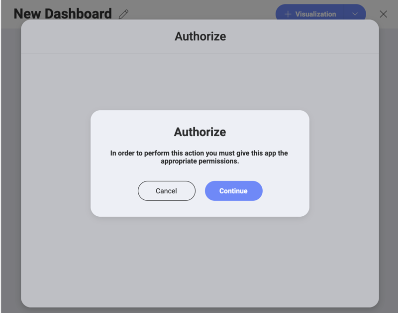

## Google ドライブ

Google アカウントでログインしている場合は、Google ドライブがデータ ソースに自動的に追加されます。

Google ドライブのデータを使用するには、以下の手順に従ってください。

1.  Google Drive (またはその中のフォルダー) を選択すると、以下のログイン プロンプトが表示されます。

    

    **ログイン情報**を入力し *[次]* を選択します。

2.  **初めてのユーザーのみ**には、[認証] ダイアログが表示され、Google ドライブのデータを使用できるように、**適切な権限** を開示するように求められます。

    

    *[続行]* をクリックすると、**承認プロンプト**にリダイレクトされます。

    

3.  *[許可]* を選択して、Reveal が Google ドライブ ファイルを使用 (表示およびダウンロード) することを承認します。

これで、Google ドライブのデータを使用して表示形式を構築できるようになり、これらの権限を再度求められることはありません。

### サポートされるファイル

Reveal では、広範な種類のファイルを使用できます。

  - **スプレッドシートと表形式データ**: Excel (.xlsls, .xlsx)、CSV または TSV (Reveal 内で動的に使用できます)。

  - **その他のファイル**: プレビューモードのみで表示されます (画像および PDF やテキストなどのドキュメント ファイルを含む)。
