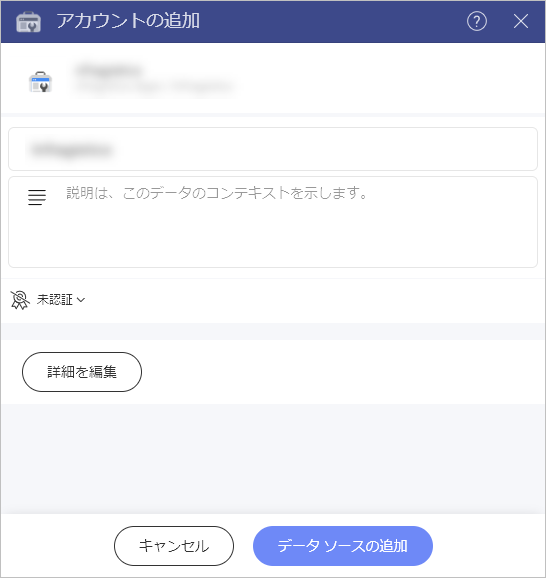
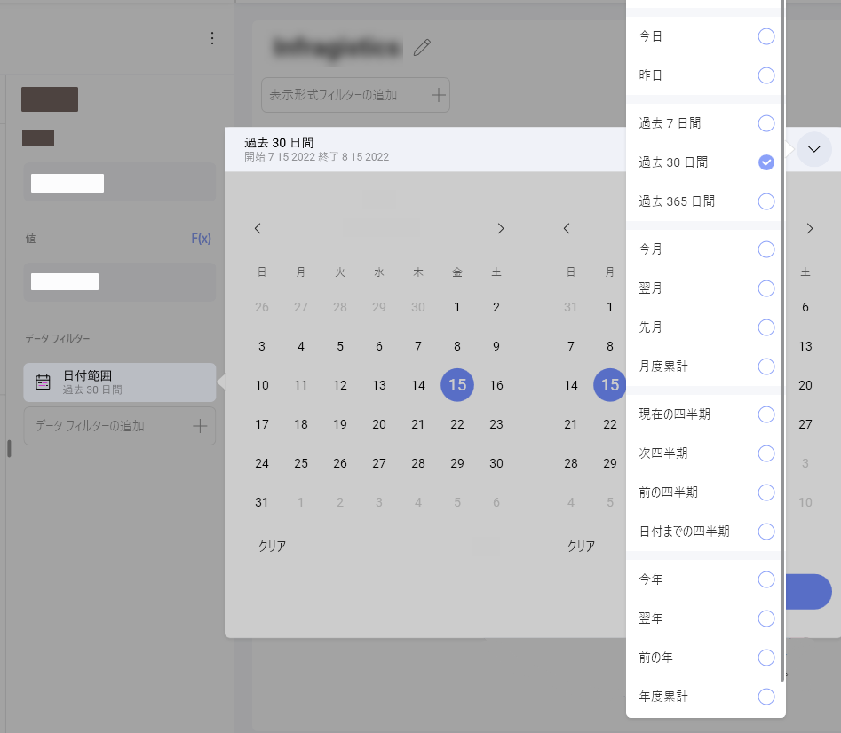
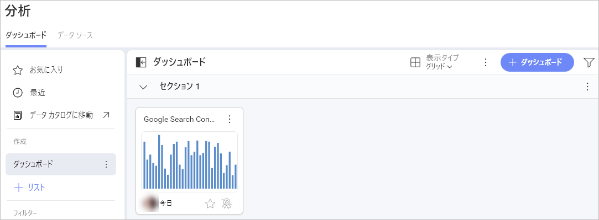

# Google Search Console

Google Search Console データ ソースを使用すると、Google Search Console アカウントを Slingshot に接続できます。 

構造化されたインサイトに富んだダッシュボードの助けを借りて、SEO テクニックがどのように機能するかを確認し、改善が必要なサイトの領域についてより良い概要を得ることができます。

## Google Search Console への接続

1.	データ ソース リストの **[マーケティング、セールス、CRM]** セクションにある **Google Search Console** を選択します。 
2.	複数のアカウントが表示されている場合は、アクセスしたいデータが保存されているアカウントを選択してください。必要なアカウントがアカウントのリストにない場合は、新しい Google Search Console アカウントを追加することもできます。Google Search Console のアカウントをお持ちでない場合は、[こちら (英語)](https://search.google.com/search-console/about) で作成方法の詳細をご覧ください。
3.	まだサインインしていない場合は、資格情報の入力を求められます。
4.	アカウントをデータ ソースに追加する前に、名前の編集、説明の追加、または詳細の編集を選択できます。

 

5.	ダッシュボードに使用するサイトを選択し、**[データの選択]** をクリックまたはタップします。
6.	変更を保存すると、**データ ソース** リストにファイルが表示されます。

## 表示形式エディターでの作業

Google Search Console をデータ ソースとして使用すると、*表示形式エディター*のフィールドが異なって表示されることがわかります。

左側の「フィールド」見出しの代わりに、独自のクエリ フィールドに 2 つのセクションが表示されます。

1.	**ディメンション**: それらはデータの属性です。  
2.	**メジャー** (123 アイコンで表示): メジャーは数値データで構成されます。たとえば、国名ごとのクリック数を確認できます。

## 日付範囲データ フィルター

このフィルターは削除できませんが、デフォルトの日付範囲は変更できます。デフォルトでは、日付フィルターは *[過去 30 日間]* に設定されています。 

変更したい場合は、右上隅の矢印をクリックして (下のスクリーンショットを参照)、ドロップダウン メニューから日付範囲を選択するか、最初のオプションをクリックしてカスタムの日付範囲を作成します。

## 設定

チャートの種類に応じて、設定でさまざまな変更を行うことができます。この場合、設定メニューから以下を調整できる柱状チャート タイプを使用しました。

- タイトルの表示
- 凡例を表示する
- 開始色
- ツールチップで合計を表示
- チャート トレンドライン
- 軸と軸の境界
- この表示形式を別のダッシュボードまたは URL に接続します。ダッシュボードをリンクする方法の詳細については、[この記事 (英語)](https://www.slingshotapp.io/en/help/docs/analytics/dashboards/dashboard-linking) を確認してください。 

表示形式エディターの準備ができたら、ダッシュボードを **[分析] > [ダッシュボード]** または特定のワークスペースに保存できます。 

データ ソースの詳細については、[こちら (英語)](https://www.slingshotapp.io/en/help/docs/analytics/datasources/overview) を参照してください。 