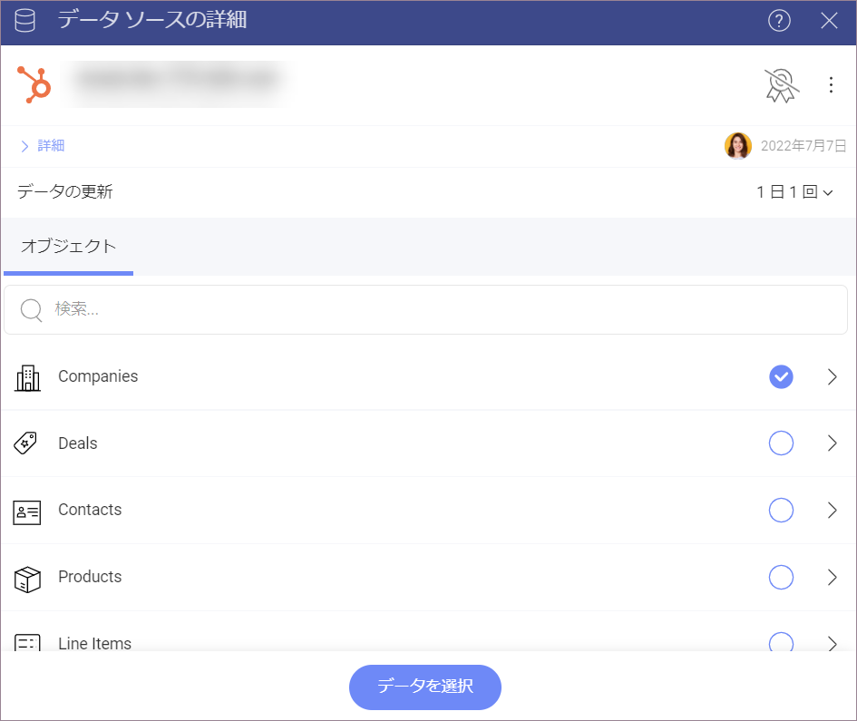
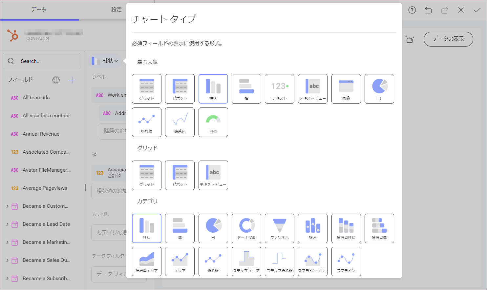

# Hubspot

Hubspot に接続すると、以下のログイン プロンプトが表示されます。

ログイン情報を入力して **[ログイン]** をクリックします。

>[!NOTE]
>[2 要素認証](https://knowledge.hubspot.com/account/how-can-i-set-up-two-factor-authentication-for-my-hubspot-login)を有効にしている場合、確認コードを入力する必要があります。

## データの設定

ログイン後、次のダイアログで Hubspot データを設定できます:

ここには、Hubspot オブジェクトのリストがあります。大きなリストでは、検索を使用して必要なオブジェクトをすばやく見つけます。

>[!NOTE]
>**カレンダー オブジェクト**。
>カレンダー イベント オブジェクトでは、表示形式エディターに進む前に、データをクエリするために *from* および *to* (日付) の 2 つのパラメーターを設定する必要があります。

## 表示形式エディターでの作業

データ ソースを追加した後、表示形式エディターが表示されます。**柱状**表示形式がデフォルトで選択されることに注意してください。それをクリックまたはタップして、ドロップダウン メニューから別のチャート タイプを選択できます。

選択した表示形式に基づいて、さまざまなタイプのフィールドが表示されます。

表示形式の準備ができたら、右上隅のチェックマークをクリックまたはタップして、ダッシュボードとして保存できます。
