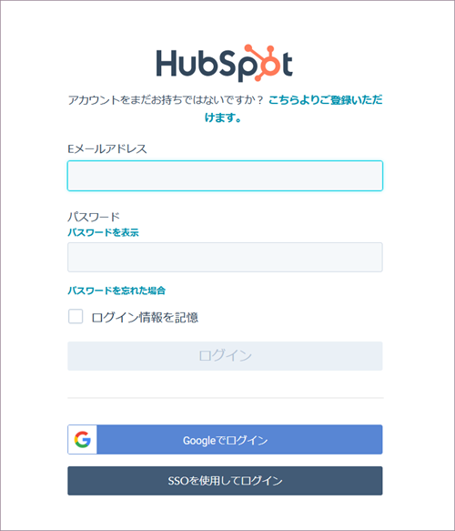
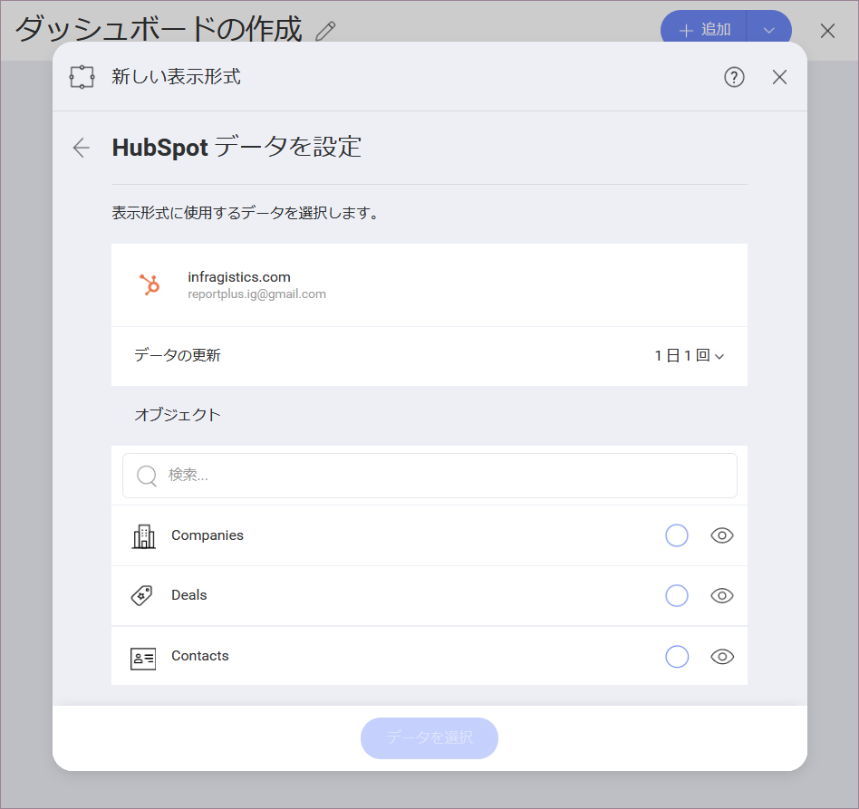

# Hubspot

Hubspot に接続すると、以下のログイン プロンプトが表示されます。

ログイン情報を入力して [ログイン] をクリックします。

認証プロンプトが表示されます。[アクセスを許可] をクリックします。

## データの設定

ログイン後、次のダイアログで Hubspot データを設定できます:

ここには、Hubspot オブジェクトのリストがあります。大きなリストでは、検索を使用して必要なオブジェクトをすばやく見つけます。

>[!NOTE]
>**カレンダー オブジェクト**。
>カレンダー イベント オブジェクトでは、表示形式エディターに進む前に、データをクエリするために _from_ および _to_ (日付) の 2 つのパラメーターを設定する必要があります。

