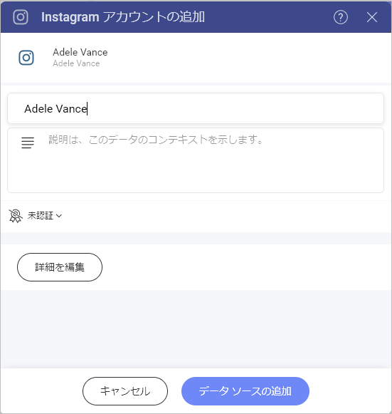
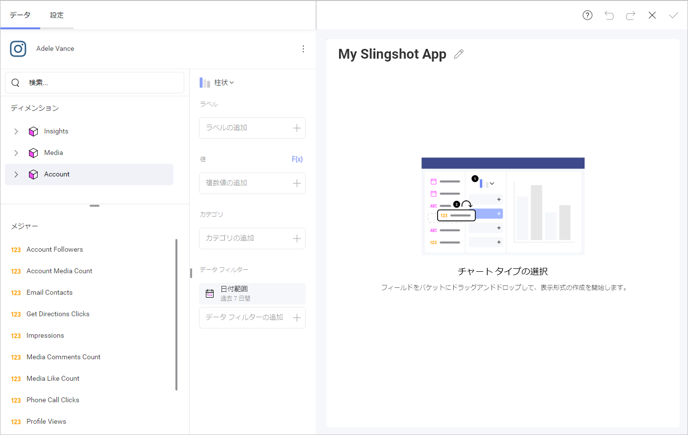
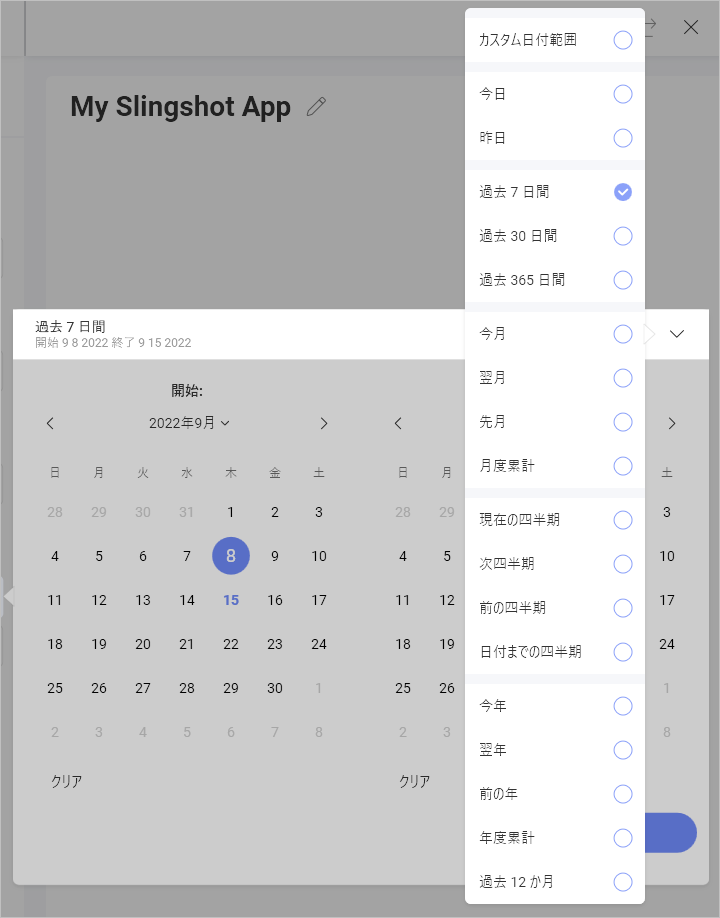
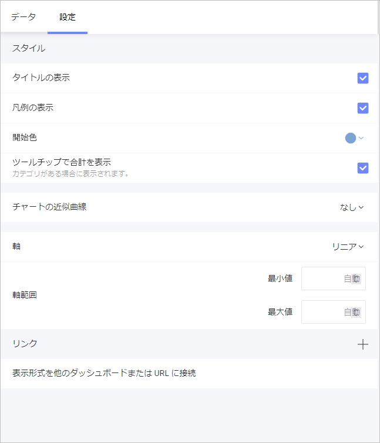
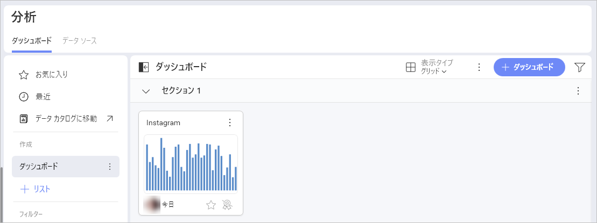

# Instagram

Instagram データ ソースを使用すると、Instagram ビジネス アカウントのデータを Slingshot に接続できます。インサイトに富んだダッシュボードにより、会社のブランド認知度をより的確に把握できます。

## Instagram Business アカウントを Slingshot に接続する

1.	データ ソースとして **Instagram** を選択します。データ ソース リストの **[ソーシャル メディア]** の下にあります。
2.	Instagram ビジネス アカウントにログインします。アカウントを持っていない場合は、[こちら](https://business.instagram.com/getting-started)から、新しいアカウントを作成する方法を確認してください。最初に Facebook ページを Instagram ビジネス アカウントに接続する必要があることに注意してください。[こちら](https://help.instagram.com/399237934150902)をクリックして、より詳細な情報をご覧ください。
3.	ダイアログが開き、データ ソースの名前を変更したり、説明を追加したり、データ ソースが認定されているかどうかを確認したり、詳細を編集したりできます。

4. ダッシュボードに使用するページを選択し、**[データの選択]** をクリックします。

## 表示形式エディターでの作業

データ ソース (この場合は Instagram ビジネス アカウント) を選択 / 追加すると、表示形式エディターでデータを管理できるようになります。

独自のクエリ フィールドに 2 つのセクションが表示されます:

- **ディメンション (ピンク色の側面の立方体アイコンで表示)**: ここで、測定したいデータの属性を見つけることができます。
- **メジャー ([123] アイコンで表示)**: メジャーは数値データで構成されます。たとえば、ウェブサイトのアカウントのフォロワー数を確認できます (ピンク色のアカウント キューブの下)。

## 日付範囲データ フィルター

特定の日付範囲を選択して、データをフィルタリングできます。データ フィルターは削除できませんが、デフォルトの日付範囲 (*過去 7 日間*) は変更できることに注意してください。

日付範囲を変更するには、フィルターをクリックしてから、右上隅の矢印をクリックします。

## 設定

設定メニューから次の項目を調整できます:
- タイトルの表示
- 凡例の表示
- 開始色
- ツールチップで合計を表示
- チャートの近似曲線
- 軸と軸の境界
- 表示形式を他のダッシュボードまたは URL に接続

表示形式エディターの準備ができたら、ダッシュボードを **[分析] > [ダッシュボード]** または特定のワークスペースに保存できます。 

データ ソースの詳細については、[こちら (英語)](https://www.slingshotapp.io/en/help/docs/analytics/datasources/overview)を参照してください。 