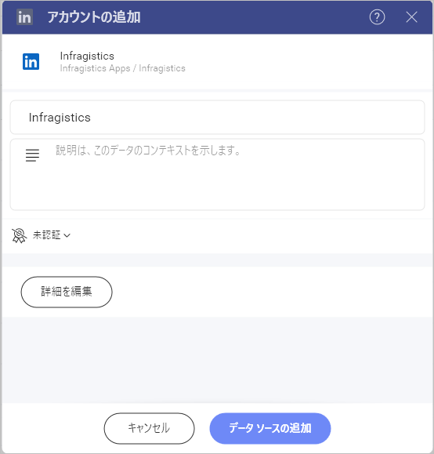
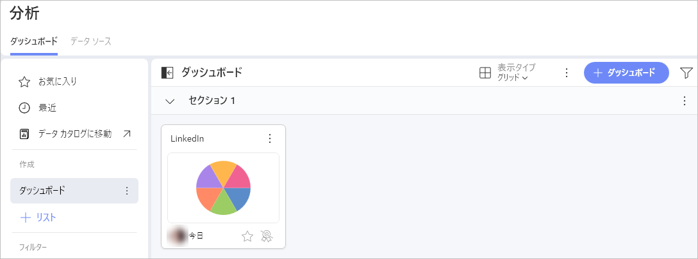

# LinkedIn

LinkedIn データ ソースを使用すると、LinkedIn 広告アカウントを Slingshot に接続できます。プラットフォームでの広告キャンペーンのパフォーマンスをよりよく把握するために、表示形式エディターを使用して洞察に満ちたダッシュボードを作成できます。

## LinkedIn 広告アカウントを Slingshot に接続する

1.	**[分析]** セクションの下にある **[+ ダッシュボードの作成]** ボタンをクリックします。
2.	**[+ データ ソース]** ボタンをクリックします。
3.	**[データ ソース]** リストで **[ソーシャル メディア]** の下にある [LinkedIn] を選択します。
4.	LinkedIn 広告アカウントにログインします。LinkedIn広告アカウントをお持ちでない場合は、[この](https://www.linkedin.com/help/linkedin/answer/a426102/create-an-ad-account?lang=ja)記事で LinkedIn 広告アカウントの作成方法の詳細を確認できます。
5.	別の LinkedIn 広告アカウントを持っている場合は、**[+ 追加]** を選択して別のアカウントを含めることができます。
6.	開いたダイアログで、LinkedIn 広告アカウント名を変更したり、説明を追加したり、ダッシュボードに表示する詳細を選択したりできます。

7. **[データ ソースの追加]** をクリックして、そのアカウントを Slingshot アカウントに接続します。

## 表示形式エディターでの作業

LinkedIn 広告アカウントからの情報でダッシュボードを作成すると、それぞれのフィールドに 2 つのセクションがあることがわかります。   

1.	**ディメンション**: それらはデータの属性です。
2.	**メジャー** ([123] アイコンで表示): メジャーは数値データで構成されます。たとえば、地域ごとのクリック数を確認できます。

## 日付範囲データ フィルター

このフィルターは削除できませんが、日付範囲は変更できます。デフォルトでは、日付フィルターは **[過去 30 日間]** に設定されています。

変更したい場合は、右上隅の矢印をクリックして (下のスクリーンショットを参照)、ドロップダウン メニューから日付範囲を選択するか、最初のオプションをクリックしてカスタムの日付範囲を作成します。

## 設定

使用しているチャートの種類に応じて、設定でさまざまな変更を行うことができます。さまざまなチャート タイプの詳細については、[こちら](https://www.slingshotapp.io/jp/help/docs/analytics/data-visualizations/visualizations-editor)の表示形式セクションを参照してください。

- タイトルを表示または非表示にする
- テキスト フィールド、数値フィールド、日付フィールドを揃える
- フォント サイズ (小、中、大) を選択する
- [総合計の表示] を有効にする
- この表示形式を別のダッシュボードまたは URI に接続します。ダッシュボードをリンクする方法の詳細については、[この](https://www.slingshotapp.io/jp/help/docs/analytics/dashboards/dashboard-linking)記事を確認してください。

表示形式エディターの準備ができたら、ダッシュボードを **[分析] > [ダッシュボード]** または特定のワークスペースに保存できます。

データ ソースの詳細については、[こちら](https://www.slingshotapp.io/jp/help/docs/analytics/datasources/overview)を参照してください。