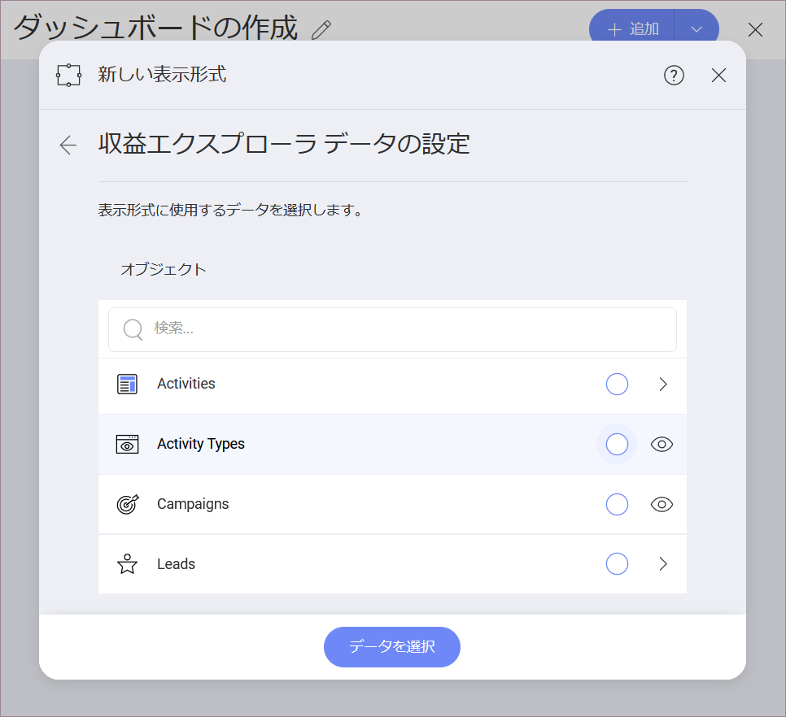

## Marketo 

### Marketo への接続

Marketo の REST API は、2-legged OAuth 2.0 で認証されています。
Reveal で Marketo データ ソース接続を構成するには、次の接続情報を提供する必要があります: 

1. **[URL]** - Marketo 管理パネルにある *ID URL* をここに貼り付けます。
2. **クライアント ID** 
3. **クライアント シークレット**

Marketo の*管理*パネルには、上記の認証要素が含まれています。それらを見つける方法の詳細については、Marketo のドキュメントの[認証 (英語)](https://developers.marketo.com/rest-api/authentication/) に関する記事をご覧ください。

### データの設定

ログイン後、次のダイアログで Marketo データを設定できます:

*Activities* と *Leads* オブジェクトでは、表示形式エディターに進む前に、データを取得するために *from* および *to* (日付) の 2 つのパラメーターを設定する必要があります。日付範囲は、最初日と最後日を含めて 31 日未満である必要があります。

> [!NOTE]
> *アクティビティ*と*リード*のオブジェクトからのデータが表示形式エディターに最初に読み込まれるまで、数分かかる場合があることに注意してください。次回は、同じクエリがより速く実行されます。
