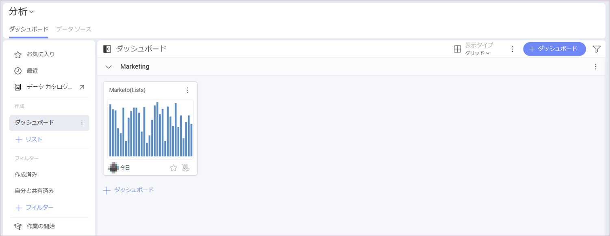

# Marketo 

## Marketo への接続

Marketo の REST API は、2-legged OAuth 2.0 で認証されています。
Reveal で Marketo データ ソース接続を構成するには、次の接続情報を提供する必要があります: 

1. **[URL]** - Marketo 管理パネルにある *ID URL* をここに貼り付けます。
2. **資格情報**:
- **クライアント ID** 
- **クライアント シークレット**

Marketo の*管理*パネルには、上記の認証要素が含まれています。それらを見つける方法の詳細については、Marketo のドキュメントの[認証 (英語)](https://developers.marketo.com/rest-api/authentication/) に関する記事をご覧ください。

## データの設定

ログイン後、次のダイアログで Marketo データを設定できます:

*Activities* と *Leads* オブジェクトでは、**表示形式エディター**に進む前に、データを取得するために *From* および *To* (日付) の 2 つのパラメーターを設定する必要があります。日付範囲は、最初日と最後日を含めて 31 日未満である必要があります。

> [!NOTE]
> **Activities** と **Leads** のオブジェクトからのデータが表示形式エディターに最初に読み込まれるまで、数分かかる場合があることに注意してください。次回は、同じクエリがより速く実行されます。

## Working in the Visualization Editor

Once your data source has been added, you will be taken to the *Visualization Editor*. By default, the *Column* visualization will be selected. You can select it in order to choose another [chart type](https://www.slingshotapp.io/en/help/docs/analytics/visualization-tutorials/overview). Keep in mind that based on the vusialization that you have chosen, you will see different types of fields.

When you are ready with your visualization, you can click/tap on the checkmark in the top right corner to save it as a dashboard. In the example below we saved the dashboard in **My Analytics** > **My Dashboards** > **Marketing**.

