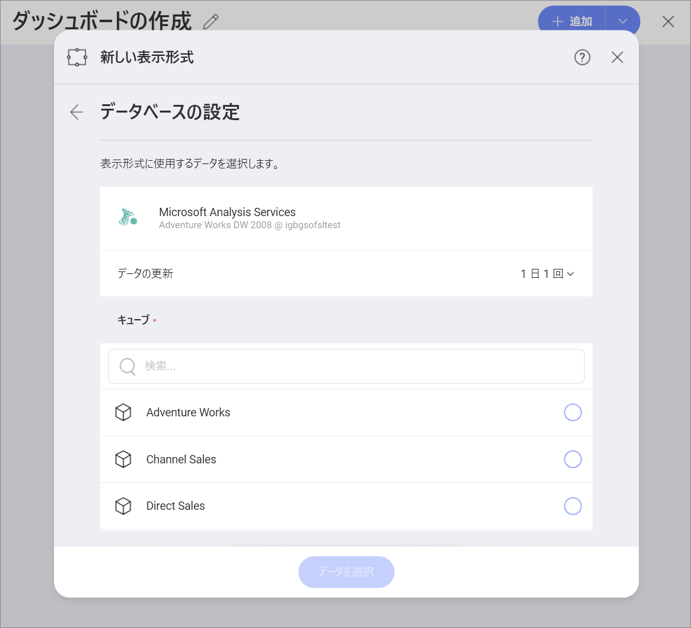

## Microsoft Analysis Services

Microsoft SQL Analysis Services (SSAS) は、Microsoft SQL Server の OLAP (同時に複数のデータベース システムからの情報のオンライン分析処理) およびデータ マイニング ツールです。

>[!NOTE] Microsoft Analysis Services は Reveal の Web バージョンでサポートされていません。

### Microsoft Analysis Services データソースの構成

Microsoft Analysis Services データソースを構成するときにサーバー設定に基づいて使用できるモジュールが 2 つあります - [*Native*](#native) および [*HTTP*](#http)。

Native および HTTP モードの詳細については、[Microsoft Instance Management ヘルプ](https://docs.microsoft.com/en-us/sql/analysis-services/instances/connect-to-analysis-services?view=sql-server-2017)をご覧ください。

#### Native の使用

Microsoft Analysis Services データソースを *Native* モード用に構成するため、以下の情報が必要です。

1. データ ソースの*デフォルト名*: データ ソース名は前のダイアログのアカウントのリストに表示されます。デフォルトでは、Reveal は *Microsoft Analysis Services* という名前を付けます。好みに合わせて変更できます。

2.  **サーバー**: サーバーが実行されているコンピューターのホスト名または IP アドレスです。

    以下の手順で*ホスト名*情報も確認できます。コマンドはサーバー マシンで実行する必要があることに注意してください。

    | WINDOWS                                                                                                         | LINUX                                                                                                         | MAC                                                                  |
    | --------------------------------------------------------------------------------------------------------------- | ------------------------------------------------------------------------------------------------------------- | -------------------------------------------------------------------- |
    | 1\. ファイル エクスプローラーを開きます。                                                                                     | 1\. ターミナルを開きます。                                                                                          | 1\. システム環境設定を開きます。                                         |
    | 2\. [マイ コンピューター] \> [プロパティ] を右クリックします。                                                                   | 2\. **$hostname** を入力します。                                                                                     | 2\. 共有セクションへ移動します。                                 |
    | ホスト名は、*コンピューター名、ドメインおよびワークグループの設定* セクションの下に 「コンピューター名」 として表示されます。 | ホスト名と DNS ドメイン名が表示されます。Reveal には **ホスト名** のみを含めるようにしてください。 | ホスト名は、上部のコンピューター名の下に表示されます。 |

  以下の手順で *IP アドレス*も確認できます。コマンドはサーバー マシンで実行する必要があることに注意してください。

  | WINDOWS                              | LINUX                             | MAC                                                           |
  | ------------------------------------ | --------------------------------- | ------------------------------------------------------------- |
  | 1. コマンド プロンプトを開きます。            | 1. ターミナルを開きます。               | 1. ネットワーク アプリケーションを起動します。                                   |
  | 2. **ipconfig** を入力します。              | 2. **$ /bin/ifconfig** を入力します。    | 2. 接続を選択します。                                    |
  | **IPv4 Address** は IP アドレスです。 | **Inet addr** は IP アドレスです。 | **IP アドレス** フィールドに必要な情報が含まれます。 |

3.  (オプション) の**ポート**: サーバー ポートの詳細。情報が入力されない場合、Reveal はデフォルトでヒント テキスト (2383) のポートに接続します。

4.  **資格情報**: *資格情報*を選択した後、Microsoft Analysis Services の資格情報を入力するか、既存の資格情報 (適用可能な場合) を選択できます。

#### HTTP の使用

Microsoft Analysis Services データソースを *HTTP* モード用に構成するため、以下の情報が必要です。

1.  **データ ソース名**: このフィールドはデータソース リストに表示されます。デフォルト名: *Microsoft Analysis Services*。

2.  **URL**: サーバーの HTTP eService URL。例: *10.1.0.15/olap/msmdpump.dll*。

3.  **資格情報**: Analysis Services サーバーのユーザーアカウントの資格情報。

### データベースの構成

Analysis Services サーバーの資格情報が確認されたら、Reveal はサーバー上のデータベースを読み込んで表示します。

データベースを選択し、*続行*をクリックして設定します。

データベース キューブを選択し、[データの選択] をクリック/タップして、表示形式エディターに進みます。

### 表示形式エディターでの作業

When you create a dashboard using a cube data source like Microsoft Analysis Services, you will see fields organized differently in the  *Visualizations Editor* (see screenshot below). Cube data sources consist of hierarchies and aggregations, which have been created by the cubes' designers in advance.

In the screenshot above, you may notice that there is no "Fields" heading on the left. Instead, there are two sections in their own query field:

1.  **ディメンション** (ピンク色の側面の立方体アイコンで表示): ディメンションは、測定可能なデータを分類するために使用される構造です。ディメンションの要素は、以下の方法で整理できます。

    a.  **階層** - ディメンション内の要素が階層別に編成されている場合、下位レベルの要素から開始して、階層全体または階層の一部を使用できます。たとえば、「国→都道府県→都市」階層で編成された「地理」ディメンションがある場合、この階層の「都道府県→都市」部分のみをドラッグして使用できます。

    b.  **名前付きセット** (フォルダーアイコンで示され、Sets という名前) - 名前を持つ要素の任意のコレクション (Top 50 Customers など)。

    c.  **属性** - 要素は単一レベルの階層で編成されます (「性別」、「婚姻状況」などの要素のグループを含む「人口統計」属性など)。

2.  **メジャー** ([123]アイコンで表示): メジャーは数値データで構成されます。

ディメンションとメジャーの詳細については、[Technet](https://docs.microsoft.com/en-us/previous-versions/sql/sql-server-2012/ms174527\(v=sql.110\)) の記事をご覧ください。

### キャプション設定で並べ替え

またキャプションで並べ替えオプションがあり、フィルターの適用をディメンションのラベルまたは対応する値に設定できます。有効にすると、[キャプションで並べ替え] により、ディメンションがラベルでアルファベット順に並べ替えられます。

有効にするには、行または列でディメンションを選択します。[昇順] または [降順] を選択してフィールドの並べ替えを有効にし、[キャプションで並べ替え] オプションを表示します。

