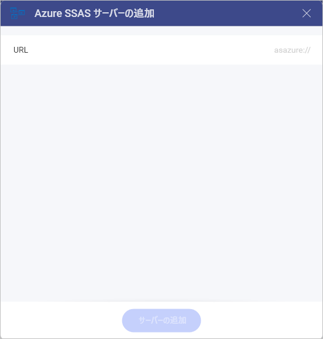
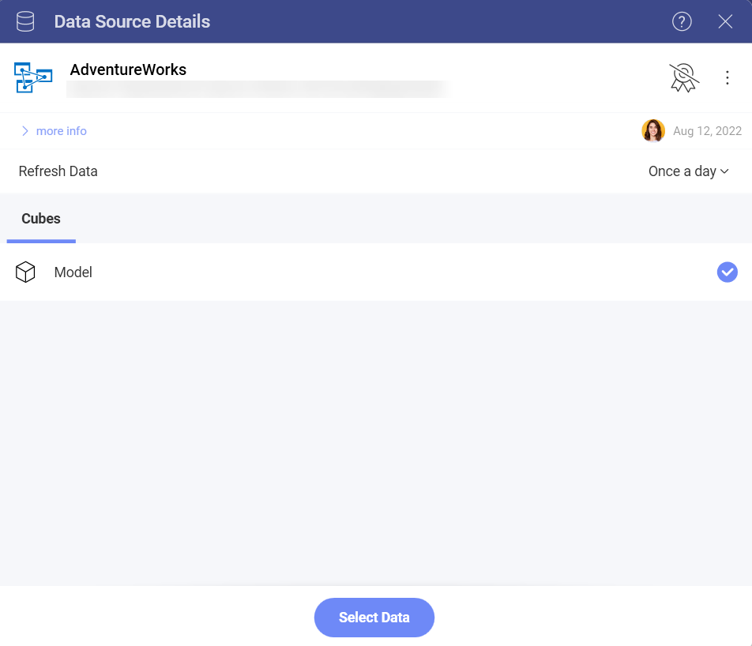
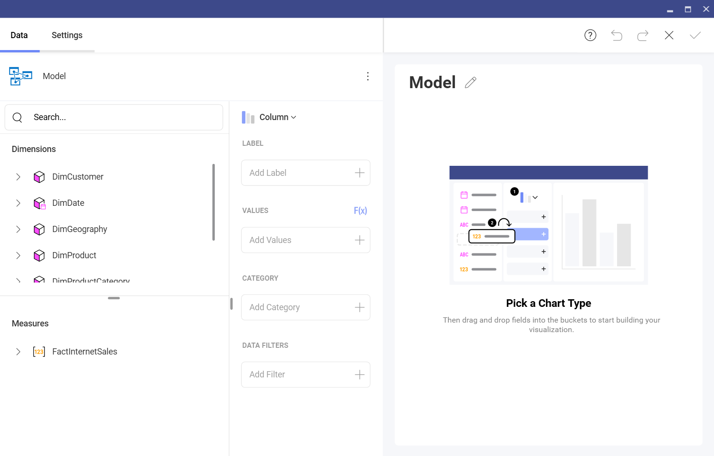
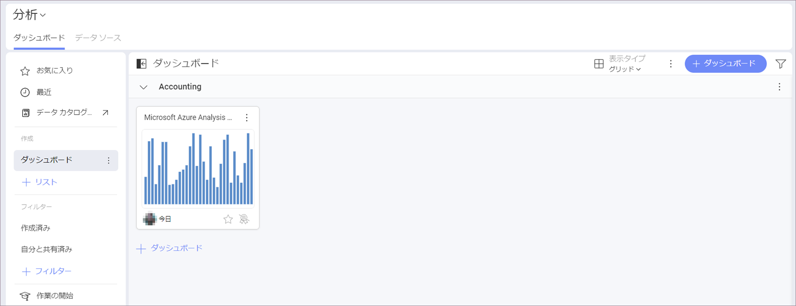

# Microsoft Azure Analysis Services

Azure Analysis Services は、クラウドでエンタープライズ レベルのデータ モデルを提供するサービス (PaaS) としてのフル マネージド プラットフォームです。Reveal の Azure Analysis データ モデルを使用して、ダッシュボードを作成し、データ分析を実行できるようになりました。
## Azure Analysis Services への接続

Reveal で使用される他のデータベース (Microsoft Analysis Services、MySQL、Oracle など) とは異なり、MS Azure Analysis Services は Reveal Web で使用できます。

>[!NOTE]
>**Azure Analysis Services に初めて接続するときの Web の制限**。
>セキュリティ上の制限により、Azure Analysis Services の初期設定と認証のプロセスは、Reveal Web 上では実行できません。最初に、iOS、Android、またはデスクトップ アプリでこのデータ ソースに接続できます。最初の接続後、この Azure Analysis Services のデータを使用してダッシュボードを作成または編集できます。制限はありません。

Azure Analysis Services データ ソースを設定するには、以下の手順を実行する必要があります。

1. Provide the credentials to your Microsoft account (the account associated with the Azure Analysis server).  

2. Provide a **URL** to your server in the **Add Azure SSAS Server** dialog:

    

    要求される _URL_ は、接続するデータ モデルのデータベースを含むサーバーの完全な名前です。Azure ポータルから*サーバー名をコピー*できます。これを行うには、以下にアクセスしてください:

    *Azure portal* (Azure ポータル) ⇒ 選択したサーバー ⇒ *Overview* (概要) ⇒ *Server Name* (サーバー名)

3. Reveal に戻り、サーバー名を *URL* に貼り付けます。Click/tap on the **Add Server** button, which is now enabled.  

4. Once you have added the server, Analytics will load and show the databases on the server. Here you will find a list of all  the available semantic models in your database. Choose a model and click/tap on **Select Data** to continue to the *Visualizations Editor*.

   

## Working in the Visualization editor

 Here you will see the data from your model presented in two categories: 

- *Dimensions* contain qualitative data ("Country", "Name", "Product", etc). 

- *Measures* consist of numeric data. 

By default, the *Column* visualization will be selected. You can click/tap on it in order to choose another chart type from the drop-down menu.

When you are ready with your visualization, you can save it as a dashboard by clicking/tapping on the checkmark in the top right corner. In this case we saved the dashboard in **My Analytics** > **My Dashboards** > **Accounting**.

