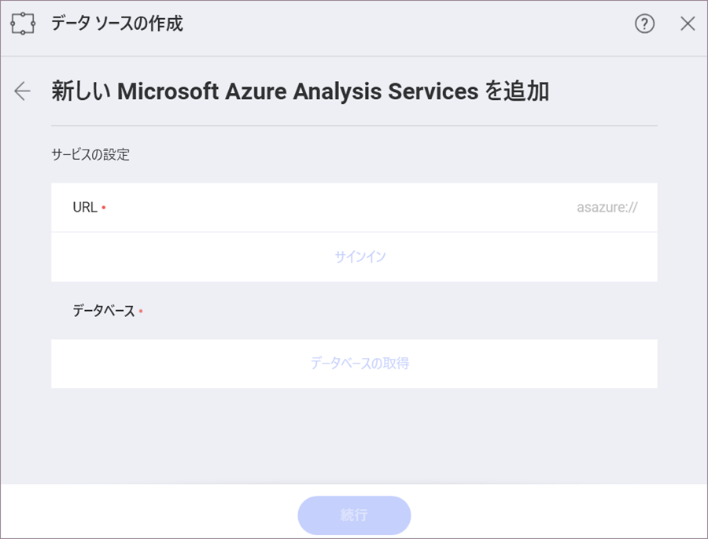

## Microsoft Azure Analysis Services

Azure Analysis Services は、クラウドでエンタープライズ　レベルのデータ モデルを提供するサービス (PaaS) としてのフル マネージド プラットフォームです。Reveal の Azure Analysis データ モデルを使用して、ダッシュボードを作成し、データ分析を実行できるようになりました。

### Azure Analysis Services データソースを設定する

Reveal で使用される他のデータベース (Microsoft Analysis Services、MySQL、Oracle など) とは異なり、MS Azure Analysis Services は Reveal Web で使用できます。

>[!NOTE]
>**Azure Analysis Services に初めて接続するときの Web の制限**。
>セキュリティ上の制限により、Azure Analysis Services の初期設定と認証のプロセスは、Reveal Web 上では実行できません。最初に、iOS、Android、またはデスクトップ アプリでこのデータソースに接続できます。その後、この Azure Analysis Services 接続のデータを使用してダッシュボードを作成または編集できます。制限はありません。

Azure Analysis Services データソースを設定するには、以下の手順を実行する必要があります。

1. [データ ソースの作成] ダイアログでサーバーの URL を指定します:

    

    要求される _URL_ は、接続するデータ モデルのデータベースを含むサーバーの完全な名前です。Azure ポータルから*サーバー名をコピー*できます。これを行うには、以下にアクセスしてください:

    *Azure ポータル* > 選択したサーバー > *概要* > *サーバー名*

2. Reveal に戻り、サーバー名を _URL_ に貼り付けます。有効になっている [サインイン] ボタンをクリックします。  

3. Microsoft アカウント (Azure Analysis サーバーに関連付けられたアカウント) に資格情報を提供します。  

4. データ ソースの作成ダイアログに戻ります (*Step 1* のスクリーンショットを参照してください)。データベースを選択し、[続行] をクリック/タップします。

5. データベースの設定ダイアログには、データベースで利用可能なすべてのセマンティック モデルのリストがあります。モデルを選択し、[データを選択] をクリック/タップします。

表示形式エディターが開きます。ここでは、モデルのデータが 2 つのカテゴリで表示されます: ディメンションとメジャー。

*ディメンション*には定性的なデータ (国、名前、製品など) が含まれています。*メジャー*は数値データで構成されます。
