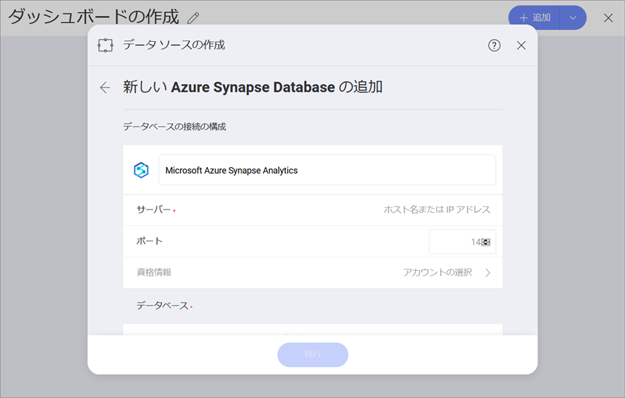

## Microsoft Azure Synapse Analytics

Microsoft Azure Synapse データ ソースは、Reveal 内でビッグ データを処理する際の速度を大幅に向上させます。これにより、大量のデータセットを速度低下することなく表示形式に使用できます。

### Azure Synapse Analytics データソースの設定

Microsoft Azure Synapse Analytics データソースを設定するには、以下の情報が必要です。

1. データソースの **デフォルト名**: データ ソース名は前のダイアログのアカウントのリストに表示されます。デフォルトでは、Reveal は *Microsoft Azure SQL Synapse Analytics* という名前を付けます。好みに合わせて変更できます。
   
2.  **サーバー**: コンピューター名またはサーバーを実行しているコンピューターに割り当てられた IP アドレス。

3.  **ポート**: 該当する場合、サーバー ポートの詳細。情報が入力されない場合、Reveal はデフォルトでヒント テキスト (1433) のポートに接続します。

4.  **資格情報**: 資格情報を選択した後、Microsoft Azure Synapse Analytics の資格情報を入力するか、既存の資格情報 (適用可能な場合) を選択できます。

    準備ができたら、*アカウントの作成*を選択します。[接続テスト] を選択すると、アカウントがデータソースに到達しているかどうかを確認できます。

5.  **データベース**: アカウントに接続すると、データベースを選択できるようになります。*続行*を選択します。

### サーバー情報を見つける方法

以下の手順で サーバーを確認できます。以下の手順で サーバーを確認できます。

| WINDOWS                                                                                                         | LINUX                                                                                                         | MAC                                                                  |
| --------------------------------------------------------------------------------------------------------------- | ------------------------------------------------------------------------------------------------------------- | -------------------------------------------------------------------- |
| 1\. ファイル エクスプローラーを開きます。                                                                                     | 1\. ターミナルを開きます。                                                                                          | 1\. システム環境設定を開きます。                                         |
| 2\. [マイ コンピューター] \> [プロパティ] を右クリックします。                                                                   | 2\. **$hostname** を入力します。                                                                                     | 2\. 共有セクションへ移動します。                                 |
| ホスト名は、*コンピューター名、ドメインおよびワークグループの設定* セクションの下に 「コンピューター名」 として表示されます。 | ホスト名と DNS ドメイン名が表示されます。Reveal には **ホスト名** のみを含めるようにしてください。| ホスト名は、上部のコンピューター名の下に表示されます。|

以下の手順で *IP アドレス*も確認できます。コマンドはサーバーで実行する必要があることに注意してください。

| WINDOWS                              | LINUX                             | MAC                                                           |
| ------------------------------------ | --------------------------------- | ------------------------------------------------------------- |
| 1\. コマンド プロンプトを開きます。           | 1\. ターミナルを開きます。              | 1\. ネットワーク アプリケーションを起動します。                                  |
| 2\. **ipconfig** を入力します。             | 2\. **$/bin/ifconfig** を入力します。   | 2\. 接続を選択します。                                   |
| **IPv4 Address** は IP アドレスです。 | **Inet addr** は IP アドレスです。 | **IP アドレス** フィールドに必要な情報が含まれます。 |

### ビューの作業

MS Azure Synapse Analytics でデータベースに接続すると、表全体または特定のビューからデータを取得することを選択できます。

Azure Synapse Analytics を使用する場合のビューの操作は、MS SQL Server を使用する場合のビューの操作とよく似ています。詳細については、**MS SQL Server データソース** トピックの[このセクション](Microsoft-SQL-Server.md#working-with-views)を参照してください。

### 表示形式エディターでの制限事項

Reveal でビッグ データを操作する場合、数百万のレコードを格納するデータ ソースを処理するために使用される特定のアプローチにより、表示形式エディターにはいくつかの制限があります。

#### 計算フィールドで使用できる関数の制限

現在、Azure Synapse Analytics のデータを使用する*計算フィールド*で、使用できる**関数**の数は限られています。

- [ロジック](~/jp/data-visualizations/fields/logic-calculated-fields.html) - false; true; not。
- [数学](~/jp/data-visualizations/fields/math-calculated-fields.html) - abs; log; log10; sign; sqrt。
- [文字列](~/jp/data-visualizations/fields/string-calculated-fields.html) - find; len; trim; lower; mid; upper。

#### データ ブレンディングの制限

現在、Azure Synapse Analytics データ ソースからのデータを使用する場合、データ ブレンディング ([1 つの表示形式でデータ ソースを組み合わせる](data-blending.html)) は**使用できません**。
