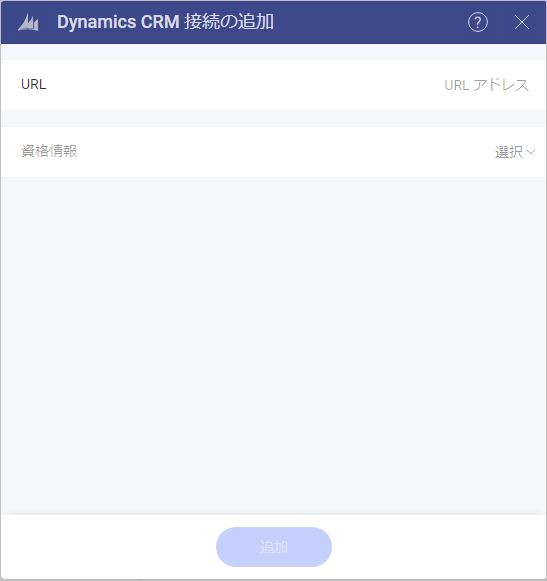
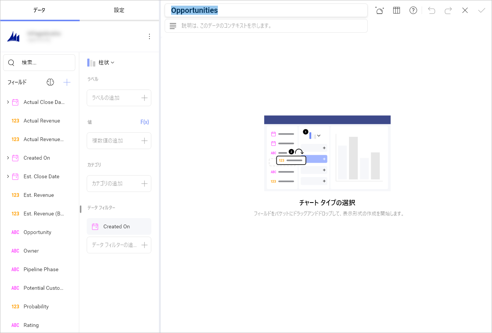

# Microsoft Dynamics CRM

Microsoft Dynamics CRM データ ソースを構成するには、以下の情報が必要です。

1.  データ ソースの**デフォルト名**: データ ソース名は前のダイアログのアカウントのリストに表示されます。デフォルトでは、Reveal は *Microsoft Dynamics CRM* という名前を付けます。好みに合わせて変更できます。

2.  **[URL]**: Dynamics CRM サイトの URL (<http://crm.YourCompany.local> など)。

3.  **[資格情報]**: [資格情報] を選択した後、Microsoft Dynamics CRM サイトの資格情報を入力するか、既存の資格情報 (適用可能な場合) を選択できます。

     - **Username**: the user account for the Dynamics CRM website or the name of the domain.

      - **Password**: the password for the Dynamics CRM website.

      - **Alias**: データ ソース アカウントの名前。以前のダイアログのアカウントのリストに表示されます。

Once ready, select **Add**.

## Setting Up Your Data

After logging in, you can set up your Microsoft Dynamics CRM data in the following dialog:

Here you can choose the Microsoft Dynamics CRM entities you need from:

- Popular Entities - this category allows quick selection between the most used entities among users;
- All Entities- this category displays the full list of entities contained in your Microsoft Dynamics CRM account. You can use the provided search to find quickly the entity you need.

## Working in the Visualization editor

Once you have chosen your entity, you will be taken to the *Visualizations Editor*. Here you can build your dashboard. 

By default, the *Column* visualization will be selected. You can select it in order to choose another chart type.

