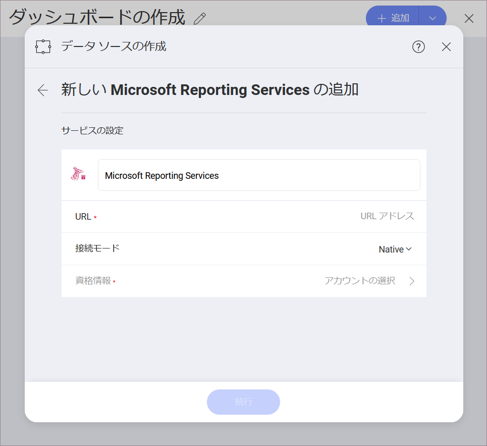

# Microsoft Reporting Services

既存の Microsoft Reporting Services (SSRS) レポートをダッシュボードに PDF ファイルとして埋め込むか、レポートからデータを取得して表示形式を作成して、Reveal で使用できます。

## Microsoft Reporting Services への接続

Microsoft Reporting Services (SSRS) データ ソースを構成するには、以下の情報が必要です。

1.  データ ソースの**デフォルト名**: データ ソース名は前のダイアログのアカウントのリストに表示されます。デフォルトでは、Reveal は *Microsoft Reporting Services* という名前を付けます。好みに合わせて変更できます。

2.  **[URL]**: サーバーの URL。

3.  **[接続モード]**: サーバー設定に基づいて以下のいずれかを選択できます。

      - **Native**: レポート サーバー インスタンスのデフォルト モード。ネイティブ モードでは、レポート サーバーはスタンドアロン アプリケーション サーバーで、レポートとレポート モデルのすべてのビュー、管理、処理、配信を提供します。

      - **Integrated**: SharePoint 統合モードでは、レポート サーバーは SharePoint サーバー ファーム内で実行する必要があります

4.  **[資格情報]**: 新しいダイアログが表示されます。Microsoft Reporting Services サーバーの新しい資格情報を入力、または既存の情報を入力します

## レポートの設定

Microsoft Reporting Services レポートへの接続を構成した後、以下のダイアログが開き、レポートの選択を促されます。

レポートとフォルダーの順序は、Microsoft Reporting Services アカウントの順序とよく似ています。

データに応じて、以下に示すようにレポートの特定の **[パラメーター]** を構成する必要があります。

レポートのパラメーターを選択/入力した後、レポートを*表示形式エディター*に読み込む形式を選択できます。

  - **[PDF として読み込み]** - レポートを PDF 文書として表示形式エディターに埋め込みます。表示形式エディター内で PDF をスクロール、ズーム、ダウンロード、または印刷できます。

  - **[データの読み込み]** - レポートのデータは標準形式で読み込まれ、表示形式を作成するためのフィールドを提供します。

>[!NOTE]
>表示形式エディターでデータ ソースを編集: 読み込み後は変更できないため、レポート形式 (pdf または data) を選択してください。データ ソースを*編集する*場合、レポートのパラメーターの構成のみ変更できます。
