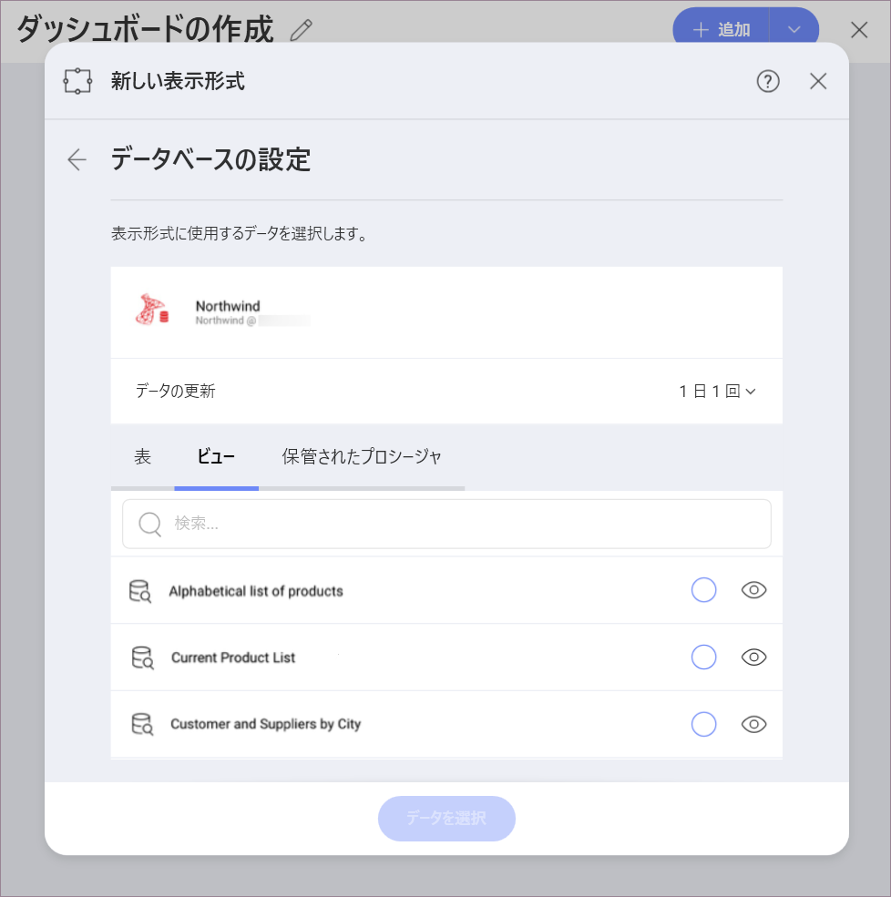
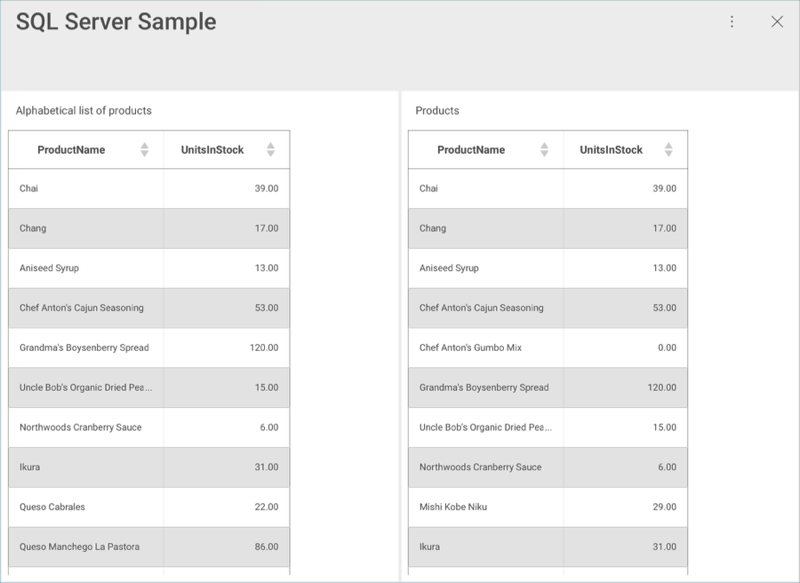
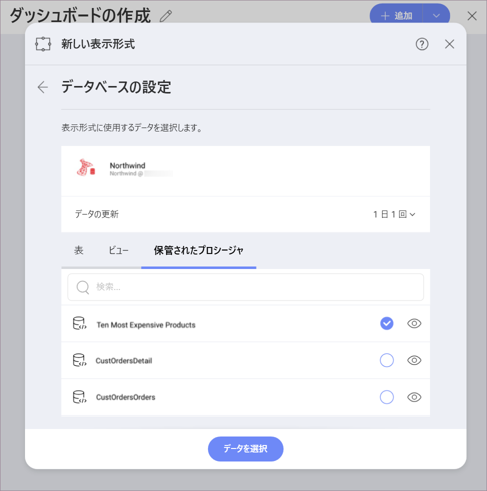
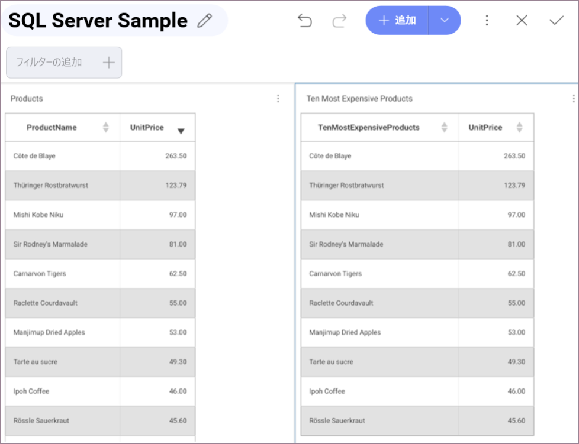

## Microsoft SQL Server

>[!NOTE] 
>**Web の制限**。In the *Reveal Web* app, you can connect only to publicly accessible Microsoft SQL addresses. If your MS SQL address is restricted for the general public (private or hosted in the company's intranet, for example), you can use *Reveal Desktop*, *iOS* or *Android* to connect to it. The device where you're running Reveal needs to have access to the SQL Server address. This limitation does not apply to *Reveal Embedded*.

Microsoft SQL サーバー データ ソースを構成するには、以下の情報が必要です。

1.  データ ソースの**デフォルト名**: データ ソース名は前のダイアログのアカウントのリストに表示されます。デフォルトでは、Reveal は *Microsoft SQL Server* という名前を付けます。好みに合わせて変更できます。

2.  **[[サーバー](#how-to-find-server)]**: コンピューター名またはサーバーを実行しているコンピューターに割り当てられた IP アドレス。

3.  **[ポート]**: 該当する場合、サーバー ポートの詳細。情報が入力されない場合、Reveal はデフォルトでヒント テキスト (1433) のポートに接続します。

4.  **[資格情報]**: [資格情報] を選択した後、Microsoft SQL Server の資格情報を入力するか、既存の資格情報 (適用可能な場合) を選択できます

      - **[名前]**: データ ソース アカウントの名前。以前のダイアログのアカウントのリストに表示されます。

      - (オプション) の **[ドメイン]**: ドメイン名 (適用可能な場合)。

      - **[ユーザー名]**: SQL サーバーのユーザー アカウント

      - **[パスワード]**: SQL サーバーのパスワード

    準備ができたら、**[作成して使用]** を選択します。

### サーバー情報を見つける方法

以下の手順でサーバーの確認ができます。コマンドはサーバーで実行する必要があることに注意してください。

| WINDOWS                                                                                                         | LINUX                                                                                                         | MAC                                                                  |
| --------------------------------------------------------------------------------------------------------------- | ------------------------------------------------------------------------------------------------------------- | -------------------------------------------------------------------- |
| 1\. ファイル エクスプローラーを開きます。                                                                                     | 1\. ターミナルを開きます。                                                                                          | 1\. システム環境設定を開きます。                                         |
| 2\. マイコンピューターを右クリックしてプロパティを表示します。                                                                   | 2\. **$hostname** と入力します。                                                                                   | 2\. 共有セクションに移動します。                                 |
| ホスト名は、[コンピューター名、ドメイン、ワークグループ設定] の下に [コンピューター名] として表示されます。 | [ホスト名] と [DNS ドメイン名] が表示されます。Reveal では**ホスト名**のみを含めることに注意してください。 | [ホスト名] は、上部の [コンピューター名] の下に表示されます。 |

以下の手順で *IP アドレス*も確認できます。コマンドはサーバーで実行する必要があることに注意してください。

| WINDOWS                              | LINUX                             | MAC                                                           |
| ------------------------------------ | --------------------------------- | ------------------------------------------------------------- |
| 1\. コマンド プロンプトを開きます。           | 1\. ターミナルを開きます。              | 1\. ネットワーク アプリケーションを起動します。                                  |
| 2\. **ipconfig** と入力します。             | 2\. **$ /bin/ifconfig** と入力します。   | 2\. 接続を選択します。                                   |
| **IPv4 アドレス** はあなたの IP アドレスです。 | **Inet addr** はあなたの IP アドレスです。 | **IP アドレス** フィールドに必要な情報が提供されます。 |

### ビューの作業

Reveal を使用すると、テーブル全体から SQL Server データを取得できますが、代わりにテーブルまたはテーブルのセットからデータのサブセットを返す、特定の[ビュー](https://docs.microsoft.com/ja-jp/sql/relational-databases/views/views?view=sql-server-2017)を選択することもできます。

上記のサンプルでは、**Alphabetical list of products** ビューに SQL サーバーの **Products** テーブルのデータの一部が含まれています。

ビューおよび MS SQL サーバーの詳細については、[この Web サイト](https://docs.microsoft.com/ja-jp/sql/relational-databases/views/views?view=sql-server-2017)を参照してください。

### 保管されたプロシージャの作業

MS SQL では、保管されたプロシージャを利用することで、特定のパラメーターを使用して、リレーショナル データベースで一連のクエリ ステートメントを実行できます。以下は、[Northwind](https://docs.microsoft.com/ja-jp/dotnet/framework/data/adonet/sql/linq/downloading-sample-databases) データを使用してテスト サーバーで実行されるサンプル 保管されたプロシージャのセットです。

たとえば、この保管されたプロシージャは、**Products** テーブルの製品を、**Unit Price** で並べ替えて返します。  **ProductName** の名前は、**TenMostExpensiveProducts** に変更されました。

この場合、保管されたプロシージャは、**Sales by Year** 情報を表示するための開始日と終了日を設定する必要があります。

ストアドプロシージャおよび MS SQL サーバーの詳細については、[この Web サイト](https://docs.microsoft.com/ja-jp/sql/relational-databases/stored-procedures/stored-procedures-database-engine?view=sql-server-2017)を参照してください。

#### Reveal 保管されたプロシージャの制限

  - 複数の結果セットを返すスト アドプロシージャの場合、最初の結果のみが表示されます。

  - 保管されたプロシージャの[出力パラメーター](https://docs.microsoft.com/ja-jp/sql/connect/jdbc/using-a-stored-procedure-with-output-parameters?view=sql-server-2017)は無視されます。

  - 結果セットを返さない保管されたプロシージャはデータ ソース リストに表示されますが、失敗します。
