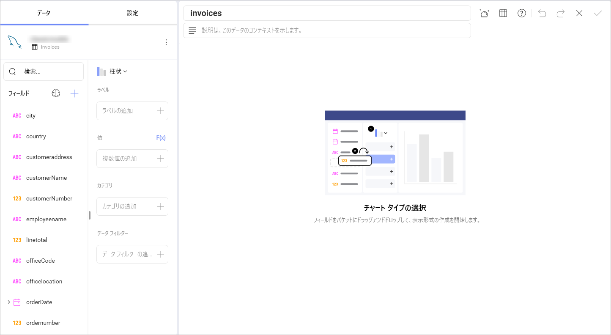

# MySQL

>[!NOTE] 
>**Web の制限**。*Reveal Web* アプリでは、公的にアクセス可能な MySQL アドレスにのみ接続できます。MySQL アドレスが一般公開 (プライベートまたは会社のイントラネットでホストされているなど) に制限されている場合は、*Reveal Desktop*、*iOS*、または *Android* を使用して接続できます。Reveal を実行しているデバイスは、MySQL アドレスにアクセスできる必要があります。この制限は、*Reveal Embedded* には適用されません。

## MySQL への接続

MySQL サーバー データ ソースを構成するには、以下の情報が必要です。

1. **[[サーバー](#how-to-find-server)]**: コンピューター名またはサーバーを実行しているコンピューターに割り当てられた IP アドレス。

2.  **[ポート]**: 該当する場合、サーバー ポートの詳細。情報が入力されない場合、Reveal はデフォルトでヒント テキスト (3306) のポートに接続します。

3.  **[資格情報]**: [資格情報] を選択した後、MySQL サーバーの資格情報を入力するか、既存の資格情報 (適用可能な場合) を選択できます。

      - **[ユーザー名]**: MySQL サーバーのユーザー アカウントまたはドメインの名前。

      - **[パスワード]**: MySQL サーバーのパスワード。

      - **Alias**: the name for your data source account. It will be
        displayed in the list of accounts in the previous dialog.

    Once ready, select **Add** and then **Add Server**.

## サーバー情報を見つける方法

以下の手順でサーバーも確認できます。コマンドはサーバーで実行する必要があることに注意してください。

| WINDOWS                                                                                                         | LINUX                                                                                                         | MAC                                                                  |
| --------------------------------------------------------------------------------------------------------------- | ------------------------------------------------------------------------------------------------------------- | -------------------------------------------------------------------- |
| 1\. ファイル エクスプローラーを開きます。                                                                                     | 1\. ターミナルを開きます                                                                                          | 1\. システム環境設定を開きます                                         |
| 2\. マイコンピューターを右クリックしてプロパティを表示します。                                                                   | 2\. **$hostname** と入力します。                                                                                     | 2\. 共有セクションに移動します。                                 |
| ホスト名は、[コンピューター名、ドメイン、ワークグループ設定] の下に [コンピューター名] として表示されます。 | [ホスト名] と [DNS ドメイン名] が表示されます。Reveal では**ホスト名**のみを含めることに注意してください。 | [ホスト名] は、上部の [コンピューター名] の下に表示されます |

以下の手順で *IP アドレス*も確認できます。コマンドはサーバーで実行する必要があることに注意してください。

| WINDOWS                              | LINUX                             | MAC                                                           |
| ------------------------------------ | --------------------------------- | ------------------------------------------------------------- |
| 1\. コマンド プロンプトを開きます。           | 1\. ターミナルを開きます。              | 1\. ネットワーク アプリケーションを起動します。                                  |
| 2\. **ipconfig** と入力します。             | 2\. **$ /bin/ifconfig** と入力します。   | 2\. 接続を選択します。                                   |
| **IPv4 アドレス** はあなたの IP アドレスです。 | **Inet addr** はあなたの IP アドレスです。 | **IP アドレス** フィールドに必要な情報が提供されます。 |

## データの設定

Reveal ではすべてのテーブルから MySQL データを取得できますが、その他にもテーブルまたはテーブルのセットからデータのサブセットを返す特定のビューを選択することもできます。

In the sample above, the **invoices** view contains a modified version
of the data in the **products**,**customers**, **orderdetails** and **orders** tables in the MySQL server.

For more information on views and MySQL, visit [this documentation page](https://dev.mysql.com/doc/refman/8.0/en/views.html).

## Working in the Visualization editor

Once you have chosen your table or view, you will be taken to the *Visualizations Editor*. Here you can build your dashboard. By default, the *Column* visualization will be selected. You can select it in order to choose another chart type.

When you are ready with the visualization editor, you can save the dashboard in **My Analytics** > **My Dashboards** or in a specific workspace. 

