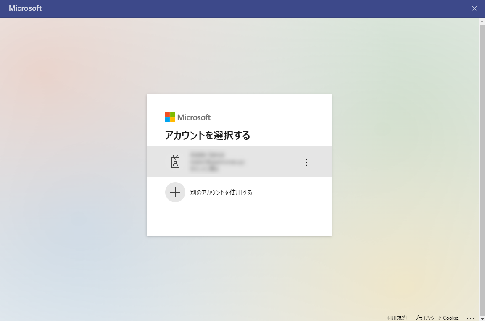
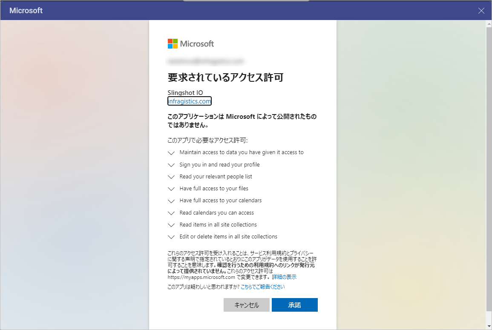

# OneDrive

Office365 アカウントでサインインしている場合、OneDrive が自動的にデータ ソースに追加されます。

OneDrive データを使用するには、以下の手順を実行します:

1. Upon selecting your OneDrive, you will be prompt to enter your **account and password** for Microsoft. Once you have entered the crendetials, select **Sign in**.

  

2. By clicking *Continue*, you will be redirected to an *authorization prompt*. Click/tap on **Accept** to continue.

  

Reveal にデータの使用を許可した後、*OneDrive* ファイルを使用して表示形式を作成できます。

## サポートされるファイル

Reveal では、広範な種類のファイルを使用できます。

  - **スプレッドシート**: Excel (.xls、.xlsx) または CSV (Reveal 内で動的に使用できます)。

  - **その他のファイル**: プレビューモードのみで表示されます (画像および PDF やテキストなどのドキュメント ファイルを含む)。
