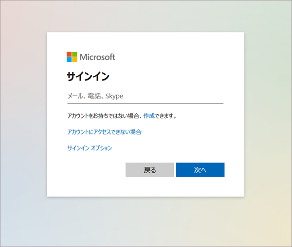
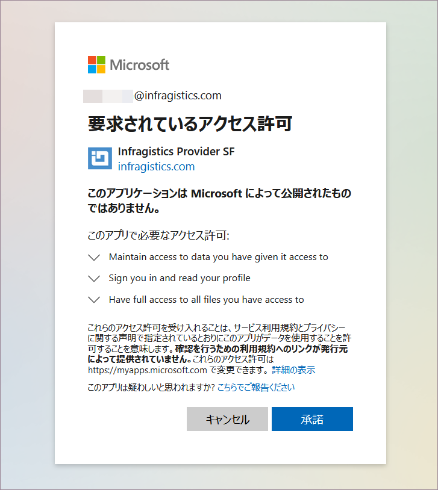

## OneDrive

Office365 アカウントでサインインしている場合、OneDrive が自動的にデータソースに追加されます。

OneDrive データを使用するには、以下の手順を実行します。

1.  OneDrive を選択すると、以下のログイン プロンプトが表示されます。

    

    **アカウント名とパスワード**を入力し、[サインイン] をクリックします。

2.  OneDrive データを使用するには、Reveal に**制限付きのアクセス許可**を与える必要があることが通知されます。

    

[承認] を選択して、OneDrive ファイルの使用 (読み取りとアクセスの維持) を Reveal に許可します。

OneDrive データを使用して表示形式を作成できます。以降、これらのアクセス許可は要求されません。

### サポートされるファイル

Reveal では、広範な種類のファイルを使用できます。

  - **スプレッドシート**: Excel (.xls, .xlsx) または CSV (Reveal 内で動的に使用できます)。

  - **その他のファイル**: プレビューモードのみで表示されます (画像および PDF やテキストなどのドキュメント ファイルを含む)。
