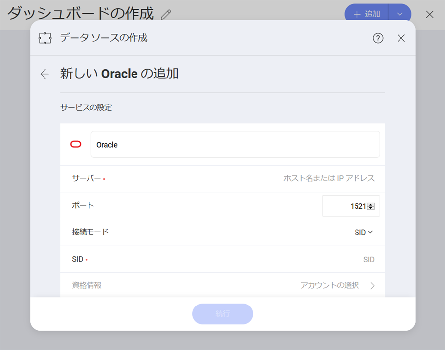
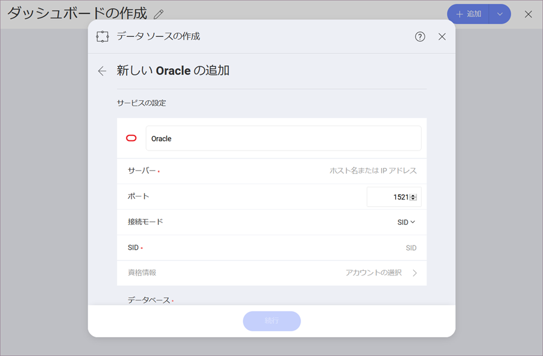
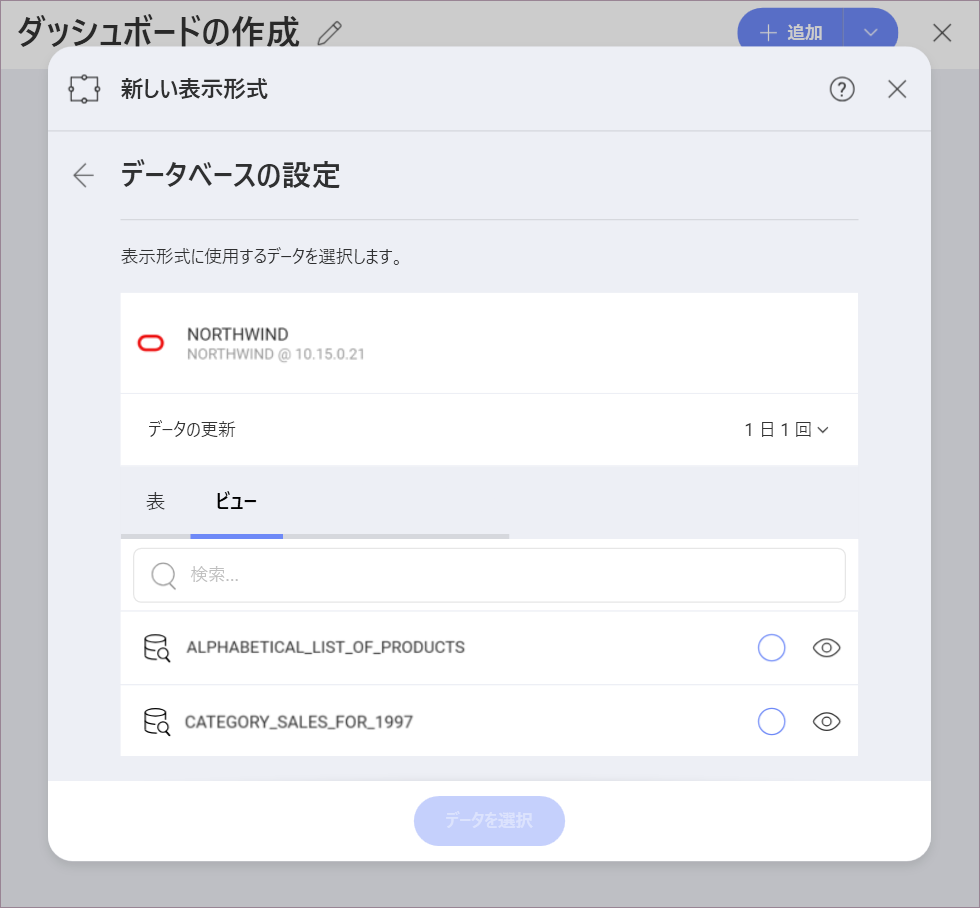
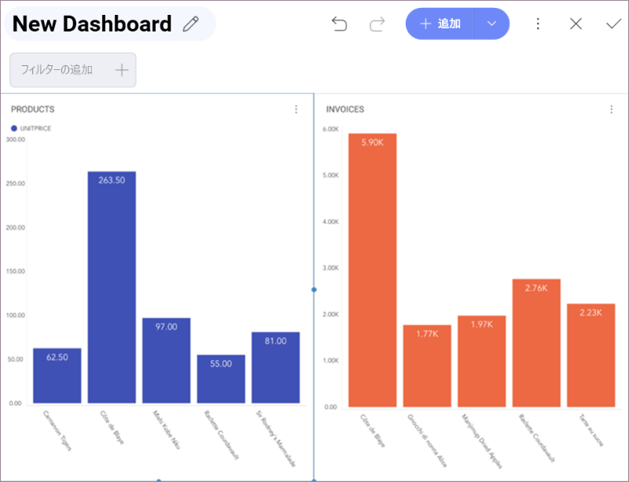

## Oracle

>[!NOTE] Oracle は Reveal の Web バージョンでサポートされていません。

サーバー データベースの設定に基づいて Oracle に接続するための 2 つのモジュールがあります。

  - [**SID の使用**](#using-sid): Oracle データベース インスタンスの一意の名前。

  - [**サービスの使用**](#using-service): データベース インスタンスへ接続するときに使用されるエイリアス。

### SID の使用

SID を使用して Orable を構成するには、以下の情報が必要です。

1. 1. データソースの**デフォルト名**: データソース名は前のダイアログのアカウントのリストに表示されます。デフォルトでは、Reveal は *Oracle* という名前を付けます。好みに合わせて変更できます。

1.  [**サーバー**](#how-to-find-server): コンピューター名またはサーバーを実行しているコンピューターに割り当てられた IP アドレス。

2.  **ポート**: 該当する場合、サーバー ポートの詳細。情報が入力されない場合、Reveal はデフォルトでヒント テキスト (1521) のポートに接続します。

3.  **接続モード**: SID。

4.  **SID**: Oracle データベース インスタンスの一意の名前。デフォルトでは、Oracle の SID は orcl です。SID を見つけるには、サーバー マネージャーにログインし select instance from v$thread と入力します。これは ORACLE\_SID を返します。

5.  **資格情報**: *資格情報*を選択した後、Oracle サーバーの資格情報を入力するか、既存の資格情報 (適用可能な場合) を選択できます。

     - **名前**: データソース アカウントの名前 (デフォルトは *Oracle*)。以前のダイアログのアカウントのリストに表示されます。

      - (オプション) の **ドメイン**: ドメイン名 (適用可能な場合)。

      - **ユーザー名**: Oracle サーバーのユーザー アカウント

      - **パスワード**: Oracle サーバーのパスワード

    準備ができたら、**アカウントの作成**を選択します。**[接続テスト]** を選択すると、アカウントがデータソースに到達しているかどうかを確認できます。

### サービスの使用

サービスを使用して Oracle を構成するには、以下の情報が必要です。

1.  **データソース名**: このフィールドはデータソース リストに表示されます。

2.  [**サーバー**](#how-to-find-server): コンピューター名またはサーバーを実行しているコンピューターに割り当てられた IP アドレス。

3.  **ポート**: 該当する場合、サーバー ポートの詳細。情報が入力されない場合、Reveal はデフォルトでヒント テキスト (1521) のポートに接続します。

4.  **接続モード**: サービス。

5.  **サービス名**: データベース インスタンスへ接続するときに使用されるエイリアス。サービスを見つけるには、サーバー マネージャーへログインし、dual から select sys\_context('userenv’);,  'service\_name’) を実行します。これは Service\_name を返します。

6.  **資格情報**: *資格情報*を選択した後、Oracle サーバーの資格情報を入力するか、既存の資格情報 (適用可能な場合) を選択できます。

      - **名前**: データソース アカウントの名前 (デフォルトは _Oracle_)。以前のダイアログのアカウントのリストに表示されます。

      - (オプション) の **ドメイン**: ドメイン名 (適用可能な場合)。

      - **ユーザー名**: Oracle サーバーのユーザー アカウント

      - **パスワード**: Oracle サーバーのパスワード

    準備ができたら、**作成と使用**を選択します。

### サーバー情報を見つける方法

以下の手順でサーバーも確認できます。コマンドはサーバーで実行する必要があることに注意してください。

| WINDOWS                                                                                                         | LINUX                                                                                                         | MAC                                                                  |
| --------------------------------------------------------------------------------------------------------------- | ------------------------------------------------------------------------------------------------------------- | -------------------------------------------------------------------- |
| 1\. ファイル エクスプローラーを開きます。                                                                                     | 1\. ターミナルを開きます。                                                                                          | 1\. システム環境設定を開きます。                                        |
| 2\. [マイ コンピューター] \> [プロパティ] を右クリックします。                                                                   | 2\. **$hostname** を入力します。                                                                                     | 2\. 共有セクションに移動します。                                 |
| ホスト名は、*コンピューター名、ドメインおよびワークグループの設定* セクションの下に「コンピューター名」として表示されます。| ホスト名と DNS ドメイン名が表示されます。Reveal には **ホスト名** のみを含めるようにしてください。| ホスト名は、上部のコンピューター名の下に表示されます。|

以下の手順で *IP アドレス*も確認できます。コマンドはサーバーで実行する必要があることに注意してください。

| WINDOWS                              | LINUX                             | MAC                                                           |
| ------------------------------------ | --------------------------------- | ------------------------------------------------------------- |
| 1. コマンド プロンプトを開きます。            | 1. ターミナルを開きます。               | 1. ネットワーク アプリケーションを起動します。                                  |
| 2. **ipconfig** を入力します。              | 2. **$ /bin/ifconfig** を入力します。    | 2. 接続を選択します。                                    |
| **IPv4 Address** は IP アドレスです。 | **Inet addr** は IP アドレスです。| **IP アドレス** フィールドに必要な情報が含まれます。|

### ビューの作業

Reveal を使用すると、すべてのテーブルから Oracle データを取得できますが、その他にもテーブルまたはテーブルのセットからデータのサブセットを返す特定の[ビュー](https://docs.oracle.com/cd/B19306_01/server.102/b14220/objects.htm#i440066)を選択することもできます。

たとえば、**請求書**ビューには、データベース内のテーブルから取得した営業予測に関する情報が含まれています。

ビューおよび Oracle の詳細については、[このドキュメント Web サイト](https://docs.oracle.com/cd/B19306_01/server.102/b14220/objects.htm#i440066)を参照してください。
