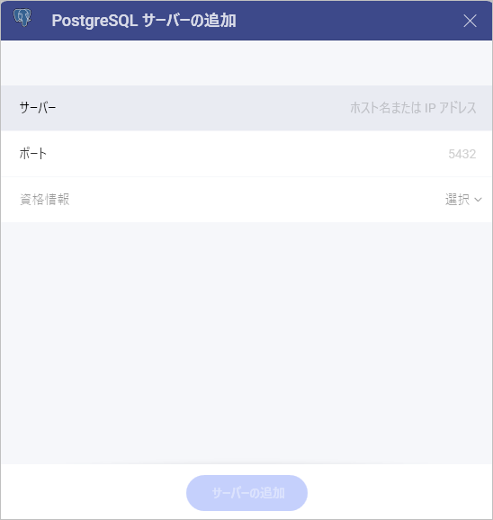
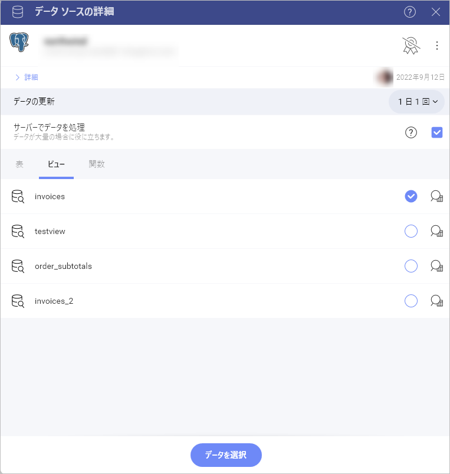
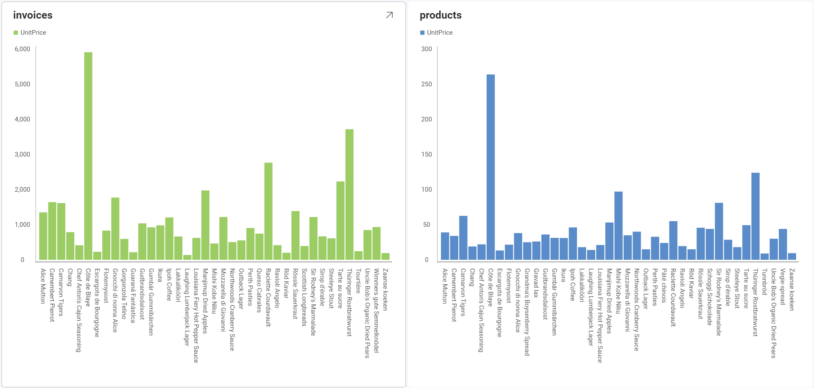
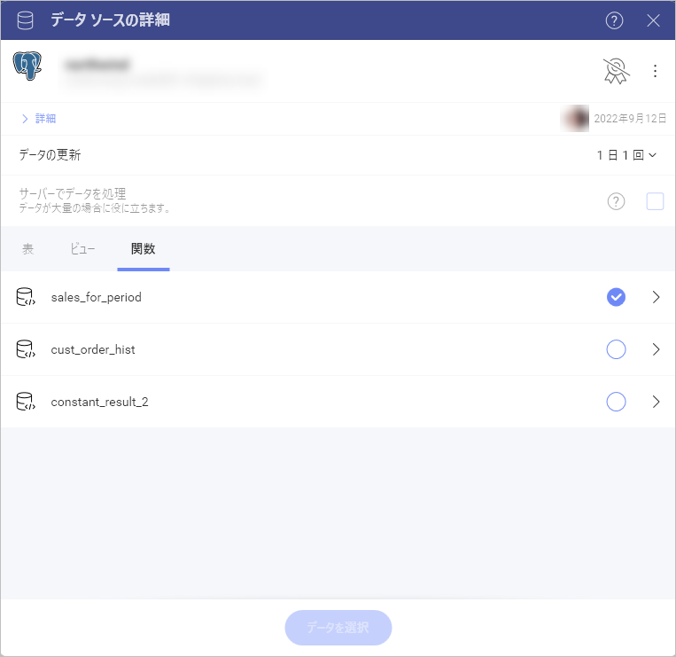
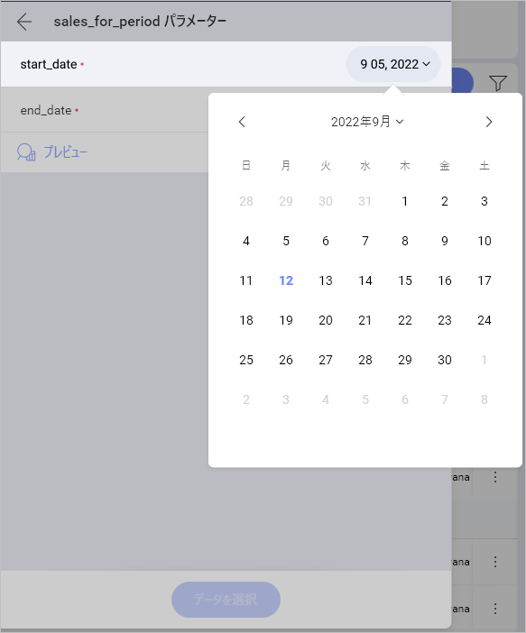

# PostgreSQL

>[!NOTE] 
>**Web の制限**。*Reveal Web* アプリでは、公的にアクセス可能な PostgreSQL アドレスにのみ接続できます。PostgreSQL アドレスが一般公開 (プライベートまたは会社のイントラネットでホストされているなど) に制限されている場合は、*Reveal Desktop*、*iOS*、または *Android* を使用して接続できます。Reveal を実行しているデバイスは、PostgreSQL アドレスにアクセスできる必要があります。この制限は、*Reveal Embedded* には適用されません。

## PostgreSQL への接続

PostgreSQL サーバー データ ソースを設定するには、以下の情報が必要です。

1.  **[[サーバー](#how-to-find-server)]**: コンピューター名またはサーバーを実行しているコンピューターに割り当てられた IP アドレス。

2.  **[ポート]**: 該当する場合、サーバー ポートの詳細。情報が入力されない場合、Reveal はデフォルトでヒント テキスト (5432) のポートに接続します。

3.  **[資格情報]**: [資格情報] を選択した後、PostgreSQL の資格情報を入力するか、既存の資格情報 (適用可能な場合) を選択できます。

      - **ユーザー名** または **ドメイン**: PostgreSQL サーバーのユーザー アカウントの名前またはドメインの名前。

      - **[パスワード]**:  PostgreSQL サーバーにアクセスするためのパスワード。

      - **エイリアス**: データ ソース アカウントの名前。

 準備ができたら、**[サーバーの追加]** を選択します。

## サーバー情報を見つける方法

以下の手順でサーバーも確認できます。コマンドはサーバーで実行する必要があることに注意してください。

| WINDOWS                                                                                                         | LINUX                                                                                                         | MAC                                                                  |
| --------------------------------------------------------------------------------------------------------------- | ------------------------------------------------------------------------------------------------------------- | -------------------------------------------------------------------- |
| 1\. ファイル エクスプローラーを開きます。                                                                                     | 1\. ターミナルを開きます。                                                                                          | 1\. システム環境設定を開きます。                                         |
| 2\. [マイ コンピューター] → [プロパティ] を右クリックします。                                                                   | 2\. **$hostname** を入力します。                                                                                     | 2\. 共有セクションに移動します。                                 |
| ホスト名は、[コンピューター名、ドメインおよびワークグループの設定] セクションの下に [コンピューター名] として表示されます。| [ホスト名] と [DNS ドメイン名] が表示されます。Reveal には**ホスト名**のみを含めるようにしてください。| [ホスト名] は、上部の [コンピューター名] の下に表示されます。|

以下の手順で *IP アドレス*を確認できます。コマンドはサーバーで実行する必要があることに注意してください。

| WINDOWS                              | LINUX                             | MAC                                                           |
| ------------------------------------ | --------------------------------- | ------------------------------------------------------------- |
| 1\. コマンド プロンプトを開きます。           | 1\. ターミナルを開きます。              | 1\. ネットワーク アプリケーションを起動します。                                  |
| 2\. **ipconfig** を入力します。             | 2\. **$ /bin/ifconfig** を入力します。   | 2\. 接続を選択します。                                   |
| **IPv4 Address** は IP アドレスです。 | **Inet addr** は IP アドレスです。 | **IP アドレス** フィールドに必要な情報が含まれます。 |

## データの設定
### ビューの作業

Reveal を使用すると、テーブル全体から PostgreSQL データを取得できるだけでなく、テーブルまたはテーブルのセットからデータのサブセットを返す特定の [ビュー](https://www.postgresqltutorial.com/postgresql-views/) を選択することもできます。

上記のサンプルの**請求書**ビューには、PostgreSQL サーバーの **Products** テーブルにあるデータの変更バージョンが含まれています。

ビューと PostgreSQL の詳細については、[このウェブサイト (英語)](https://www.postgresql.org/docs/10/tutorial-views.html) をご覧ください。

### 関数の使用

PostgreSQL 関数を使用すると、データベース内の単一の関数で、通常は複数のクエリとラウンド トリップを必要とする操作を実行できます。

以下は、[Northwind](https://docs.microsoft.com/ja-jp/dotnet/framework/data/adonet/sql/linq/downloading-sample-databases) データを使用してテスト サーバーで実行されるサンプル関数のセットです:

関数を選択した後、いくつかの追加パラメーターを設定する必要があります。

この場合、関数は、Sales for period の情報を表示するために開始日と終了日を設定する必要があります。

関数と PostgreSQLの 詳細については、この [Web サイト (英語)](https://www.postgresql.org/docs/9.0/sql-createfunction.html) にアクセスしてください。

## Reveal の関数の制限

* 関数の出力パラメーターは無視されます。
* 結果セットを返さない関数は、データ ソース リストにリストされますが、失敗します。
