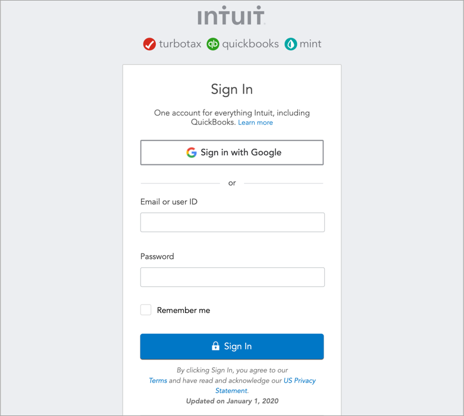
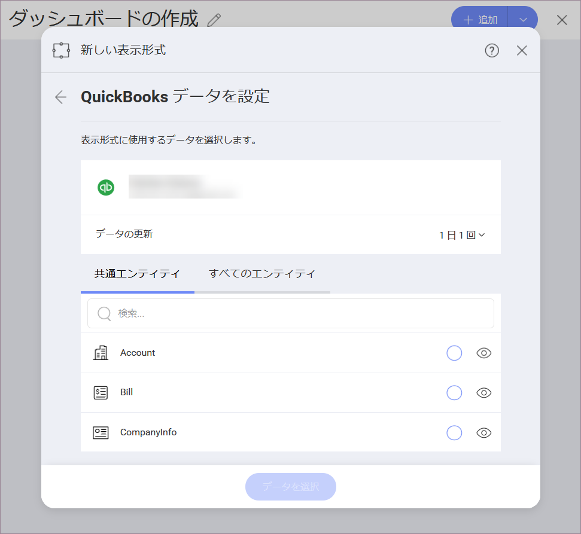

# Quickbooks

Quickbooks に接続すると、次のログイン プロンプトが表示されます:

ログイン情報を入力するか、[Sign in with Google] (Googleでサインイン) を選択して、[Sign in] (サインイン) をクリックします。

ID 認証が有効な場合は、送信された*確認コード*を入力するプロンプトが表示されます。

## データの設定

ログイン後、次のダイアログで Quickbooks データを設定できます:

ここで、必要な Quickbooks エンティティを選択できます。

- **[共通エンティティ]** - このカテゴリでは、ユーザーが最もよく使用するエンティティをすばやく選択できます。
- **[すべてのエンティティ]** - このカテゴリには、Quickbooks アカウントに含まれるエンティティの完全なリストが表示されます。提供されている検索を使用して、必要なエンティティをすばやく見つけることができます。
