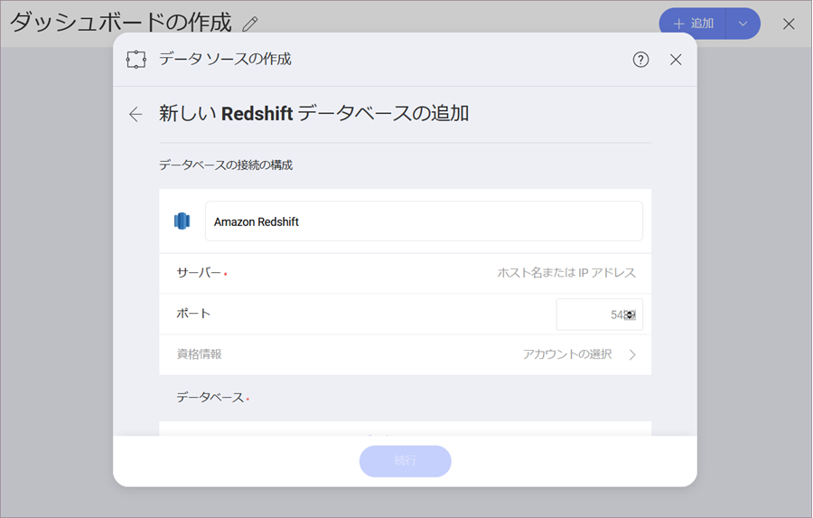
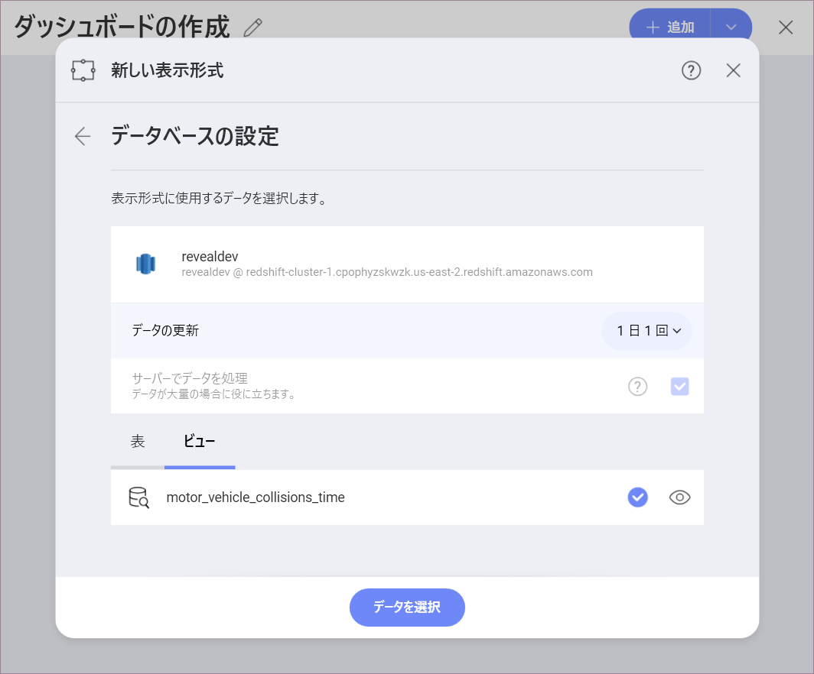
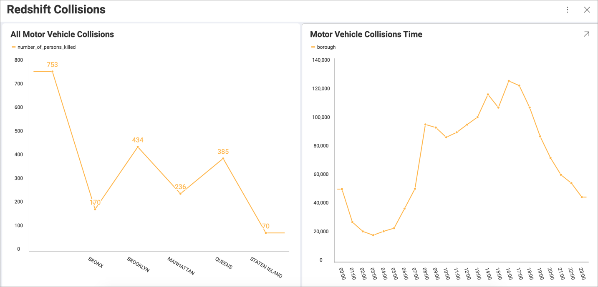

# Amazon Redshift

## Amazon Redshift への接続
Amazon Redshift のデータ ソースを設定するには、以下の情報が必要です:

1.  データ ソースの **デフォルト名**: データ ソース名は前のダイアログのアカウントのリストに表示されます。デフォルトでは、Reveal は *Amazon Redshift* という名前を付けます。好みに合わせて変更できます。 

2.  **[[サーバー](#how-to-find-server)]**: コンピューター名またはサーバーを実行しているコンピューターに割り当てられた IP アドレス。

3.  **[Port]**: 該当する場合、サーバー ポートの詳細。情報が入力されない場合、Reveal はデフォルトでヒント テキスト (5432) のポートに接続します。

4.  **[資格情報]**: *資格情報*を選択した後、*Redshift* サーバーの資格情報を入力するか、既存の資格情報 (利用可能な場合) を選択できます。
    
    

      - **[名前]**: データ ソース アカウントの名前。以前のダイアログのアカウントのリストに表示されます。
        

      - (オプション) の **[ドメイン]**:  ドメイン名 (該当する場合)。

      - **[ユーザー名]**:  *Redshift*サーバーのユーザーアカウント。

      - **[パスワード]**:  *Redshift*サーバーにアクセスするためのパスワード。

## サーバー情報を見つける方法

以下の手順でサーバーも確認できます。コマンドはサーバーで実行する必要があることに注意してください。

| WINDOWS                                                                                                         | LINUX                                                                                                         | MAC                                                                  |
| --------------------------------------------------------------------------------------------------------------- | ------------------------------------------------------------------------------------------------------------- | -------------------------------------------------------------------- |
| 1\. ファイル エクスプローラーを開きます。                                                                                     | 1\. ターミナルを開きます。                                                                                          | 1\. システム環境設定を開きます。                                         |
| 2\. [マイ コンピューター] → [プロパティ] を右クリックします。                                                                   | 2\. **$hostname** を入力します。                                                                                     | 2\. 共有セクションに移動します。                                 |
| ホスト名は、[コンピューター名、ドメインおよびワークグループの設定] セクションの下に [コンピューター名] として表示されます。 | [ホスト名] と [DNS ドメイン名] が表示されます。Reveal には**ホスト名**のみを含めるようにしてください。| [ホスト名] は、上部の [コンピューター名] の下に表示されます。 |

以下の手順で *IP アドレス*も確認できます。コマンドはサーバーで実行する必要があることに注意してください。

| WINDOWS                              | LINUX                             | MAC                                                           |
| ------------------------------------ | --------------------------------- | ------------------------------------------------------------- |
| 1\. コマンド プロンプトを開きます。           | 1\. ターミナルを開きます。              | 1\. ネットワーク アプリケーションを起動します。                                  |
| 2\. **ipconfig** を入力します。             | 2\. **$ /bin/ifconfig** を入力します。   | 2\. 接続を選択します。                                   |
| **IPv4 Address** は IP アドレスです。 | **Inet addr** は IP アドレスです。 | **IP アドレス** フィールドに必要な情報が含まれます。 |

## データの設定

Reveal ではすべてのテーブルから *Redshift* データを取得できますが、その他にもテーブルまたはテーブルのセットからデータのサブセットを返す特定の[ビュー](https://docs.aws.amazon.com/redshift/latest/dg/r_CREATE_VIEW.html)を選択することもできます。

上記のスクリーンショットの **motor_vehicle_collisions_time** ビューには、Redshift サーバーの **motor_vehicle_collisions** テーブルにあるデータの変更バージョンが含まれています。 
以下のスクリーンショットでは、左側の表示形式はテーブルのデータを使用して構築され、右側の表示形式はビューに含まれるデータを使用しています。 

