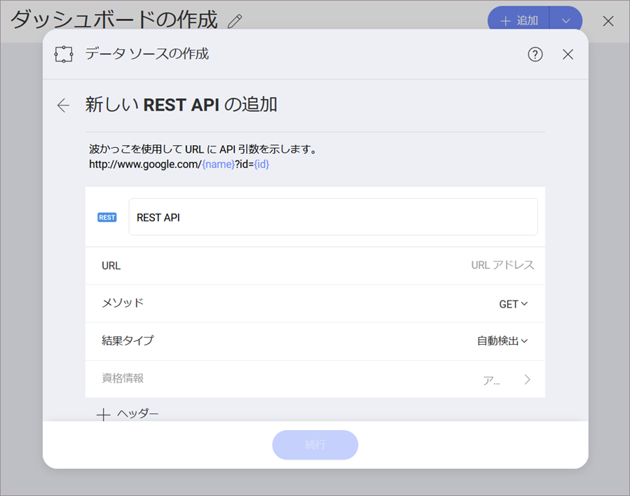
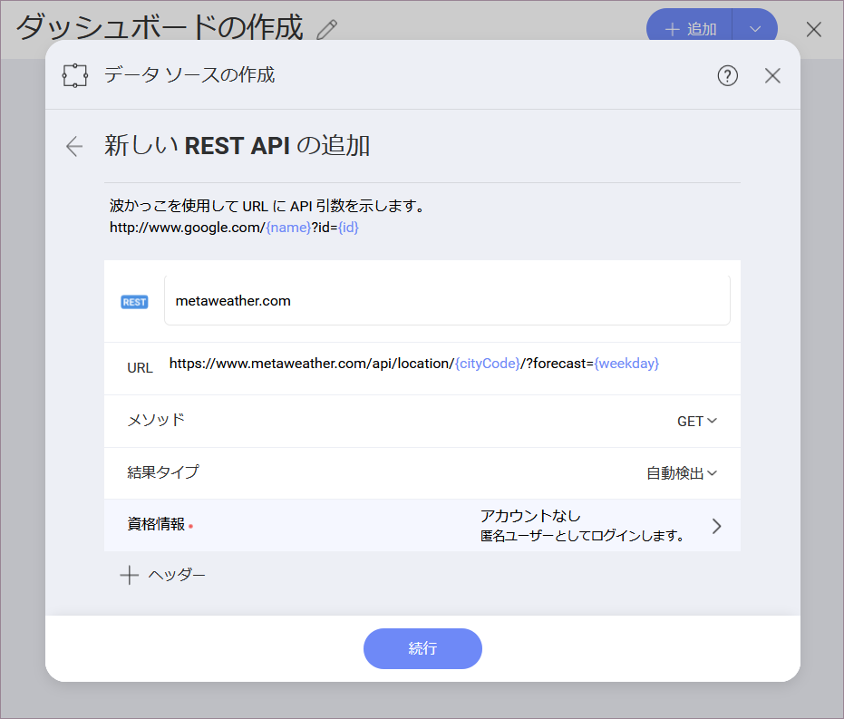
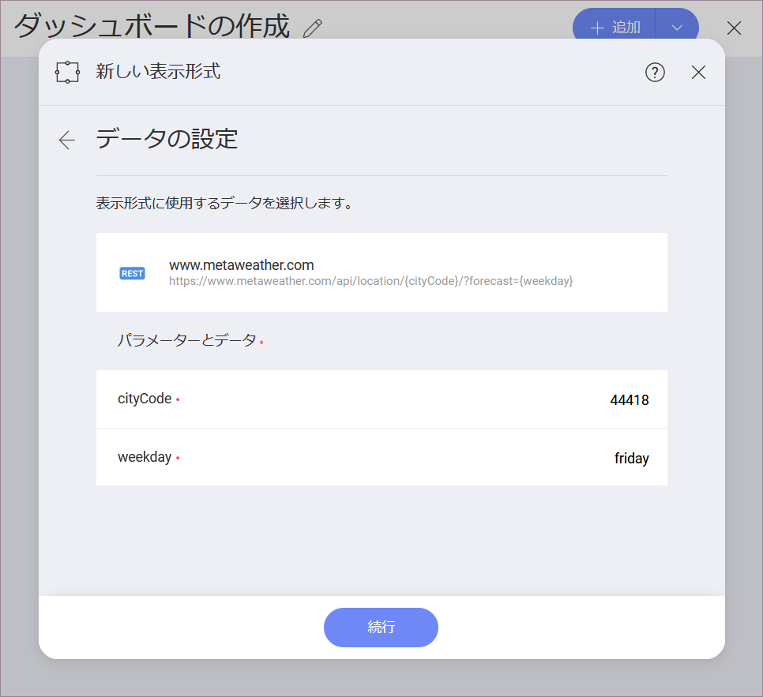
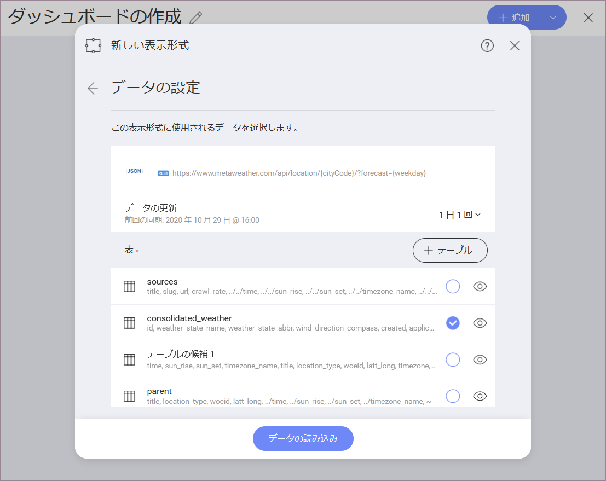
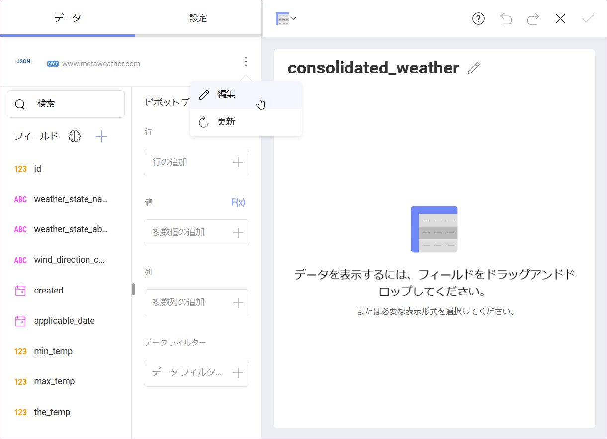
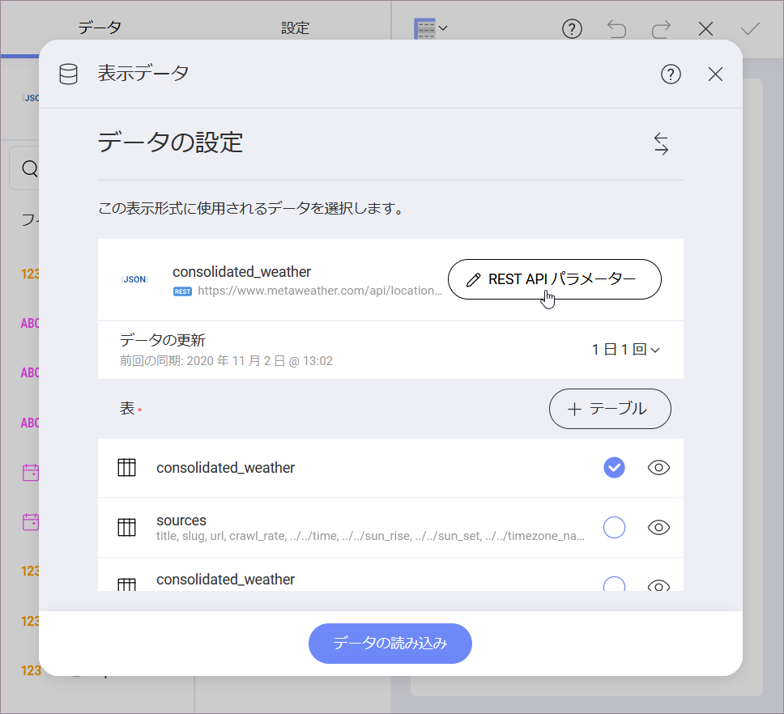
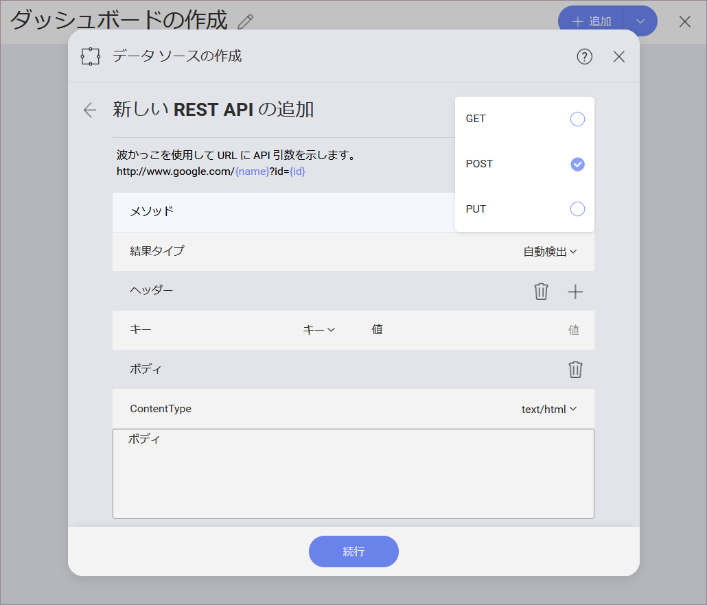

# REST API

Reveal の REST API データ ソースを使用すると、GET、POST、および PUT HTTP リクエストを一意の URLに送信して、Web サービス経由でデータを操作できます。

REST API データ ソースは、進行状況を失わずに表示形式を作成している最中に、URL のパラメーターの値を変更するだけで、受信データを変更する可能性も提供します。

## REST API とは?

**API** (アプリケーション プログラム インターフェイス) を使用すると、2 つのソフトウェア プログラムが相互に通信できます。すべての Web サービスは、Web 環境を通じてアクセスされる API です。

REST API (REST Web サービスとも呼ばれる) は、**REST** (Representational State Transfer) アーキテクチャ上の制約のグループに基づいており、Web 上のコンピューター システム間の通信の標準を提供します。REST アーキテクチャでは、クライアントはリソースを取得または変更するリクエストを送信し、サーバーはこれらの要求への応答を送信します。

## REST API への接続

REST API データ ソースを構成するには、以下の情報が必要です。

1. データ ソースの**デフォルト名**: データ ソース名は前のダイアログのアカウントのリストに表示されます。デフォルトでは、Reveal は *REST API* という名前を付けます。好みに合わせて変更できます。

2.  **[URL]**: サービスが配置されている URL。

3.  **[メソッド]**: ドロップダウンメニューから、希望のリクエスト タイプ (*GET*、*POST*、または *PUT*) を選択できます。

    >[!NOTE]
    >サポートされていないメソッド: メソッド (POST など) が REST サービスでサポートされていない場合、エラー メッセージが表示されます。

4. **[結果タイプ]**: REST API から取得する予定のファイル タイプを指定できます。たとえば、*.csv* を選択し、REST API が *json* で応答した場合、Reveal はファイルを *.csv* として解析しようとします。

    [自動検出] を選択した場合、Reveal は REST API からのファイル (コンテンツ) タイプに関する情報を使用してファイルを解析します。

5.  **[資格情報]**: [資格情報] を選択した後、REST API の資格情報を入力するか、既存の資格情報 (適用可能な場合) を選択できます。**[アカウントなし]** オプションを選択することもできます。

## URL パラメーターの使用

パラメーターは、Web サービスからの応答に影響を与えるために URL で渡すことができるオプションです。REST API データ ソースを構成するときに、URL にパスとクエリのパラメーターを指定できます。

パラメーターを効果的に使用するには、以下の手順に従います。

1.  **URL にパラメーターを指定します**。パス パラメーターは*波括弧*で囲み、*疑問符 (?)* の後にクエリ パラメーターを指定する必要があります。以下の例では、パス パラメーターとクエリ パラメーターの両方が*青*で色分けされ、識別しやすくなっています。

    

2.  **パラメーター値の追加**。次の画面で、URL に追加した各パラメーターの値を指定します。

    

    その結果、REST API サービスは、提供された URL のデータを REST に準拠する形式で応答します。通常、JSON ファイルを受け取ります。

    

    JSON ファイルの使用方法の詳細については、[このトピック](~/jp/datasources/working-files/working-with-json-files.html)を参照してください。
    
    データをロードした後、表示形式エディター画面に進みます。

>[!NOTE]
>サポートされていないファイル形式: REST API が Reveal でサポートされていないファイル形式 (XML など) で応答する場合、このファイルに含まれるデータを使用して表示形式を作成することはできません。

3.  **表示形式のデータを失わずにパラメーターの値を変更します**。表示形式の構築を開始した後でパラメータの値を変更すると、さまざまな可能性が提供されます。たとえば、weather rest api の都市コード パス パラメータを変更して、この新しい都市の新しいデータセットをロードすることができます。すでに作成した表示形式の情報は、新しいデータで自動的に更新されます。

    これを行うには、表示形式エディター画面のファイル名の横にあるオーバーフロー メニューをクリックしてから、**[編集]** をクリックします。

    

    開いた画面で、**[REST API パラメーター]** ボタンを*クリック/タップします*。

    

    *ステップ 2* の画面にリダイレクトされます。ここで、パラメーターに新しい値を指定できます。

> [!NOTE]
> **データを失う警告**。
パラメーターの値を変更すると、エディターで既に作成した表示形式が失われる可能性があります。この場合、[データの読み込み] ボタンをクリック/タップすると、警告メッセージが表示されます。続行する場合は、新しいデータセットがエディターに読み込まれ、表示形式の構築を最初から開始する必要があります。

## メソッドの選択

REST API データ ソース構成のメソッドは、REST システムのリソースと対話するために使用されるリクエストを表します。リクエストは通常、次のもので構成されます。

1.  リソースへのパス (**URL**)

2.  **HTTP 動詞**:

      - *GET* - 特定のリソースを取得する

      - *POST* - 新しいリソースを作成する

      - *PUT* - 特定のリソースを更新する

3.  **[ヘッダー]**: ヘッダーにより、クライアントはリクエストに関する情報を渡すことができます。

4.  **[ボディ]**: データを含むオプションのメッセージ (*POST* および *PUT* メソッドを使用する場合)。

    

リクエストのヘッダーとボディの詳細については、[このリンク (英語)](https://developer.mozilla.org/en-US/docs/Web/HTTP/Messages#Headers) を参照してください。
