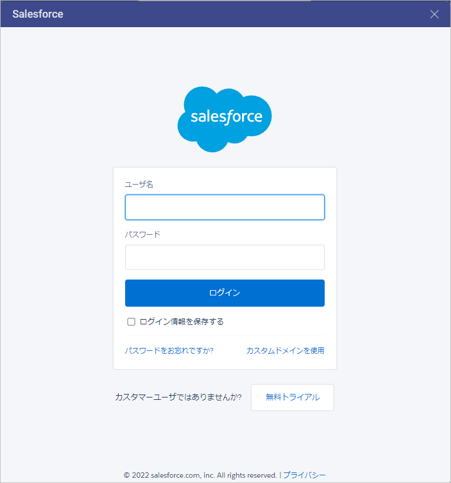
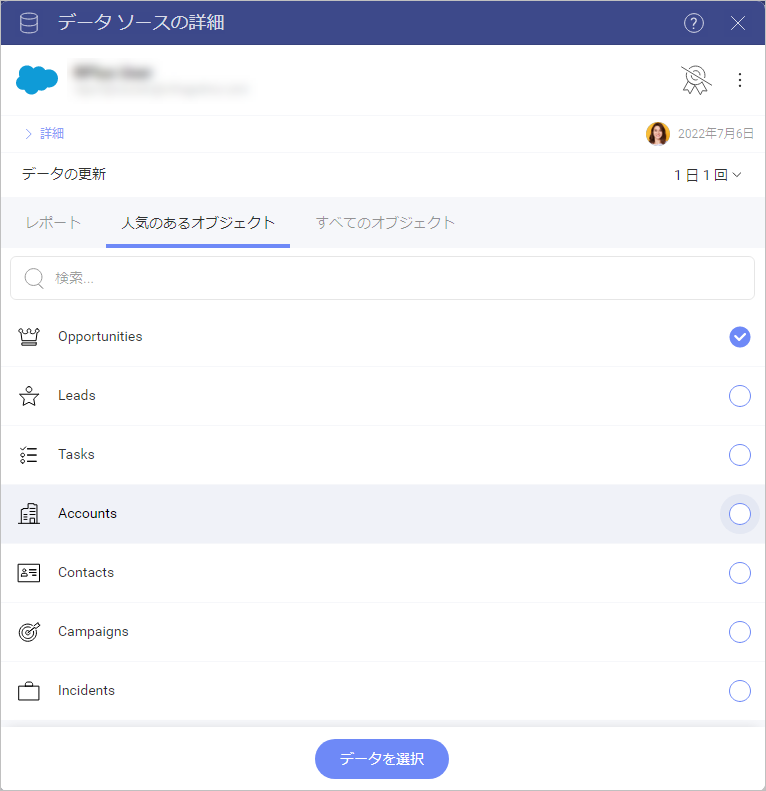
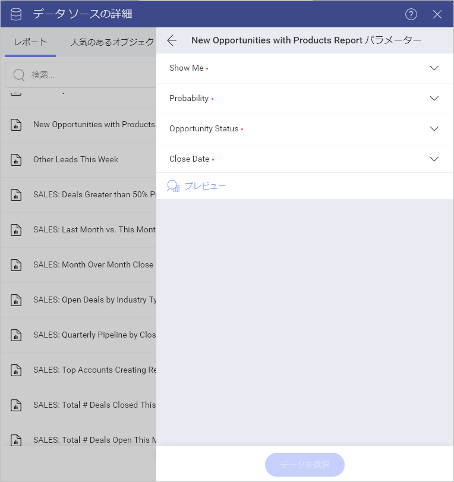
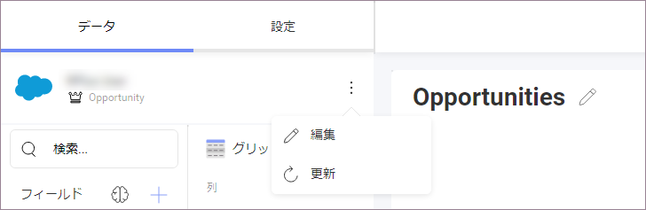
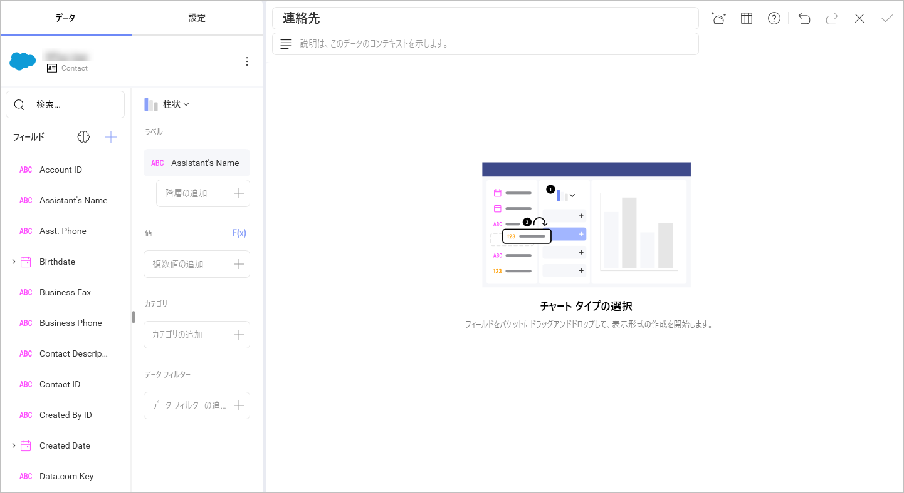
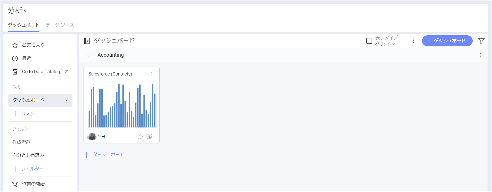

# Salesforce

Salesforce データ ソースを選択すると、以下のログイン プロンプトが表示されます。

ログイン情報を入力して [ログイン] をクリックします。

>[!NOTE] ID 認証が有効な場合は、送信された**確認コード**を入力するプロンプトが表示されます。ID 認証についての情報は、[Salesforce ヘルプ](https://help.salesforce.com/articleView?id=security_activation_about.htm&type=5)をご覧ください。

## データの設定

ログイン後、次のダイアログで Salesforce データを設定できます。

Slingshot で Salesforce をデータ ソースとして設定および使用する方法。

  - **[レポート]** - このカテゴリには、Salesforce アカウントからのすべてのレポートが表示されます。

  - **[人気のあるオブジェクト]** - このカテゴリでは、ユーザーが最もよく使用する 7 つのオブジェクトをすばやく選択できます。

  - **[すべてのオブジェクト]** - このカテゴリには、Salesforce アカウントに含まれるオブジェクトの完全なリストが表示されます。提供されている検索を使用して、必要なオブジェクトをすばやく見つけることができます。

## レポートの使用

表示形式エディターで使用するレポートを選択した後、パラメーターの値を設定する必要があります:

リストに表示されるパラメーター (**Show me**、**Probability** など) は、レポートのフィルターです。レポート フィルターは、ユーザーがレポートに表示するデータを制御するために設定された条件です。Reveal では、フィルタリングされたデータは、**表示形式エディター**のチャートで使用されます。

上のダイアログでは、フィルターは Salesforce のデフォルト値で事前設定されています。これらの値を変更するには、各フィルターの横にあるドロップダウン メニューを使用します。

その後、データ ソースを **[編集]** を選択することで、表示形式エディターでレポート フィルターの値を変更できます (以下を参照)。

## 表示形式エディターでの作業

データ ソースを追加した後、**表示形式エディター**が表示されます。ここでダッシュボードを作成できます。選択した表示形式に基づいて、さまざまなタイプのフィールドが表示されることに注意してください。

表示形式の準備ができたら、右上隅のチェックマークをクリックまたはタップして、ダッシュボードとして保存できます。以下の例では、ダッシュボードを **[分析]** > **[ダッシュボード]** > **Accounting** に保存しました。

