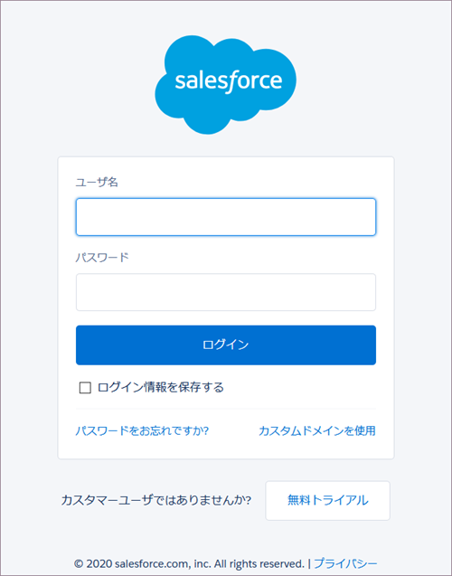

# Salesforce

Salesforce データ ソースを選択すると、以下のログイン プロンプトが表示されます。

ログイン情報を*入力*して [ログイン] をクリックします。

ID 認証が有効な場合は、送信された**確認コード**を入力するプロンプトが表示されます。ID 認証についての情報は、[Salesforce ヘルプ](https://help.salesforce.com/articleView?id=security_activation_about.htm&type=5)をご覧ください。

## データの設定

ログイン後、次のダイアログで Salesforce データを設定できます。

ここで、必要な Salesforce オブジェクトを選択できます。

  - **[人気のあるオブジェクト]** - このカテゴリでは、ユーザーが最もよく使用する 7 つのオブジェクトをすばやく選択できます。

  - **[すべてのオブジェクト]** - このカテゴリには、Salesforce アカウントに含まれるオブジェクトの完全なリストが表示されます。提供されている検索を使用して、必要なオブジェクトをすばやく見つけることができます。

## レポートの使用

表示形式エディターで使用するレポートを選択した後、次のダイアログでパラメーターの値を設定する必要があります:

リストに表示されるパラメーター (_Show me_、_Probability_ など) は、レポートのフィルターです。レポート フィルターは、ユーザーがレポートに表示するデータを制御するために設定された条件です。Reveal では、フィルタリングされたデータは、表示形式エディターのチャートで使用されます。

上のダイアログでは、フィルターは Salesforce のデフォルト値で事前設定されています。これらの値を変更するには、各フィルターの横にあるドロップダウンを使用します。

その後、データ ソースを [編集] を選択することで、表示形式エディターでレポート フィルターの値を変更できます (以下を参照)。

