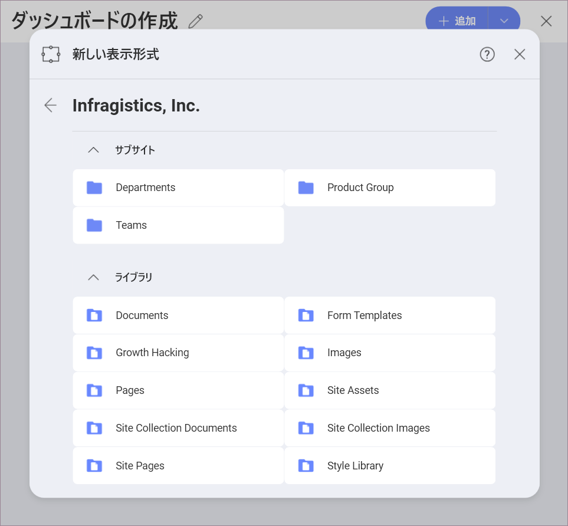

# SharePoint オンライン

## SharePoint への接続

SharePoint を選択すると、次のログイン プロンプトが表示されます:

ここでは、Office365 アカウントでルートの SharePoint サイトを使用することを選択できます。*サブサイト URL* を追加して、コンテンツのブラウズを直接開始することもできます。SharePoint サブサイトに接続すると、[データ ソースの選択] ダイアログのリストからすばやくアクセスできるようになります。

## サポートされるファイル

Reveal では、SharePoint サイト (サブサイト) の広範な種類のファイルを使用できます:

* *スプレッドシート、JSON ファイルおよび表形式データ* (Excel - .xls、.xlsx、CSV、TSV) をReveal 内で動的に使用して、チャートの表示形式を作成できます。
* *その他のファイル*はプレビュー モードのみで表示されます (画像および PDF やテキストなどのドキュメント ファイルを含む)。

## データの設定

ログイン後、SharePoint データ - サブサイト、ライブラリ、フォルダー、リスト、ファイル (下に表示) のブラウズを開始できます。

ダッシュボードを作成するには、以下の SharePoint データ型を使用できます。

1. SharePoint サイトに保存されている*ファイル* - 上記の [サポートされているファイル](#supported-files)を参照してください。

2. *SharePoint リスト* - すべてのタイプの SharePoint リストのアイテムを使用できます。*SharePoint ビュー*を選択して、SharePoint リストを設定します。

  

  >[!NOTE]
  >**詳細設定 - ページごとの項目。**
  >SharePoint リストからデータをロードしているときに予期しない速度低下やその他の障害が発生した場合は、**[ページごとの項目]** 設定を設定してみてください。これは詳細な設定で、データの検索速度を制御できます。速度を向上させるために、ページごとの項目数を増やすことができます。情報を読み込めない場合は、値を小さくすると上手くいく場合があります。ページごとの項目のデフォルト値は 5000 です。

3. *ドキュメント ライブラリのメタデータ* - SharePoint ライブラリのメタデータは、このライブラリに保存されているファイルに関するデータ、例えば、ファイルのサイズ、名前、タイプ、作成/アップロードの日付です。ライブラリの分析に使用できます。

    例えば、IT 部門が求職者から最も高い関心を受け取っている年間のインサイトを提供したいとします。求職者の履歴書をアップロードしたドキュメント ライブラリを見つけ、そのメタデータを使用して、ライブラリ内のファイルが時間の経過とともにどのように変化したかを示すグラフを作成します。

    これを行うには、ライブラリを開いて、右上隅にある [メタデータの使用] ボタンをクリックする必要があります。

    

    ここでは、選択可能な SharePoint リストとして表示されるライブラリのメタデータがあります。

>[!NOTE]
>**Reveal のライブラリのメタデータと SharePoint の管理されたメタデータを混同しないでください!**
Reveal でデータ ソースとして使用できるドキュメント ライブラリから収集したメタデータを、SharePoint でユーザーが作成し、大規模なデータ リストの整理とフィルタリングに使用する管理されたメタデータと混同しないでください。管理されたメタデータの詳細については、[この SharePoint ドキュメント トピック](https://docs.microsoft.com/ja-jp/sharepoint/managed-metadata) をご覧ください。
