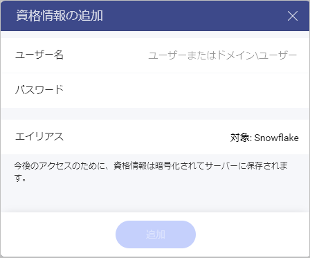
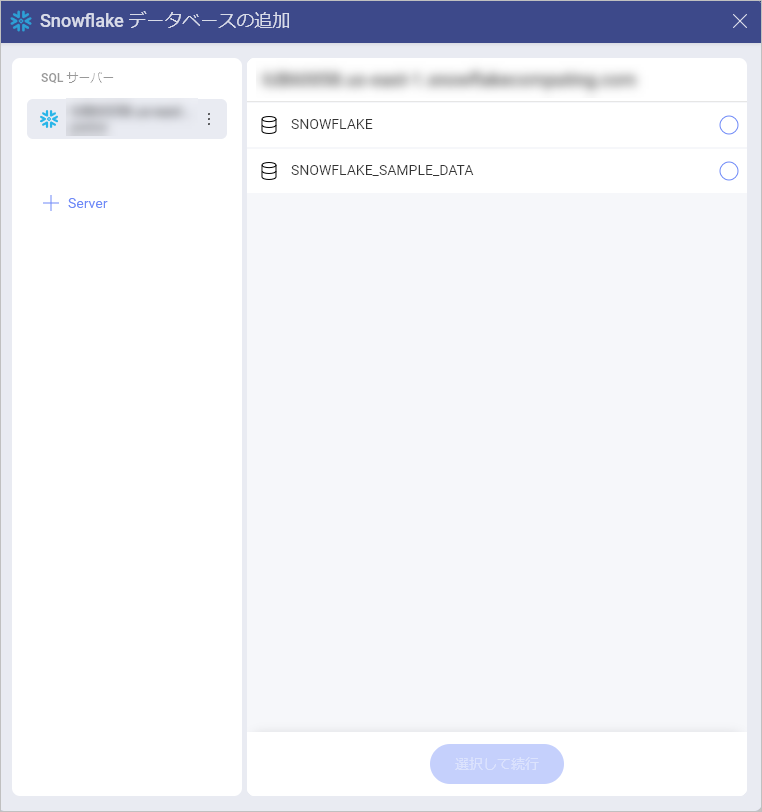
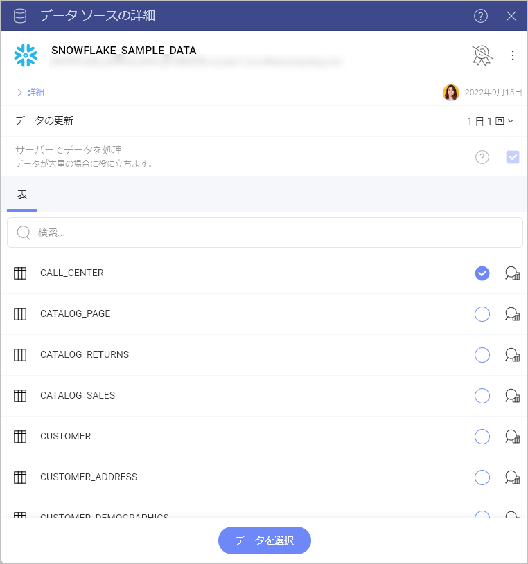

# Snowflake

## Snowflake への接続

Snowflake データ ソースを構成するには、最初に次の情報を入力してサーバーに接続する必要があります:

1.  **アカウント**: 領域またはクラウド プロバイダー情報のない Snowflake アカウント。たとえば、_\<account_name\>.us-east-1.snowflakecomputing.com_ ではなく、\<account_name\> のようにする必要があります。

2.  **[ホスト]**:  必須ではありませんが、値が指定されていない場合は _\<28/>.snowflakecomputing.com_ が使用されます。米国西部地域にいない場合、またはグローバル URL を使用する場合は、_\<account_name\>.\<region_id\>.snowflakecomputing.com_ の形式でホストを指定する必要があります。

3.  **[資格情報]**: *資格情報*を選択した後、*Snowflake* サーバーの資格情報を入力するか、既存の資格情報 (利用可能な場合) を選択できます。

    

- **ユーザー名**: *Snowflake* サーバーのユーザー アカウントまたはドメインの名前。

- **[パスワード]**:  *Snowflake*サーバーにアクセスするためのパスワード。

- **エイリアス**: データ ソース アカウントの名前。以前のダイアログのアカウントのリストに表示されます。

## Snowflake データ ソースの構成

1.  データベースの横にある空の円をマークして、**データベースを選択します**。

  

2.  データベースから**テーブルを選択します**。右側の空の円の横にあるアイコンを使用して、データをプレビューします。

  

これで、Snowflake から取得したデータを使用して表示形式の構築を開始できる**表示形式エディター**が表示されます。
