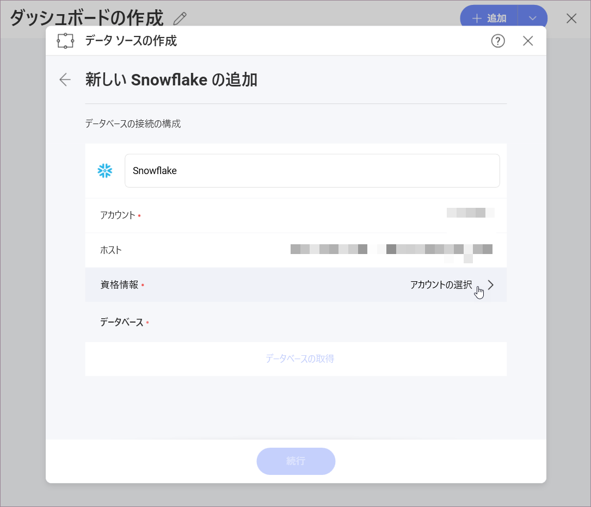
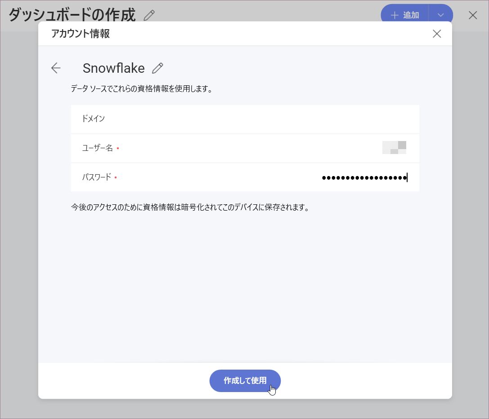
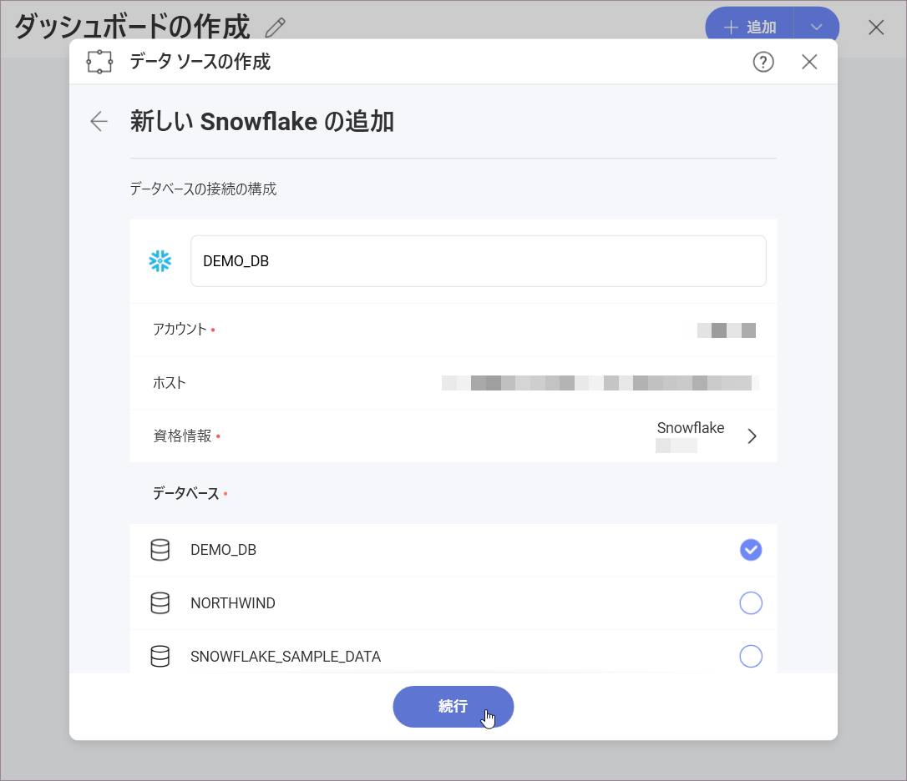
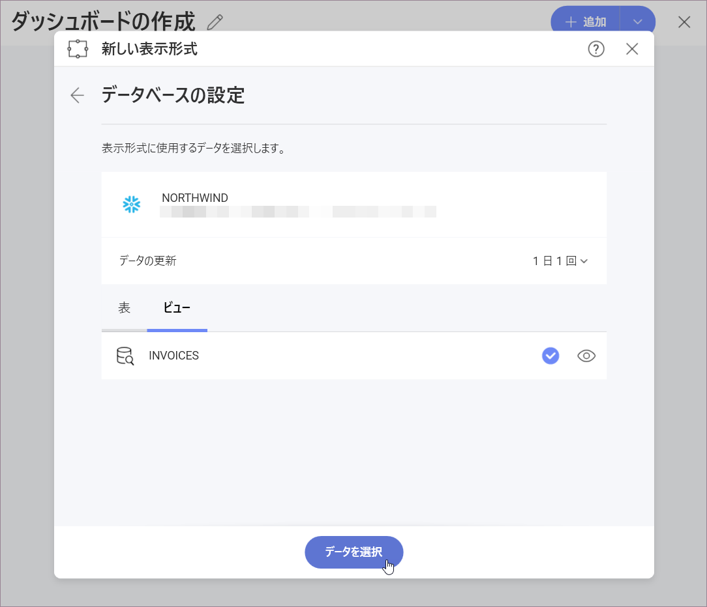

## Snowflake

Snowflake データ ソースを構成するには、最初に次の情報を入力してサーバーに接続する必要があります:

1.  データソースの **デフォルト名**: データソース名は前のダイアログのアカウントのリストに表示されます。デフォルトでは、Reveal は *Snowflake* という名前を付けます。好みに合わせて変更できます。

2.  **[アカウント]**:  領域またはクラウド プロバイダー情報のない Snowflake アカウント。たとえば、_\<account_name\>.us-east-1.snowflakecomputing.com_ ではなく \<account_name\> に似ている必要があります。

3.  **[ホスト]**:  必須ではありませんが、値が指定されていない場合は _\<28/>.snowflakecomputing.com_ が使用されます。米国西部地域にいない場合、またはグローバル URL を使用する場合は、_\<account_name\>.\<region_id\>.snowflakecomputing.com_ の形式でホストを指定する必要があります。

4.  **[資格情報]**: *資格情報*を選択した後、*Snowflake* サーバーの資格情報を入力するか、既存の資格情報 (利用可能な場合) を選択できます。

    

    - **名前**: データソース アカウントの名前。以前のダイアログのアカウントのリストに表示されます。

    - *(オプション)* **ドメイン**:  ドメイン名 (該当する場合)。

    - **[ユーザー名]**:  *Snowflake*サーバーのユーザーアカウント。

    - **[パスワード]**:  *Snowflake*サーバーにアクセスするためのパスワード。

### Snowflake データ ソースの構成

1.  データベースの横にある空の円をマークして、**データベースを選択します**。

    

    >[!NOTE]    
    >**Reveal の Snowflake サンプル データ**。
    上のスクリーンショットの Northwind データベースはデモ目的で作成されたものであり、Snowflake のサンプル データの一部としては利用できません。

2.  データベースから **[表] または [ビュー] を選択します**。右側の*目のアイコン*を使用して、データをプレビューします。

    

これで、Snowflake から取得したデータを使用して表示形式の構築を開始できる**表示形式エディター**が表示されます。

#### データ ブレンディングの制限

現在、Snowflake データ ソースからのデータを使用する場合、データ ブレンディング ([1 つの表示形式でデータ ソースを組み合わせる](~/jp/datasources/data-blending.md))は**使用できません**。
