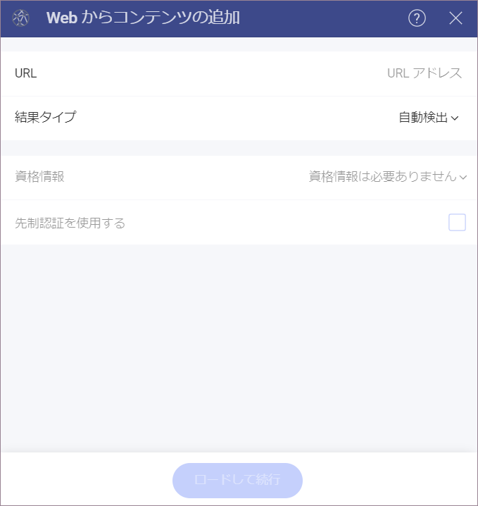

# ウェブ リソース

ウェブ リソースは、ウェブの任意の仮想ファイルで一意の URL アドレスを使用して取得できます。たとえば、Excel スプレッドシート ([サンプル](https://download.infragistics.com/reveal/help/samples/Reveal_Dashboard_Tutorials.xlsx)など) または画像 ([サンプル](http://www.infragistics.com/media/442175/home-header-shots.png)など) です。

ウェブ リソース データ ソースを構成するには、以下の情報が必要です。

1.  **[URL]**: サービスの URL (ダッシュボード チュートリアルの場合は <https://download.infragistics.com/reveal/help/samples/Reveal_Dashboard_Tutorials.xlsx> など)。

2. **[結果タイプ]**: サービスから取得する予定のファイル タイプを指定できます。たとえば、*.csv* を選択し、サービス が *json* で応答した場合、Reveal はファイルを *.csv* として解析しようとします。

    [自動検出] を選択した場合、Reveal は サービス からのファイル (コンテンツ) タイプに関する情報を使用してファイルを解析します。

3.  **資格情報**: ドロップダウン メニューをクリックして、**[+ 資格情報]** を選択できます。その後、次のように入力できます:

      - **[資格情報の種類]**: 2 つのオプション - **[汎用資格情報]** または **[OAuth 2 / OIDC 資格情報]**。

      - **ユーザー名またはドメイン**: ウェブ リソースのユーザー アカウントまたはドメインの名前。

      - **[パスワード]**: ウェブ リソースにアクセスするためのパスワード。

  資格情報に変更を加える場合は、ドロップダウン メニューから **[資格情報の管理]** を選択できます。

準備ができたら、**[ロードして続行]** を選択します。

保護されたウェブ リソースの **OAuth 2 / OIDC アカウント**を設定するには、[このトピック](~/jp/datasources/oauth-2-oidc-user-authentication.html)をお読みください。
