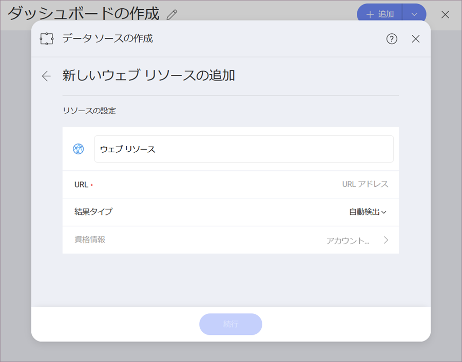

## ウェブ リソース

ウェブ リソースは、ウェブの任意の仮想ファイルで一意の URL アドレスを使用して取得できます。たとえば、Excel スプレッドシート ([サンプル](http://download.infragistics.com/reveal/help/samples/Reveal_Dashboard_Tutorials.xlsx)など) または画像 ([サンプル](http://www.infragistics.com/media/442175/home-header-shots.png)など) です。

Web リソース データソースを構成するには、以下の情報が必要です。

1.  データソースの**デフォルト名**: データソース名は前のダイアログのアカウントのリストに表示されます。デフォルトでは、Reveal は *Web Resource* という名前を付けます。好みに合わせて変更できます。

2.  **URL**: サービスの URL (ダッシュボード チュートリアルの場合は <http://download.infragistics.com/reveal/help/samples/Reveal_Dashboard_Tutorials.xlsx> など)。

3. **結果タイプ**:  サービスから取得する予定のファイル タイプを指定できます。たとえば、*.csv* を選択し、サービス が *json* で応答した場合、Reveal はファイルを *.csv* として解析しようとします。

    *自動検出*を選択した場合、Reveal は サービス からのファイル (コンテンツ) タイプに関する情報を使用してファイルを解析します。

4.  **資格情報**: *資格情報*を選択した後、Web リソースの資格情報を入力するか、既存の資格情報 (適用可能な場合) を選択できます。

      - **名前**: データソース アカウントの名前。以前のダイアログのアカウントのリストに表示されます。

      - *(オプション)* **ドメイン**:  ドメイン名 (該当する場合)。

      - **ユーザー名**:  Web リソースのユーザー アカウント (該当する場合)。

      - **パスワード**:  Web リソース にアクセスするためのパスワード (該当する場合)。

準備ができたら、**アカウントの作成**を選択します。**[接続テスト]** を選択すると、アカウントがデータソースに到達しているかどうかを確認できます。

保護された Web リソースの *OAuth 2 / OIDC アカウント* を設定するには、[このトピック](~/jp/datasources/oauth-2-oidc-user-authentication.html)をお読みください。
