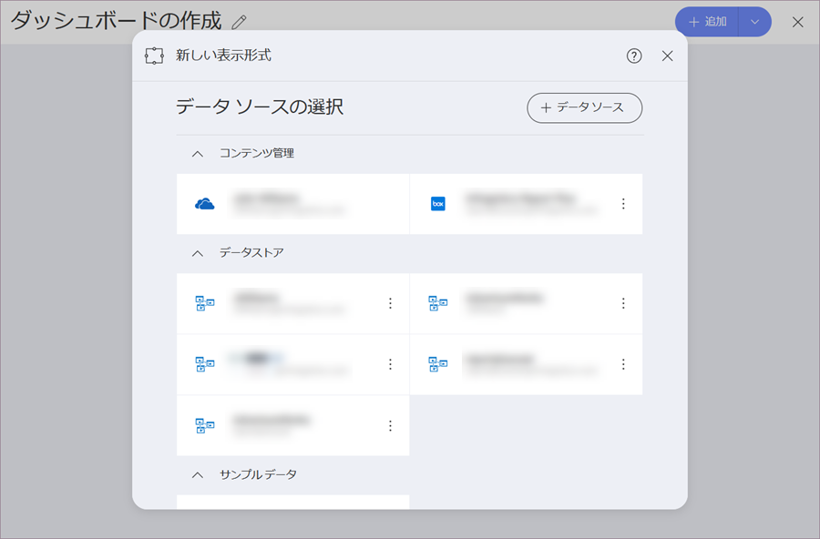
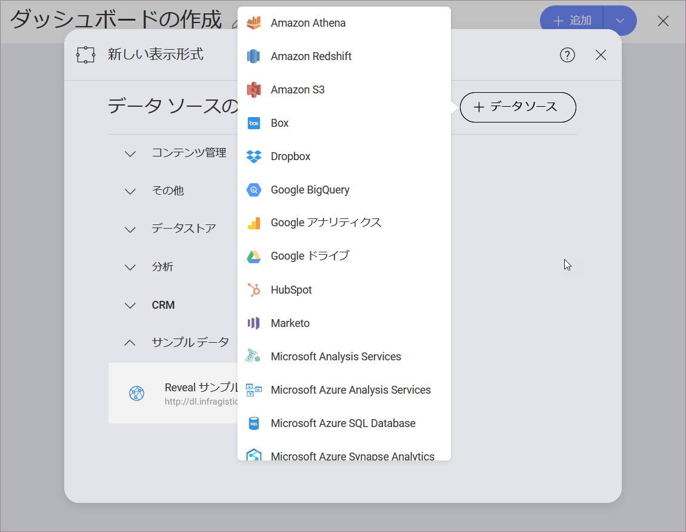

## データ ソースの概要

データ ソースはデータの送信元です。Reveal は解析ツール、コンテント マネージャー、CRM、データベース、スプレッドシート、ソーシャル メディア、および公開用のデータ ソースに接続できます。ユーザーがコンピューターまたはネットワークでソースへ直接アクセスする必要はありません。

以下のスクリーンショットはアプリケーションで構成される複数のデータ ソースを表示します。

### データ ソースの構成方法とは?

*[+] 表示形式*ボタンを選択してダッシュボードを作成すると、新しいデータソースまたは既存のデータソースを設定するよう求められます。

最近使用したデータソースのリストが表示されます。新しいデータソースを作成するには、**[+データソース]ボタンを選択します**。

サポートされるデータソースの完全なリストと、各データソースの構成方法に関する詳細情報については、次のトピックにアクセスしてください。

  - [データ ソース](data-sources.md)

  - [ボックス](box.md)

  - [Dropbox](dropbox.md)

  - [Google アナリティクス](google-analytics.md)

  - [Google BigQuery](google-bigquery.md)

  - [Google Drive](google-drive.md)

  - [Microsoft Analysis サービス](microsoft-analysis-services/microsoft-analysis-services.md)

  - [Microsoft Azure Synapse Analytics](microsoft-azure-synapse-analytics.md)

  - [Microsoft Azure SQL](azure-sql.md)

  - [Microsoft Dynamics CRM](microsoft-dynamics-crm.md)

  - [Microsoft Reporting Services (SSRS)](microsoft-reporting-services.md)

  - [Microsoft SQL Server](microsoft-sql-server.md)

  - [MySQL](mysql.md)

  - [OData Feed](odata-feed.md)

  - [OneDrive](onedrive.md)

  - [Oracle](oracle.md)

  - [PostgreSql](postgresql.md)

  - [REST API](rest-api.md)

  - [Salesforce](salesforce.md)

  - [SharePoint](sharepoint.md)

  - [Sybase](sybase.md)

  - [ウェブ リソース](web-resource.md)

  - [JSON ファイル](working-with-json-files.md)

  - [Azure Machine Learning との統合](azure-machine-learning-models.md)

  - [BigQuery Machine Learning との統合](bigquery-machine-learning-models.md)
