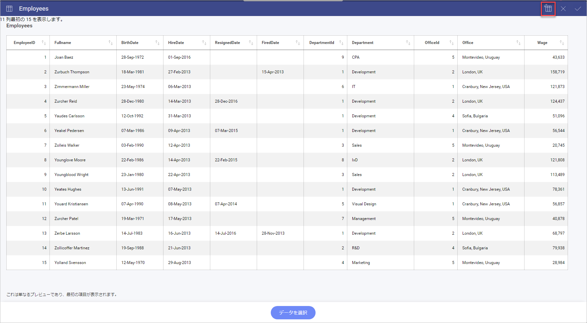
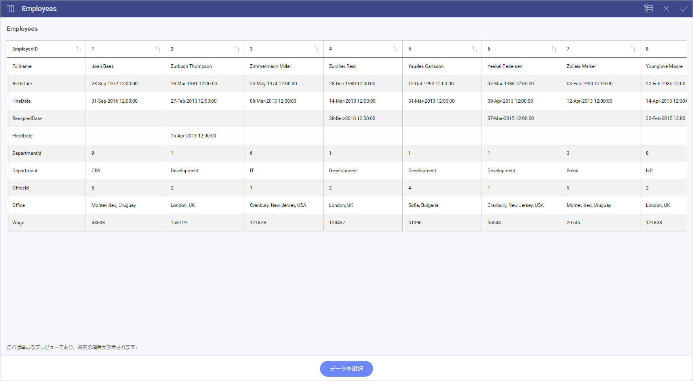

# Reveal スプレッドシートの作業

以下は Reveal でスプレッドシートとの作業のためのヒントがあります。

<table>
<colgroup>
<col style="width: 33%" />
<col style="width: 33%" />
<col style="width: 33%" />
</colgroup>
<tbody>
<tr class="odd">
<td>
  

<em>Reveal でデータを列に構成し、フィールドをスプレッドシートの最初の行によって名前を付けます。</em> データが列ではなく行で構成される場合、Reveal でフィールドの<a href="#transposing-spreadsheets">入れ替えができます。</a>

<a href="~/jp/data-visualizations/visualizations-editor.md">詳細情報</a> 

</td>
<td>
 

<strong>CSV ファイルを使用するときは、スプレッドシートを書式設定しないでください。</strong>.代わりに Reveal で書式設定 (1000 コンマ分割記号、通貨記号など) を適用します。

<a href="~/jp/data-visualizations/fields/field-settings.md">詳細情報</a> 

</td>
<td>
 

<strong>シリーズが 2 つ以上あるチャートの場合、</strong>Excel ファイルの列順序に関係なく [列]、[行]、および [値] にフィールドをドロップする順序によって<strong>チャートをプロットする方法を決定します</strong>。
</td>
</tr>
<tr class="even">
<td>
  

<strong>列に異なるデータ型 </strong> (文字列、数値など) <strong>を結合する場合、Reveal はそれを文字列型の列として使用します。</strong>これは書式設定に影響します。
</td>
<td>
 

Reveal でパスワードの保護ファイルおよび非表示範囲がサポートされません。
</td>
<td></td>
</tr>
</tbody>
</table>

## データ範囲

<table>
<colgroup>
<col style="width: 33%" />
<col style="width: 33%" />
<col style="width: 33%" />
</colgroup>
<tbody>
<tr class="odd">
<td>
  

<em>Excel ファイルはスプレッドシートでデータのカスタム範囲の選択を許可しますが、</em>CSV ファイルはこれを許可しません。特定のデータを選択する場合、常に Excel スプレッドシートを使用します。
</td>
<td>
 

名前付き範囲を持つスプレッドシートがある場合、<strong>その名前付き範囲をデータ ソースとして選択できます。</strong>
</td>
<td>
 

Excel データが<strong>隣接しない列</strong>にある場合、Reveal は<strong>データの最も多い列</strong>を使用します。</strong>.
</td>
</tr>
</tbody>
</table>

## 日付、数値、およびパーセンテージ

<table>
<colgroup>
<col style="width: 33%" />
<col style="width: 33%" />
<col style="width: 33%" />
</colgroup>
<tbody>
<tr class="odd">
<td>
 

デフォルトで<strong>2 桁の小数桁があります。</strong>これを変更するには、[フィールド設定] の [小数桁] へアクセスします。

<a href="~/jp/data-visualizations/fields/field-settings.html#numeric-fields">詳細情報</a> 

</td>
<td>
 

数値が大きい場合もデフォルトでは桁区切りが無効です。有効にするには、[フィールド設定] の [桁区切りの表示] へアクセスします。

<a href="~/jp/data-visualizations/fields/field-settings.html#numeric-fields">詳細情報</a> 

</td>
<td>
 

パーセントまたは通貨を表示するには、そのオプションを [タイプ] から選択します。

<a href="~/jp/data-visualizations/fields/field-settings.html#numeric-fields">詳細情報</a> 

</td>
</tr>
<tr class="even">
<td>
 

日付を列ヘッダーに設定するには、Excel が書式設定を使用するために「'」を含みます。デフォルトのヘッダー日付書式は (YYYY-MM-DD 00:00:00 +0000) の省略なしで全体を示す書式です。
</td>
<td>
 

書式設定がパーセントに変更される場合以外、Excel シートのパーセントは 0 ～ 1 スケールで表示されます。たとえば、39% が 0.39 として表示されます。
</td>
<td></td>
</tr>
</tbody>
</table>

## 列を行に転置

Microsoft Excel および Google スプレッドシートを使用する場合、転置機能を使用して列を行から切り替えることができます。

To make this change, you need to first click/tap on the *Preview Data* button for the chosen sheet.

>[!NOTE]
>スプレッドシートの最初の 200 行のみが転置されます。  

次に、十字ボタンの隣の右上隅に転置アイコンが表示されます。
それをクリックまたはタップすると、Reveal は列を行に、またはその逆に切り替えます。

上記の例では、スプレッドシートの情報は、会社の各従業員の *EmployeeID* を表す列に編成されます。

ティック アイコンを選択します。これにより、**[データ ソースの詳細]** メニューに戻ります。ここで、シートの名前が表示され、その左側に、シートが変更されたことを示す新しいアイコンが表示されます。

## 関連項目

一般的な使用例として、クラウド ファイル共有サービスにあるスプレッドシートでのダッシュボードの構築があります。
これらのダッシュボードを他のユーザーと正常に共有する方法については、[クラウド ファイルをデータ ソースとするダッシュボードを共有する](~/jp/dashboards/sharing-dashboards/sharing-dashboards-datasource-files-cloud-provider.html)トピックをご覧ください。
