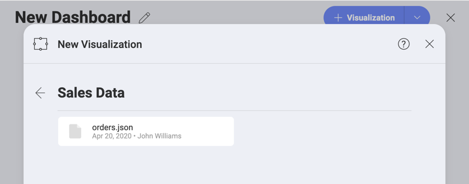
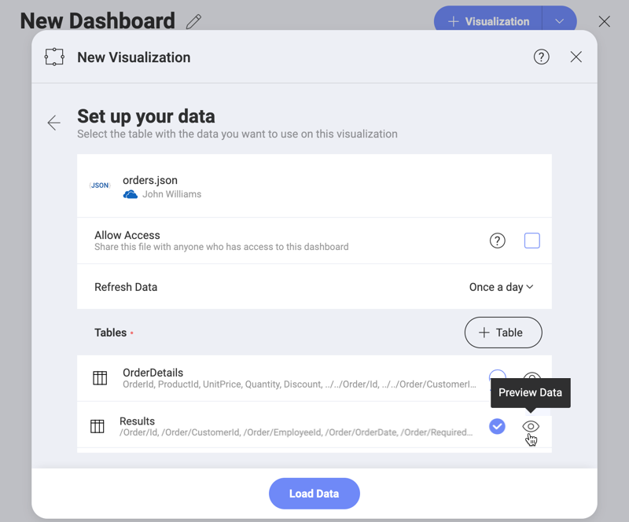
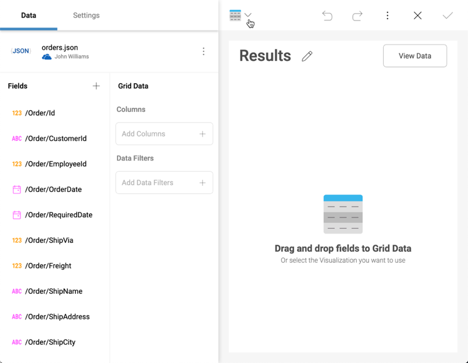
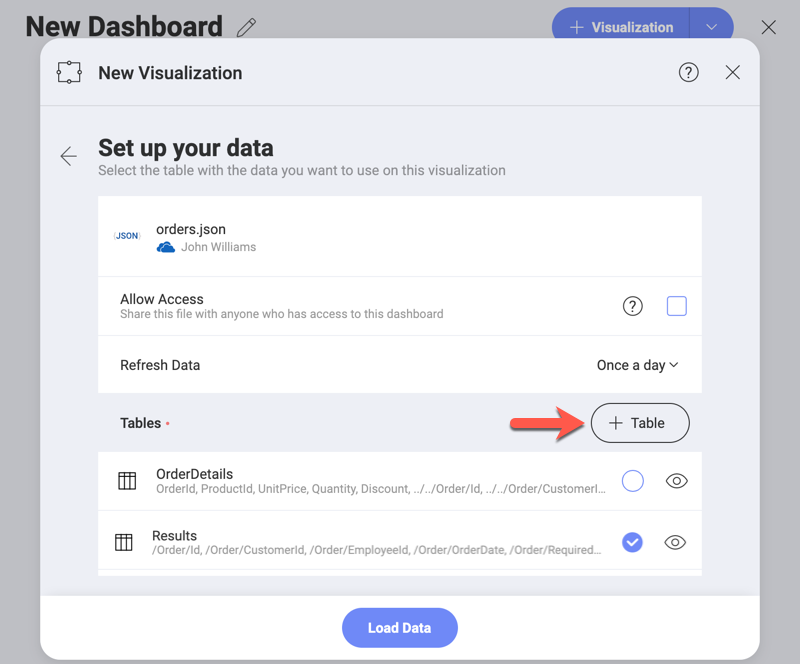
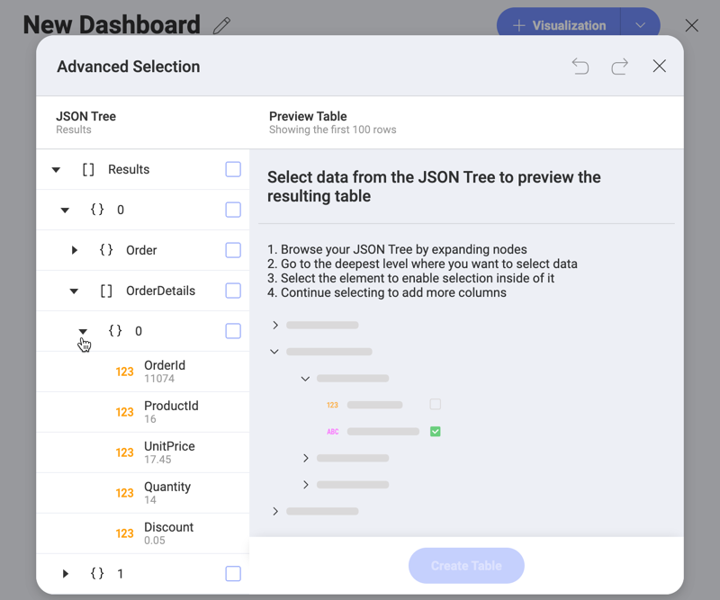
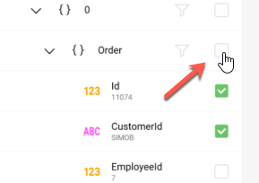
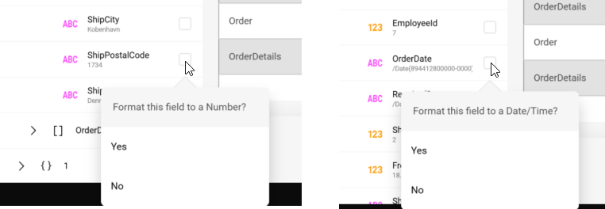
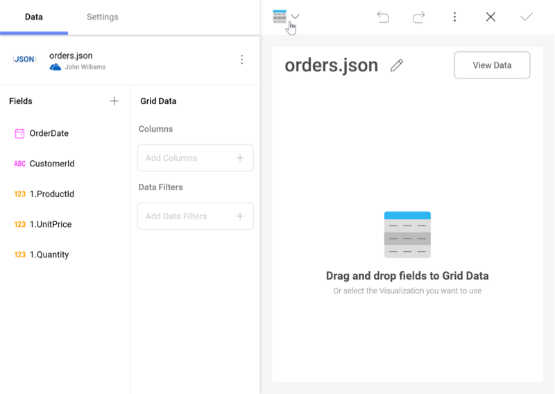

## JSON ファイル を使用した作業

Reveal では、JSON ファイル データの可視化をサポートします。

JSON ファイル形式を読み込んだ後、Reveal は使用する可能性のあるデータ構造を提供します。さらに、カスタム データ構造を選択できる[**高度な選択**](#json-advanced-selection)モードがあります。

### JSON 書式の情報

JSON (**J**ava**S**cript **O**bject **N**otation) は、データを保存および交換するための自己記述型の軽量なフォーマットです。

書式のハイライト:

  - JSON の書式は、**データのさまざまな構造を表す**ために使用できます。

  - データは常に**コンマで区切られた名前/値のペア**として配置されます。

  - データ型の表記には、**オブジェクトの波括弧 {}** と**配列の角括弧 \[\]** が含まれます。

### JSON ファイルの読み込み

JSON ファイルのデータを使用する新しいビジュアライゼーションを作成するには、次の手順に従います。

1.  **ファイルを利用できるようにする**。

    JSON ファイルをストレージ プロバイダーのいずれかにアップロードして、後で Reveal からアクセスできるようにします。次の使用可能なオプションから選択できます。Dropbox、OneDrive、Box、Google Drive、および SharePoint。

2.  **新しいビジュアライゼーションの作成**。

    ダッシュボード内で、JSON ファイルのデータを使用するビジュアライゼーションを作成します。

3.  **ファイルの参照**。

    a.  ファイルのあるストレージ プロバイダーを選択し、ログイン認証情報を提供します。

    b.  プロバイダーを参照し、JSON ファイルを選択します。

    

4.  **必要なデータ構造の選択**。

    ファイルをスキャンした後、Reveal は選択可能なデータ構造のリストを表示します。

    

    リストに目的のデータ構造が含まれていない場合は、[**高度な選択モード**](#json-advanced-selection)を使用して、カスタムデータ構造を選択できます。

5.  ***データのロード*をクリック/タップ**。

    データ構造を選択、*[データのロード]* ボタンをクリック/タップして、*表示形式エディター*を開きます。

    

### 高度な選択モード

JSON ファイルを使用して、さまざまなデータ構造を表すことができます。このため、Reveal では、作業するカスタム データ構造を選択できます。処理したいデータ列を選択した後、それらの上に表示形式を構築することができます。

1.  **詳細選択モードを開く**。

    **[+テーブル]** ボタンをクリック/タップして、*[詳細選択]* 画面にアクセスします。

    

2.  **JSON ツリーのナビゲーション**。

    ノードを展開し、データを選択する最も深いレベルを選択します。

    

3.  **ツリー要素とフィールドを選択**。
    子の選択を有効にするには、ツリー要素 (object **[ ]** または配列 **{ }**) を選択する必要があります。

    |                                                                             |                                                                                                                                           |
    | --------------------------------------------------------------------------- | ----------------------------------------------------------------------------------------------------------------------------------------- |
    |  | 1 つ以上の子の選択後、親要素 (オブジェクトと配列) の選択を解除し、データ構造から除外できます。 |

4.  (*オプション*) **テキスト フィールドを日付/時刻または数値に書式設定します**。

    フィールドを選択すると、Reveal はその値を読み取り、最適な形式を自動検出し、実行する操作を選択できるダイアログを表示します。

    

5.  ***テーブルの作成*をクリック/タップ**。

    カスタム データ構造を選択後、*[テーブルの作成]* ボタンをクリック/タップして、*表示形式* エディターを開きます。

    
