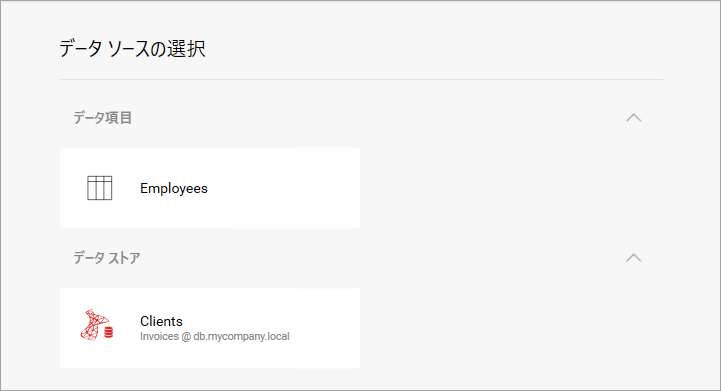

## 新しい可視化とダッシュボードの作成

### 概要

既存のダッシュボードに新しい可視化を追加するには、ユーザーが使用するデータ ソースを**選択する**必要があります。そのためには、含まれているアプリケーションが SDK に情報を提供する必要があるので、新しい可視化に使用できるデータ ソースのリストを表示できます。

### データ ソースのリストを表示

データ ソースのリストを表示するために使用する必要があるコールバックは、__DataSourcesRequested__ です。
このコールバックに独自のメソッドを設定しない場合、新しい可視化が作成されると、Reveal はダッシュボードで使用されているデータ ソースがある場合はすべて表示します。

#### コード:

以下のコードは、インメモリ項目と SQL Server データ ソースを表示するようにデータ ソース選択画面を構成する方法を示しています。

``` csharp
private void RevealView_DataSourcesRequested(object sender, DataSourcesRequestedEventArgs e)
{
    var inMemoryDSI = new RVInMemoryDataSourceItem("employees");
    inMemoryDSI.Title = "Employees";
    inMemoryDSI.Description = "Employees";

    var sqlDs = new RVSqlServerDataSource();
    sqlDs.Title = "Clients";
    sqlDs.Id = "SqlDataSource1";
    sqlDs.Host = "db.mycompany.local";
    sqlDs.Port = 1433;
    sqlDs.Database = "Invoices";

    e.Callback(new RevealDataSources(
            new List<RVDashboardDataSource> { sqlDs },
            new List<RVDataSourceItem> { inMemoryDSI },
            false));
}
```

上記のコードでは、DataSourcesRequested イベントを処理するために次のメソッドをアタッチしたと想定しています。

``` csharp
revealView.DataSourcesRequested += RevealView_DataSourcesRequested
```

3 番目のパラメータの false 値は、ダッシュボード上の既存のデータ ソースが表示されないようにします。そのため、[+] ボタンを使用して新しいウィジェットを作成すると、以下の画面が表示されます。



RVInMemoryDataSourceItem コンストラクタに渡される employees パラメーターは[**インメモリ データのサポート**](in-memory-data.html)で使用されているコンストラクタと同じデータセット ID で、返されるデータセットを識別します。

### 新しいダッシュボードの作成

以下の手順でダッシュボードを簡単に作成できます。__RevealView__ を初期化するだけです。通常、ユーザーにダッシュボードを最初から作成する機能を提供する場合は、空のダッシュボードを編集モードで直接開いて、ユーザーがすぐに編集を開始できるようにします。

``` csharp
revealView = new RevealView();
revealView.StartInEditMode = true;
revealView.DataSourcesRequested += RevealView_DataSourcesRequested;

revealView.Dashboard = new RVDashboard();
```

SDK とともに配布されている UpMedia WPF アプリケーションに、*EmptyDashboard.xaml.cs* の実用的な例があります。
