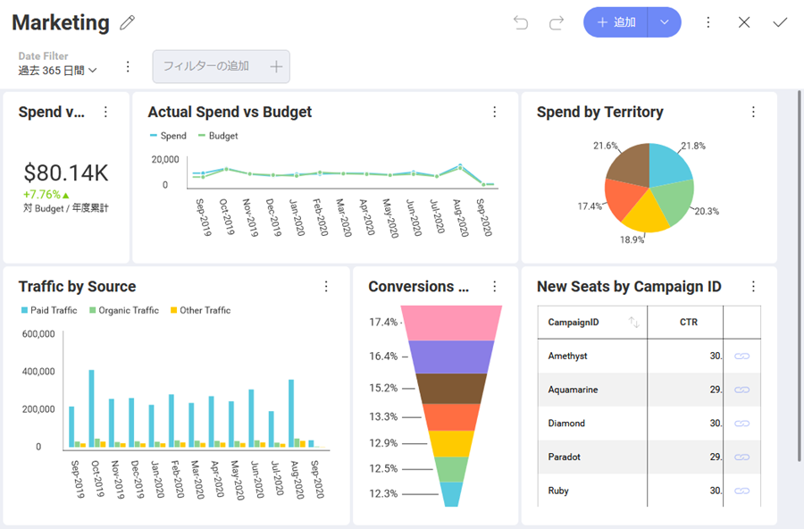
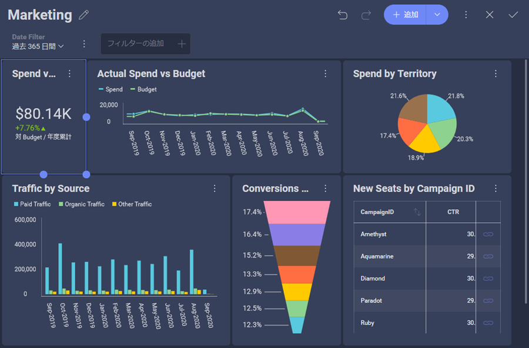

## カスタム テーマの作成

### 概要

分析を既存のアプリケーションに埋め込む場合、それらのダッシュボードがアプリのルック アンド フィールと一致することが重要です。そのため、SDK を通じて Reveal ダッシュボードを完全に制御できます。

Reveal で独自のテーマを作成するには、**Theme** プロパティを変更します。

``` csharp

var regularFont = new FontFamily(new Uri("pack://application:,,,/ [Your ProjectName];component/[pathToFonts]/"), "./#Verdana Italic");
var boldFont = new FontFamily(new Uri("pack://application:,,,/ [Your ProjectName];component/[pathToFonts]/"), "./#Verdana Bold");
var mediumFont = new FontFamily(new Uri("pack://application:,,,/ [Your ProjectName];component/[pathToFonts]/"), "./#Verdana Bold Italic");

var currentTheme = RevealSdkSettings.Theme;
currentTheme.ChartColors.Clear();
currentTheme.ChartColors.Add(Color.FromRgb(192, 80, 77));
currentTheme.ChartColors.Add(Color.FromRgb(101, 197, 235));
currentTheme.ChartColors.Add(Color.FromRgb(232, 77, 137);

currentTheme.BoldFont = new FontFamily("Gabriola");
currentTheme.MediumFont = new FontFamily("Comic Sans MS");
currentTheme.FontColor = Color.FromRgb(31, 59, 84);
currentTheme.AccentColor = Color.FromRgb(192, 80, 77);
currentTheme.DashboardBackgroundColor = Color.FromRgb(232, 235, 252);

RevealSdkSettings.Theme = currentTheme;

```

> [!NOTE]
> 新しい色のセットを追加するには、まずチャートの色リストのデフォルト値をクリアする必要があります。

画面にダッシュボードまたは別の Reveal コンポーネントがすでに表示されている場合は、適用された変更を表示するために、再度レンダリングする必要があります。

### カスタマイズ可能なテーマ設定

テーマのカスタマイズに使用できる設定は、_RevealTheme()_ クラスの一部です。_RevealTheme() class_ には、すべてのダッシュボードとアプリの設定と現在の設定値が含まれています。
以下のテーブルには、カスタマイズ可能なすべての設定とそれぞれに関する簡単な説明、タイプ、各設定のデフォルト値があります。

| 名前                         | タイプ                    | 説明                                                                                                                                                                                                                                                                       |
|------------------------------|-------------------------|-----------------------------------------------------------------------------------------------------------------------------------------------------------------------------------------------------------------------------------------------------------------------------------|
| **ChartColors**                  | List<Color>             | 表示形式でシリーズを示すために使用される色。色の数に制限はありません。すべての色が表示形式で使用されると、Reveal はこれらの色の新しい色合いを自動生成します。これにより、色が重複せず、各値に独自の色が設定されます。 |
| **AccentColor**                  | Color                   | Reveal のデフォルトのアクセント色は、[+ 新規] ボタンやその他のインタラクティブなアクションで確認することができる青の色合いです。アプリケーションで使用するのと同じアクセント色に一致するように色を変更できます。                                                            |
| **DashboardBackgroundColor**     | Color                   | ダッシュボードの背景色を設定します。これはメインの背景色です。                                                                                                                                                                                                   |
| **VisualizationBackgroundColor** | Color                   | 表示形式の背景色を設定します。これは二番目のな背景色です。                                                                                                                                                                                            |
| **ConditionalFormatting**        | RVConditionalFormatting | 条件付き書式を使用するときに設定できる境界のデフォルトの色を変更します。                                                                                                                                                                                           |
| **RegularFont**                  | FontFamily              | 通常のフォント スタイルを設定します。                                                                                                                                                                                                                                                      |
| **BoldFont**                     | FontFamily              | 太字のフォント スタイルを設定します。                                                                                                                                                                                                                                                         |
| **MediumFont**                   | FontFamily              | 中のフォント スタイルを設定します。                                                                                                                                                                                                                                                       |
| **FontColor**                    | Color                   | フォントの色を設定します。                                                                                                                                                                                                                                                       |
| **HighlightColor**               | Color                   | 特定のダッシュボード シナリオ (予測および外れ値の統計関数) の強調色を設定します。                                                                                                                                                                        |
| **UseRoundedCorners**            | bool                    | (デフォルト) ボタン、ツールチップ、コンテナ、表示形式などの隅が丸められています。false に設定すると、コーナーは四角になります。                                                                                                                                               |
### ビルド済みのテーマ

Reveal SDK には、*Mountain Light*、*Mountain Dark*、*Ocean Light*、*Ocean Dark* の 4 つのビルド済みテーマが付属しています。アプリケーションのデザインに最適なものを設定することも、カスタム テーマのベースとして使用することもできます。

新しいインスタンスを作成して、選択したビルド済みテーマの設定を適用します。

***Mountain Light テーマ***
``` csharp
RevealSdkSettings.Theme = new MountainLightTheme();
```
> [!NOTE]
> Mountain Light には、カスタマイズ可能なすべての設定のデフォルト値が含まれています。

***Mountain Dark テーマ***
``` csharp
RevealSdkSettings.Theme = new MountainDarkTheme();
```

***Ocean Light テーマ***
``` csharp
RevealSdkSettings.Theme = new OceanLightTheme();
```

***Ocean Dark テーマ***
``` csharp
RevealSdkSettings.Theme = new OceanDarkTheme();
```

#### ビルド済みのテーマはどのように見えますか? 

以下は、各ビルド済みテーマが適用されたときの*形式エディター*と*ダッシュボード エディター*の外観を示すテーブルです。

<style type="text/css">
.tg  {border-collapse:collapse;border-spacing:0;}
.tg td{border-color:black;border-style:solid;border-width:1px;font-family:Arial, sans-serif;font-size:14px;
  overflow:hidden;padding:10px 5px;word-break:normal;}
.tg th{border-color:black;border-style:solid;border-width:1px;font-family:Arial, sans-serif;font-size:14px;
  font-weight:normal;overflow:hidden;padding:10px 5px;word-break:normal;}
.tg .tg-fymr{border-color:inherit;font-weight:bold;text-align:left;vertical-align:top}
.tg .tg-0pky{border-color:inherit;text-align:left;vertical-align:top}
</style>
<table class="tg">
<thead>
  <tr>
    <th class="tg-fymr">テーマ</th>
    <th class="tg-0pky"><span style="font-weight:bold">ダッシュボード エディター</span></th>
    <th class="tg-0pky"><span style="font-weight:bold">形式エディター</span></th>
  </tr>
</thead>
<tbody>
  <tr>
    <td class="tg-0pky">Mountain Light (デフォルト?)</td>
    <td class="tg-0pky"></td>
    <td class="tg-0pky"></td>
  </tr>
  <tr>
    <td class="tg-0pky">Mountain Dark </td>
    <td class="tg-0pky"></td>
    <td class="tg-0pky"></td>
  </tr>
  <tr>
    <td class="tg-0pky">Ocean Light</td>
    <td class="tg-0pky"></td>
    <td class="tg-0pky"></td>
  </tr>
  <tr>
    <td class="tg-0pky">Ocean Dark</td>
    <td class="tg-0pky"></td>
    <td class="tg-0pky"></td>
  </tr>
</tbody>
</table>