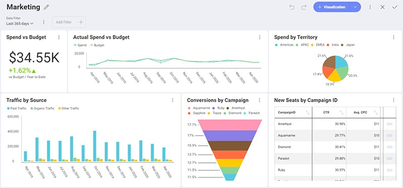
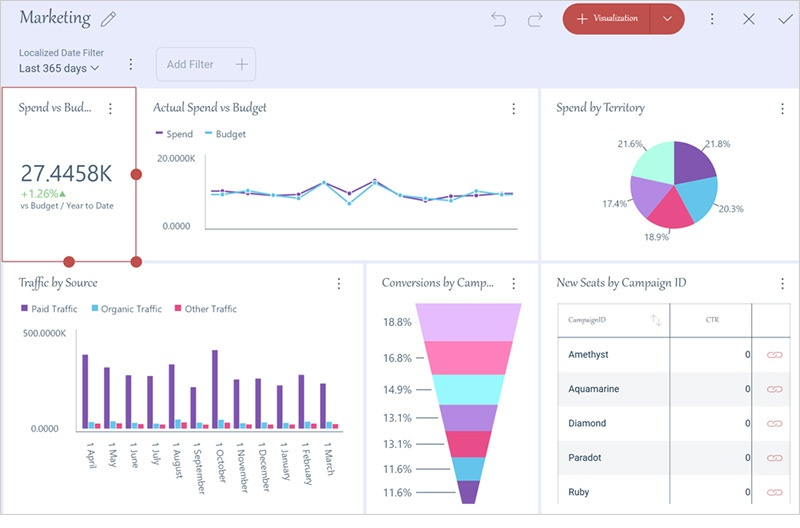

## カスタム テーマの作成

### 概要

分析を既存のアプリケーションに埋め込む場合、それらのダッシュボードがアプリのルック アンド フィールと一致することが重要です。そのため、SDK を通じて Reveal ダッシュボードを完全に制御できます。

カスタム テーマで達成できる主なカスタマイズ:

- **カラー パレット**: 表示形式でシリーズを表示するために使用される色。色の数に制限はありません。すべての色が表示形式で使用されると、Reveal はこれらの色の新しい色合いを自動生成します。これにより、色が重複せず、各値に独自の色が設定されます。
- **アクセント色**: Reveal のデフォルトのアクセント色は、**[+ ダッシュボード]** ボタンやその他のインタラクティブなアクションで見つけることができる青の色合いです。アプリケーションで使用するのと同じアクセント色に一致するように色を変更できます。
- **条件付き書式の色**: 条件付き書式を使用するときに設定できる境界のデフォルトの色を変更します。
- **フォント**: Reveal は、アプリケーションで 3 種類のテキストを使用します: 標準、中、太字。これらの各テキストグループのフォントの使用を指定できます。
- **表示形式とダッシュボードの背景色**: ダッシュボードの背景色と表示形式の背景色を個別に構成できます。

### 一般的なユース ケース: 新しいカスタム テーマ
Reveal で独自のテーマを作成するのは、新しい __RevealTheme()__ クラスのインスタンスを作成するのと同じように簡単です。このクラスには、概要にリストされているすべてのカスタマイズ可能な設定が含まれています。

新しい __RevealTheme__ インスタンスを作成すると、各設定のデフォルト値が取得され、必要に応じてそれらを変更できます。

次に、テーマ インスタンスを __UpdateRevealTheme(theme)__ メソッドに渡します。画面にダッシュボードまたは別の Reveal コンポーネントがすでに表示されている場合は、適用された変更を表示するために、再度レンダリングする必要があります。

### 一般的なユース ケース: カスタム テーマの変更

すでに独自のテーマを適用しているが、他に加えた変更を失わずに一部の設定を変更したい場合があります。

この場合、__GetCurrentTheme()__ メソッドを呼び出す必要があります。このメソッドを使用すると、RevealTheme 設定に最後に設定した値を取得できます。RevealTheme の新しいインスタンスを最初から作成する場合とは異なり、変更を適用してテーマを再度更新すると、デフォルト値ではなく、変更していない各設定の最新の値が取得されます。

__GetCurrentTheme()__ メソッドと __UpdateRevealTheme(theme)__ メソッドの両方に、__RevealView__ クラスからアクセスできます。


### コード例

まず、以下は変更する前のサンプル ダッシュボードです。



次のコード スニペットでは、現在のテーマを取得し、変更したい設定を適用し、Reveal でテーマを更新する方法を確認できます。

``` csharp

var regularFont = new FontFamily(new Uri("pack://application:,,,/ [Your ProjectName];component/[pathToFonts]/"), "./#Verdana Italic");
var boldFont = new FontFamily(new Uri("pack://application:,,,/ [Your ProjectName];component/[pathToFonts]/"), "./#Verdana Bold");
var mediumFont = new FontFamily(new Uri("pack://application:,,,/ [Your ProjectName];component/[pathToFonts]/"), "./#Verdana Bold Italic");

var customTheme = RevealView.GetCurrentTheme();
customTheme.ChartColors.Clear();
customTheme.ChartColors.Add(Color.FromRgb(192, 80, 77));
customTheme.ChartColors.Add(Color.FromRgb(101, 197, 235));
customTheme.ChartColors.Add(Color.FromRgb(232, 77, 137);

customTheme.BoldFont = new FontFamily("Gabriola");
customTheme.MediumFont = new FontFamily("Comic Sans MS");
customTheme.FontColor = Color.FromRgb(31, 59, 84);
customTheme.AccentColor = Color.FromRgb(192, 80, 77);
customTheme.DashboardBackgroundColor = Color.FromRgb(232, 235, 252);

RevealView.UpdateRevealTheme(customTheme);

```

> [!NOTE]
> 新しい色のセットを追加するには、まずチャートの色リストのデフォルト値をクリアする必要があります。

テーマの変更を実装すると、ダッシュボード エディターと表示形式エディターの両方の結果が表示されます。




