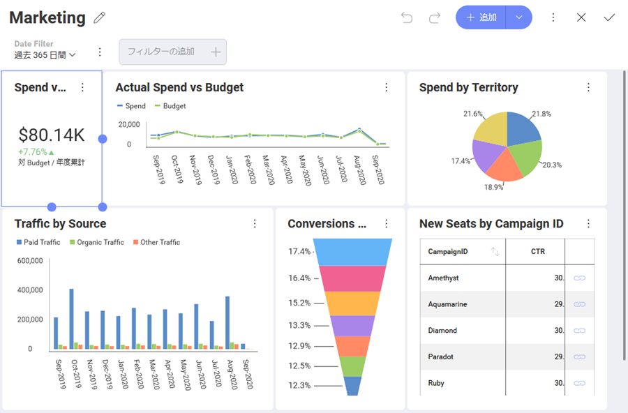
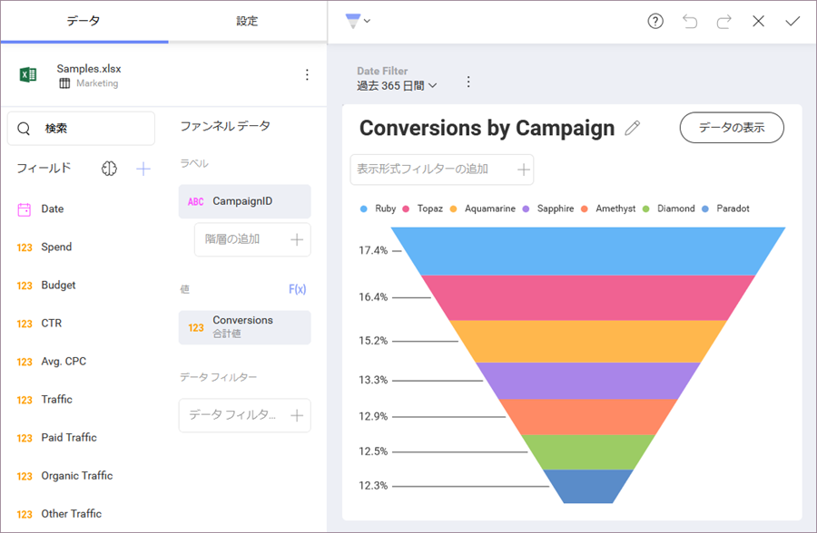
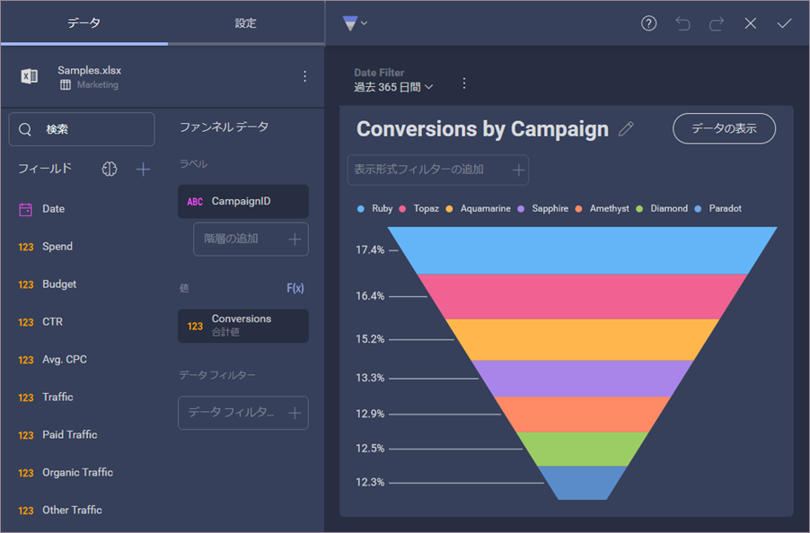
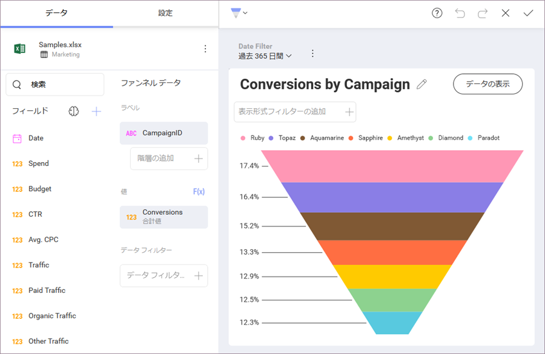

## カスタム テーマの作成

### 概要

分析を既存のアプリケーションに埋め込む場合、それらのダッシュボードがアプリのルック アンド フィールと一致することが重要です。そのため、SDK を通じて Reveal ダッシュボードを完全に制御できます。

Reveal で独自のテーマを作成するには、**Theme** プロパティを変更します。 

``` csharp

var regularFont = new FontFamily(new Uri("pack://application:,,,/ [Your ProjectName];component/[pathToFonts]/"), "./#Verdana Italic");
var boldFont = new FontFamily(new Uri("pack://application:,,,/ [Your ProjectName];component/[pathToFonts]/"), "./#Verdana Bold");
var mediumFont = new FontFamily(new Uri("pack://application:,,,/ [Your ProjectName];component/[pathToFonts]/"), "./#Verdana Bold Italic");

var currentTheme = RevealSdkSettings.Theme;
currentTheme.ChartColors.Clear();
currentTheme.ChartColors.Add(Color.FromRgb(192, 80, 77));
currentTheme.ChartColors.Add(Color.FromRgb(101, 197, 235));
currentTheme.ChartColors.Add(Color.FromRgb(232, 77, 137);

currentTheme.BoldFont = new FontFamily("Gabriola");
currentTheme.MediumFont = new FontFamily("Comic Sans MS");
currentTheme.FontColor = Color.FromRgb(31, 59, 84);
currentTheme.AccentColor = Color.FromRgb(192, 80, 77);
currentTheme.DashboardBackgroundColor = Color.FromRgb(232, 235, 252);

RevealSdkSettings.Theme = currentTheme;

```

> [!NOTE]
> 新しい色のセットを追加するには、まずチャートの色リストのデフォルト値をクリアする必要があります。

画面にダッシュボードまたは別の Reveal コンポーネントがすでに表示されている場合は、適用された変更を表示するために、再度レンダリングする必要があります。

### カスタマイズ可能なテーマ設定

The settings that you can use to customize your theme are part of the _RevealTheme()_ class. The _RevealTheme() class_ contains all Dashboard and App settings with their current values. 
以下のテーブルには、カスタマイズ可能なすべての設定とそれぞれに関する簡単な説明、タイプ、各設定のデフォルト値があります。 

| 名前                         | タイプ                    | 説明                                                                                                                                                                                                                                                                       |
|------------------------------|-------------------------|-----------------------------------------------------------------------------------------------------------------------------------------------------------------------------------------------------------------------------------------------------------------------------------|
| **ChartColors**                  | List<Color>             | The colors used to show the series in your visualizations. You can add an unlimited number of colors. Once all colors are used in a visualization, Reveal will autogenerate new shades of these colors. This way your colors won’t repeat and each value will have its own color. |
| **AccentColor**                  | Color                   | The default accent color in Reveal is a shade of blue that you can find in the + Dashboard button and other interactive actions. You can change the color to match the same accent color you use in your applications.                                                            |
| **DashboardBackgroundColor**     | Color                   | Sets the background color of the dashboards. This is the main background color.                                                                                                                                                                                                   |
| **VisualizationBackgroundColor** | Color                   | Sets the background color of the visualizations. This is a secondary background color.                                                                                                                                                                                            |
| **ConditionalFormatting**        | RVConditionalFormatting | Changes the default colors of the bounds you can set when using conditional formatting.                                                                                                                                                                                           |
| **RegularFont**                  | FontFamily              | Sets the regular font style.                                                                                                                                                                                                                                                      |
| **BoldFont**                     | FontFamily              | Sets the bold font style.                                                                                                                                                                                                                                                         |
| **MediumFont**                   | FontFamily              | Sets the medium font style.                                                                                                                                                                                                                                                       |
| **FontColor**                    | Color                   | Sets the color of the font.                                                                                                                                                                                                                                                       |
| **HighlightColor**               | Color                   | Sets the highlighting color in specific dashboard scenarios (forecast and outliers statistical functions).                                                                                                                                                                        |
| **UseRoundedCorners**            | bool                    | (By default) Rounded corners in buttons, tooltips, containers, visualizations, etc. If set to false, squared corners will be shown.                                                                                                                                               |
### ビルド済みのテーマ

Reveal SDK には、*Mountain Light*、 *Mountain Dark*、*Ocean Light*、*Ocean Dark* の 4 つのビルド済みテーマが付属しています。アプリケーションのデザインに最適なものを設定することも、カスタム テーマのベースとして使用することもできます。    

新しいインスタンスを作成して、選択したビルド済みテーマの設定を適用します。

***Mountain Light テーマ***
``` csharp
RevealSdkSettings.Theme = new MountainLightTheme();
```
> [!NOTE]
> Mountain Light には、カスタマイズ可能なすべての設定のデフォルト値が含まれています。 

***Mountain Dark テーマ***
``` csharp
RevealSdkSettings.Theme = new MountainDarkTheme();
```

***Ocean Light テーマ***
``` csharp
RevealSdkSettings.Theme = new OceanLightTheme();
```

***Ocean Dark テーマ***
``` csharp
RevealSdkSettings.Theme = new OceanDarkTheme();
```

#### ビルド済みのテーマはどのように見えますか? 

以下は、各ビルド済みテーマが適用されたときの*形式エディター*と*ダッシュボード エディター*の外観を示すテーブルです。 

<style type="text/css">
.tg  {border-collapse:collapse;border-spacing:0;}
.tg td{border-color:black;border-style:solid;border-width:1px;font-family:Arial, sans-serif;font-size:14px;
  overflow:hidden;padding:10px 5px;word-break:normal;}
.tg th{border-color:black;border-style:solid;border-width:1px;font-family:Arial, sans-serif;font-size:14px;
  font-weight:normal;overflow:hidden;padding:10px 5px;word-break:normal;}
.tg .tg-fymr{border-color:inherit;font-weight:bold;text-align:left;vertical-align:top}
.tg .tg-0pky{border-color:inherit;text-align:left;vertical-align:top}
</style>
<table class="tg">
<thead>
  <tr>
    <th class="tg-fymr">テーマ</th>
    <th class="tg-0pky"><span style="font-weight:bold">ダッシュボード エディター</span></th>
    <th class="tg-0pky"><span style="font-weight:bold">形式エディター</span></th>
  </tr>
</thead>
<tbody>
  <tr>
    <td class="tg-0pky">Mountain Light (デフォルト?)</td>
    <td class="tg-0pky"></td>
    <td class="tg-0pky"></td>
  </tr>
  <tr>
    <td class="tg-0pky">Mountain Dark </td>
    <td class="tg-0pky"></td>
    <td class="tg-0pky"></td>
  </tr>
  <tr>
    <td class="tg-0pky">Ocean Light</td>
    <td class="tg-0pky"></td>
    <td class="tg-0pky"></td>
  </tr>
  <tr>
    <td class="tg-0pky">Ocean Dark</td>
    <td class="tg-0pky"></td>
    <td class="tg-0pky"></td>
  </tr>
</tbody>
</table>