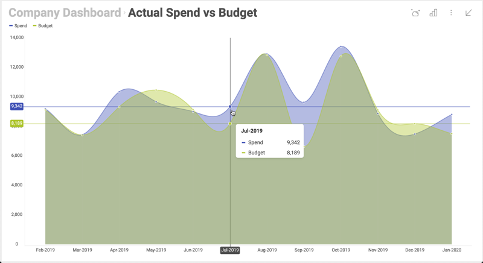

# 表示形式の最大化と単一表示形式モード

## 概要

Desktop SDK は、ダッシュボードをユーザーに表示する際に最大化した表示形式を 1 つだけ表示し、更に最初の表示形式をロックしてユーザーがダッシュボード全体にアクセスできないようにすることができます。



### サンプル詳細

表示した 3 つのダッシュボードがあり、それぞれの表示形式で会社の異なる部門のデータが表示されていると仮定します (例えば、Marketing、Sales、HR)。


この例では、業務アプリケーションでこれらの表示形式を使用します。各部署のホームページに表示される情報の一部として含めます。

## 表示形式の最大化

最大化された表示形式でダッシュボードを開くには、revealView.Dashboard プロパティを割り当てた後、__RevealView__ の __MaximizedVisualization__ プロパティを使用する必要があります。
この属性に視覚化を設定しないと、ダッシュボード全体が表示されます。


**RevealView オブジェクトの設定**に示すように、ページに特定のダッシュボードを表示できます。今回は、__MaximizedVisualization__ 属性を設定する必要があります。以下のコード スニペットに示すように、表示形式 Sales を使用してください。

``` csharp
var revealView = new RevealView();
using (var fileStream = File.OpenRead(path))
{
    var dashboard = new RVDashboard(fileStream);
    revealView.Dashboard = dashboard;
    revealView.MaximizedVisualization = dashboard.Visualizations.GetByTitle("Sales");
}
```

最初に最大化した表示形式は Sales というタイトルの表示形式になりますが、それでもエンドユーザーはダッシュボードに戻って残りの表示形式を表示できます。

## 単一表示形式モード

また、最初の表示形式をロックして、常に表示形式を 1 つのみ表示するようにすることもできます。これにより、ダッシュボードは単一の視覚化ダッシュボードのように機能します。これが [単一表示形式モード] の概念です。

単一表示形式モードをオンにするには、以下に示すように、
__SingleVisualizationMode__
プロパティを true に設定します。

``` csharp
revealView.SingleVisualizationMode = true;
```

この 1 行を追加すると、ダッシュボードは単一の視覚化ダッシュボードとして機能します。各部門のホームページでも同じことができます。__dashboard.Visualizations.GetByTitle()__ の表示形式のタイトルを適切なタイトルに置き換えてください。


### ロックされた表示形式を動的に変更

ページを再ロードせずに、表示されている単一の表示形式を動的に変更することもできます。ユーザーの観点から見ると、アプリは部門のセレクターと最大化された視覚化を備えた単一ページのアプリケーションになります。ユーザーがリストから 1 つの部門を選択すると、最大化された視覚化が更新されます。

以下では、
__RevealView__ の __MaximizeVisualization__ メソッドを使用するか、__MaximizedVisualization__ プロパティを設定してこのシナリオを実現できます。

``` csharp
private void MaximizeVisualization(string title)
        {
            revealView.MaximizeVisualization(revealView.Dashboard.Visualizations.GetTitle(title));
            //or set the property
            revealView.MaximizedVisualization = revealView.Dashboard.Visualizations.GetTitle(title);
        }
```

最後に、カスタム コントロールを上記の方法で接続します。それにより、アプリケーションの選択が変わったときに視覚化が最大化されます。

注意事項:

  - ダッシュボードで表示形式のリストを繰り返すことで、ボタンのリストを動的に生成できます。詳細については、__RVDashboard.Visualizations__ をご覧ください。
  - SDK とともに配布されている UpMedia WPF アプリケーションの UpMedia に、**Manufacturing.xaml.cs** の動作を確認できる例があります。このサンプルビューでは、画面下部にすべての表示形式がトグル ボタンのリストとして表示されます。
