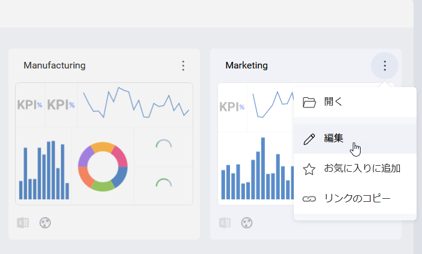

## ユーザー インターフェイス要素の表示/非表示

__RevealView__ コンポーネントを使用して、エンド ユーザーに対するさまざまな機能または UI 要素を有効または無効にすることができます。使用可能なプロパティの多くはブール型で簡単に使用できますが、その他のプロパティはそれほど多くありません。

以下に作成する *revealView* インスタンスは、このトピックのすべてのコード スニペットで使用されます。

``` csharp
var revealView = new RevealView();
```

すべてのプロパティは、初期化時に __RevealView__ によって読み取られ、その値に基づいて、ユーザーにさまざまな機能または UI 要素を表示または非表示にします。

### CanEdit
このプロパティは、ダッシュボードを編集するユーザー機能を無効にするために使用できます。



``` csharp
revealView.CanEdit = false;
```

### ShowExportButton
このプロパティは、ダッシュボードをエクスポートするユーザー機能を無効にするために使用できます。


``` csharp
revealView.ShowExportButton = false;
```

### CanCopyVisualization
このプロパティは、表示形式をコピーし、後で現在のダッシュボードまたは別のダッシュボードに貼り付ける機能を無効にするために使用できます。


``` csharp
revealView.CanCopyVisualization = false;
```

### CanDuplicateVisualization
このプロパティは、現在のダッシュボードで表示形式を複製する機能を無効にするために使用できます。


``` csharp
revealView.CanDuplicateVisualization = false;
```

### CanAddPostCalculatedFields
このプロパティを使用して、現在のダッシュボードに新しい事後計算フィールドを追加する機能を無効にできます。


事後計算フィールドはデータセットの新しいフィールドで、すでに集計された値に数式を適用して作成されます。
詳細については、[Reveal ヘルプ](https://help.revealbi.io/en/data-visualizations/fields/calculated-fields/overview.html)をご覧ください。

``` csharp
revealView.CanAddPostCalculatedFields = false;
```

### CanAddCalculatedFields
このプロパティを使用して、現在のダッシュボードに新しい事前計算フィールドを追加する機能を無効にできます。


事前計算フィールドはデータセットの新しいフィールドで、データ エディター集計を実行する前に評価されます。
詳細については、[Reveal ヘルプ](https://help.revealbi.io/en/data-visualizations/fields/calculated-fields/overview.html)をご覧ください。

``` csharp
revealView.CanAddCalculatedFields = false;
```

### ShowFilters
このプロパティは、ユーザーにダッシュボード フィルター UI を表示または非表示にするために使用できます。


ダッシュボード フィルターを使用すると、ダッシュボードの全ての表示形式のコンテンツを一度にフィルター適用できます。

``` csharp
revealView.ShowFilters = false;
```

### 選択済みフィルター
ダッシュボードを読み込みする時に既存のダッシュボード フィルターから最初に選択される値を指定できます。


次のコードスニペットは、ダッシュボードを読み込む方法を示し、選択された「Territory」値を「Americas」に設定します。したがって、ダッシュボードには「Americas」でフィルタリングされたデータが表示されます。

``` csharp
var dashboard = new RVDashboard(path);
dashboard.filters.GetByTitle("Territory").selectedValues = new List<object>() { "Americas" };
revealView.Dashboard = dashboard;
```


### AvailableChartTypes
このプロパティは、ユーザーが使用できる表示形式タイプをフィルターするために使用できます。


たとえば、以下のように表示形式を追加または削除できます。

``` csharp
revealView.AvailableChartTypes.Add(RVChartType.BulletGraph);
revealView.AvailableChartTypes.Remove(RVChartType.Choropleth);
```

さらに、使用可能な表示形式のみを含む新しいリストを作成できます。

``` csharp
revealView.AvailableChartTypes = new List<RVChartType>() { RVChartType.BulletGraph, RVChartType.Choropleth };
```