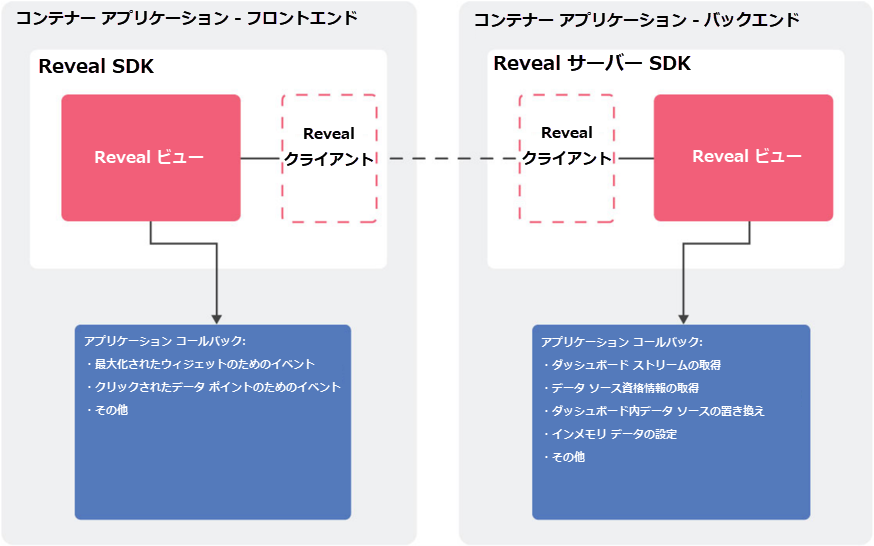

## 概要

Web アプリケーションに Reveal を埋め込む場合、2 つのコンポーネントが常に関係しているため、アーキテクチャはネイティブ アプリよりも少々複雑になります:

  - **Reveal クライアント SDK**: ウェブ アプリケーションに統合される必要がある JavaScript ライブラリ。現在サポートされているフレームワークは、jQuery、Angular、および React です。

  - **Reveal サーバー SDK**: サーバー アプリケーションに統合されるサーバー側のコンポーネント。現在、これは .NET ランタイム v4.6.2 またはそれ以降を使用する ASP.NET Core アプリケーションです。今後、.NET Core を使ったライブラリがリリースされる予定です。

次の図では、Reveal Web SDK を埋め込んだ Web アプリケーションのアーキテクチャを可視化しています:



上記の示したように、SDK はネイティブ アプリケーションとほとんど同じように機能します。違いは、一部のコールバックはクライアント側で呼び出され (データポイントがクリックされたときに送信されるイベントなど)、その他はサーバー側で呼び出される (ダッシュボードのロードまたはメモリ内データの提供のためのコールバックなど) 点です。

<a name='host-client-server-separate'></a>
### クライアント側とサーバー側の部分のホスト (異なるサーバーを利用)

クライアント側とサーバー側のパーツを個別に、たとえば異なる URL でホストできます。

これには、以下のようにウィンドウ オブジェクトのプロパティを設定します:

``` js
$.ig.RevealSdkSettings.setBaseUrl("{back-end base url}");
```

プロパティを正しく設定するには、**URL に末尾にスラッシュ記号が必要**です。

このプロパティは、[$.ig.RevealView のインスタンス化](~/jp/developer/web-sdk/setup-configuration-web.html#instantiate-web-client-sdk)**の前に**設定します。
