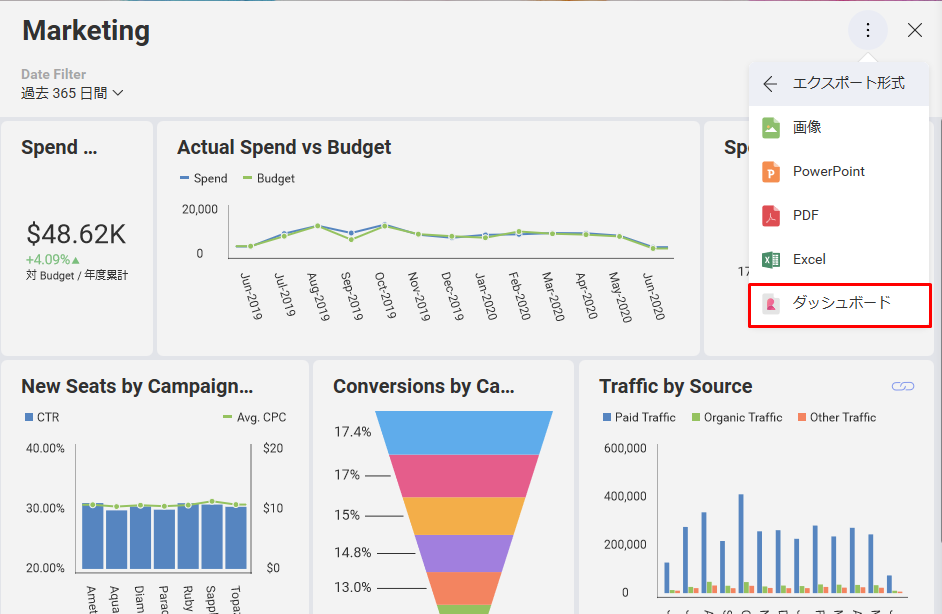

# Web SDK をはじめて使用する

このページは、Web ページ/アプリケーションにはじめてダッシュボードを表示する際の手順について説明します。

## 手順

1.  プロジェクトを作成する
2.  Reveal SDK のインストール
3.  サーバー構成の設定
4.  クライアント アプリケーションに Reveal を埋め込む
5.  Reveal フォントの使用
6.  クライアント アプリケーションのスタイル設定

## 手順 1 - プロジェクトを作成する

Visual Studio 2017 を開き、*ASP.NET Core Web アプリケーション*の新しいプロジェクトを作成します。


以下のように **.NET Framework** および **ASP.NET Core 2.2** を選択します。


## 手順 2 - Reveal SDK のインストール

<https://www.revealbi.io/jp> から Infragistics Reveal SDK をダウンロードし、システムにインストールします。*Visual Studio* で ツール > オプション > Nuget パッケージ マネージャー > パッケージ ソース を選択します。インストールされた SDK の Nuget フォルダーを指す新しいソースを追加します。


その後、パッケージ ソースを追加したものに変更して Nuget をインストールできます。


## 手順 3 - サーバー構成の設定

プロジェクトに新しい Reveal SDK フォルダーを作成し、**RevealSdkContextBase** 抽象クラスを実装する **RevealSdkContext.cs** クラスを追加します。

``` csharp
    using Reveal.Sdk;
    using System;
    using System.IO;
    using System.Reflection;
    using System.Threading.Tasks;

    namespace Demo1.RevealSDK
    {
        public class RevealSdkContext : RevealSdkContextBase
        {
            public override IRVDataSourceProvider DataSourceProvider => null;

            public override IRVDataProvider DataProvider => null;

            public override IRVAuthenticationProvider AuthenticationProvider => null;

            public override Task<Dashboard> GetDashboardAsync(string dashboardId)
            {
                var dashboardFileName = dashboardId +".rdash";
                var resourceName = $"Demo1.Dashboards.{dashboardFileName}";
                var assembly = Assembly.GetExecutingAssembly();
                return Task.FromResult(new Dashboard(assembly.GetManifestResourceStream(resourceName)));
            }

            public override Task SaveDashboardAsync(string userId, string dashboardId, Dashboard dashboard)
            {
                return Task.CompletedTask;
            }

        }
    }
```

上記のコードでは、**Demo1.Dashboards** がダッシュボード ファイルが含まれる場所を示しているため、プロジェクトに新しいダッシュボード フォルダーを作成し、ここでは空のままにします。

これを行うには、**Startup.cs** の **ConfigureServices** メソッドに以下のコードを追加します。

``` csharp
   services.AddRevealServices(new RevealEmbedSettings
    {
        CachePath = @"C:\Temp"
    }, new RevealSdkContext());

    services.AddMvc().AddReveal();
```

同じファイルに必要な参照を追加します。

``` csharp
    using Demo1.RevealSDK;
    using Reveal.Sdk;
```

問題が発生した場合は、サーバー SDK - [**セットアップと構成**](~/jp/developer/setup-configuration/setup-configuration-web.html)トピックを参照してください。

## 手順 4 - クライアント アプリケーションに Reveal を埋め込む

はじめにダッシュボードを準備します。このデモでは、Reveal の**サンプル** セクションの **Marketing ダッシュボード**を使用できますが、テーマは異なります。
ダッシュボードを開き、編集モードに入ります。

Reveal アプリ (<https://app.revealbi.io>) を開き、**サンプル**に移動します。


Marketing ダッシュボードを選択し、**編集モード**に入ります。


編集モードに入った後に \[テーマ\] ボタンをクリックします。


[Ocean テーマ] を選択します。


変更したダッシュボードを保存し、エクスポートします。

> [!NOTE]
> Marketing ダッシュボードは、Reveal アプリの**サンプル**の一部であるため、通常のダッシュボードと同じ方法で保存することはできません。代わりに、**[名前を付けて保存]** を使用して場所を選択する必要があります。



**Marketing.rdash** ダッシュボード ファイルを手順 3 で作成したダッシュボード フォルダーに移動し、Visual Studio でこのアイテムのビルド アクションを**埋め込みリソース**に設定します。


次に、新しいページ *Marketing.cshtml* を追加して、ダウンロードしたダッシュボードを可視化します。

``` csharp
   @{
        ViewData["Title"] = "Marketing";
    }

    @section Scripts
        {
        <script type="text/javascript">
            // #revealView 要素にダッシュボードを読み込む
        </script>
    }

    <section>
        <div id="revealView" style="height:800px;"></div>
    </section>
```

次に、**HomeController.cs** に新しいアクション メソッドを追加します。

``` csharp
   public IActionResult Marketing()
    {
        return View();
    }
```

**\_Layout.cshtml** にある Reveal のサードパーティの依存関係について、スクリプトと css ファイルへの参照をいくつか追加しましょう:

``` html
   <script src="https://unpkg.com/dayjs"></script>
   <link rel="stylesheet" href="https://code.jquery.com/ui/1.10.2/themes/smoothness/jquery-ui.css" />
   <script type="text/javascript" src="https://ajax.aspnetcdn.com/ajax/jQuery/jquery-3.2.1.min.js"></script>
   <script src="https://code.jquery.com/ui/1.12.1/jquery-ui.min.js"></script>
   <script src="https://cdn.quilljs.com/1.3.6/quill.js"></script>
   <link href="https://cdn.quilljs.com/1.3.6/quill.snow.css" rel="stylesheet">
```

続行するには、プロジェクトの wwwroot フォルダーに新しい Reveal フォルダーを作成します。**infragistics.reveal.js** をコピーします。このファイルは、Reveal SDK の **\<InstallationDirectory\>\\SDK\\Web\\JS\\Client** にあります。


そして、Day.js のスクリプトの後に **\_Layout.cshtml** でこのライブラリを参照します。

``` html
   <script src="~/Reveal/infragistics.reveal.js"></script>
```

同じファイル内のフッター セクションも削除し、新しいページのナビゲーションにリンクを追加します。

``` html
   <li class="nav-item">
        <a class="nav-link text-dark" asp-area="" asp-controller="Home" asp-action="Marketing">Marketing</a>
    </li>
```

**Marketing.cshtml** のスクリプトを、ダッシュボードをロードするためのロジックで更新しましょう。

``` js
    var dashboardId = "Marketing.rdash";

    $.ig.RVDashboard.loadDashboard(dashboardId, function (dashboard) {
        var revealView = new $.ig.RevealView("#revealView");
        revealView.dashboard = dashboard;
    }, function (error) {
        //ここで発生する可能性があるエラーを処理します。
    });
```

最後に、Web ページを実行すると、ダッシュボードが表示されます。


問題が発生した場合は、クライアント SDK [**セットアップと構成**](~/jp/developer/setup-configuration/setup-configuration-web.html)トピックを参照してください。

## 手順 5 - Reveal フォントの使用

Reveal アプリは Roboto フォントを使用します。アプリと同じ外観を実現するには、
<https://fonts.google.com/specimen/Roboto> からフォントをダウンロードし、次の TTF ファイルをプロジェクトの **wwwroot/css** フォルダーへコピーします。

  - Roboto-Regular.ttf

  - Roboto-Bold.ttf

  - Roboto-Light.ttf

  - Roboto-Medium.ttf

次に、**site.css** に以下のように参照を追加します。

``` css
@font-face {
   font-family: "Roboto-Regular";
   src: url("Roboto-Regular.ttf");
}

@font-face {
   font-family: "Roboto-Bold";
   src: url("Roboto-Bold.ttf");
}

@font-face {
   font-family: "Roboto-Light";
   src: url("Roboto-Light.ttf");
}

@font-face {
   font-family: "Roboto-Medium";
   src: url("Roboto-Medium.ttf");
}
```

フォントの読み込みを改善するには、infragistics.reveal.js 参照の横にある **\_Layout.cshtml** で Google Web Font Loader への参照を追加します。

``` html
<script src="https://ajax.googleapis.com/ajax/libs/webfont/1/webfont.js"></script>
```

最後に、**Marketing.cshtml** ページのスクリプト セクションを変更して、フォント ローダーを利用します。

``` csharp
   WebFont.load({
        custom: {
            families: ['Roboto-Regular', 'Roboto-Bold', 'Roboto-Light', 'Roboto-Medium'],
            urls: ['/css/site.css']
        },
        active: function () {
            var dashboardId = "Marketing.rdash";

            $.ig.RVDashboard.loadDashboard(dashboardId, function (dashboard) {
                var revealView = new $.ig.RevealView("#revealView");
                revealView.dashboard = dashboard;
            }, function (error) {
                //ここで発生する可能性があるエラーを処理します。
            });
        },
    });
```

結果は以下のようになります。


## 手順 6 - クライアント アプリケーションのスタイル設定

デフォルトのテンプレートを使用する代わりに、クライアント アプリケーションのスタイルを設定できます。

**HomeController.cs** からプライバシーを削除し、Marketing にリダイレクトするようにインデックスを変更します。

``` csharp
   public IActionResult Index()
    {
        return RedirectToAction("Marketing");
    }
```

また、Index.cshtml および Privacy.cshtml ファイルは使用されないため削除してください。Marketing.cshtml の \<div\> 要素のスタイル設定を削除します。

*wwwroot* に新しい img フォルダーを作成し、そこへ *logo.png* をコピーします。これは、[こちら](https://download.infragistics.com/reveal/help/samples/logo.png?)からダウンロードできます。

**\_Layout.cshtml** で、以下の変更を行います。

  - タイトルを Demo1 から Overview へ変更します。

  - ヘッダーの後の div を削除します。

  - ロゴ、セパレータ、タイトルを追加してヘッダーを変更します。

<!-- end list -->

``` html
   <header>
        <div class="header">
            
            <span class="line" />
            <h1>Overview</h1>
        </div>
    </header>
```

**site.css** で、Roboto フォント用に追加したものを除くすべてのスタイルを削除し、ヘッダーにスタイルを追加します。

``` css
  /* Header
    -------------------------------------------------- */

    header {
        display: flex;
        width: 100%;
        height: 70px;
        box-shadow: 0 4px 12px 0 rgba(0, 0, 0, 0.2);
        background-color: #37405a;
    }

    img.logo {
        width: 50px;
        height: 50px;
        margin: 10px;
        float: left;
    }

    span.line {
        float: left;
        width: 1px;
        height: 50px;
        margin-top: 10px;
        border: solid 1px #2b2e40;
    }

    h1 {
        float: left;
        padding-top: 12px;
        padding-left: 20px;
        height: 24px;
        font-family: Roboto-Regular;
        font-size: 20px;
        font-weight: 400;
        color: #ffffff;
    }
```

ボディのスタイル:

``` css
  /* Body
    -------------------------------------------------- */
    body {
        display: flex;
        flex-direction: column;
        background-image: linear-gradient(to bottom, #30365a, #2b2e40);
    }

    html, body {
        width: 100%;
        height: 100%;
    }

        body section {
            display: block;
            width: 100%;
            height: 100%;
            padding: 15px;
        }

    #revealView {
        height: 100%;
    }
```

結果は以下のようになります。


