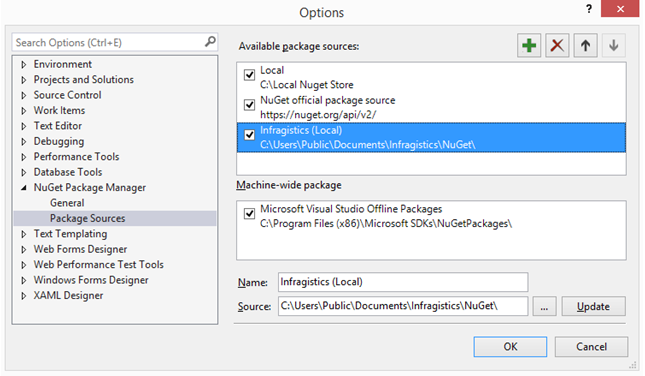

# セットアップと構成 (Web)

## 前提条件

Reveal Server SDK には、.NET Core 3.1 以降が必要です。

## セットアップと構成の概要 

以下は、Reveal Web Server SDK 設定の手順です。

1.  [**Reveal SDK をインストールします。**](#installing-reveal-sdk)

2.  [**DashboardProvider を定義します。**](#defining-dashboardprovider)

3.  [**サーバー SDK を初期化します。**](#initializing-server-sdk)

4.  [**サーバー側画像生成を設定します。**](#server-side-image-export)

5.  [**Reveal ログを有効にします。**](#enable-reveal-logging)

<a name='installing-reveal-sdk'></a>

### 1\. Reveal SDK のインストール

マシンで Reveal Sdk インストーラーを実行して、アセンブリと依存関係パッケージを準備します。

インストールが完了すると、**nuget.config** に追加された _Infragistics (Local)_ という新しい NuGet パッケージ ソースが見つかります。
これは、「%public%\\Documents\\Infragistics\\NuGet」を指します。



Infragistics (Local) フィードがインストーラーによって正しく設定されていることを確認後:

- **Reveal.Sdk.Web.AspNetCore(.Trial)** NuGet パッケージをアプリ プロジェクトにインストールします。
- NuGet パッケージ参照を System.Data.SQLite バージョン 1.0.111 以降に追加します。

> [!NOTE] 
> トライアル nuget パッケージは nuget.org で入手できます: [**Reveal.Sdk.Web.AspNetCore.Trial**](https://www.nuget.org/packages/Reveal.Sdk.Web.AspNetCore.Trial/)。


ビルドに問題がある場合は、この[**リンク**](#sqlite-fix)に従ってください。

<a name='defining-dashboardprovider'></a>

### 2\. DashboardProvider の定義

nuget パッケージをインストールした後、**IVRDashboardProvider** インターフェイスを実装するクラスを作成する必要があります。このクラスは、ダッシュボードの読み込みと保存を処理します。

```csharp
    using Reveal.Sdk;
    public class DashboardProvider : IRVDashboardProvider
    {
        private string _ext = ".rdash";
        readonly string _dashboardsDirectoryPath;

        public DashboardProvider(string dashboardsDirectoryPath = "Dashboards")
        {
            _dashboardsDirectoryPath = dashboardsDirectoryPath;
        }
        public Task<Dashboard> GetDashboardAsync(IRVUserContext userContext, string dashboardId)
        {
            var fileToLoad = Directory.EnumerateFiles(_dashboardsDirectoryPath)
                                        .Where(f => f == dashboardId || f == dashboardId + _ext)
                                        .FirstOrDefault(f => f.EndsWith(_ext));
            if (fileToLoad != null)
            {
                return Task.FromResult(new Dashboard(fileToLoad));
            }
            throw new ArgumentException($"No rdash file with name \"{dashboardId}\" was found in the dashboards folder:{_dashboardsDirectoryPath}.");
        }

        public Task SaveDashboardAsync(IRVUserContext userContext, string dashboardId, Dashboard dashboard)
        {
            string dashboardFileName = dashboardId.Contains(_ext) ? dashboardId : dashboardId + _ext;

            return dashboard.SaveToFileAsync(Path.Combine(_dashboardsDirectoryPath, dashboardFileName));
        }
    }
```

上記のコードは、単純なファイル システム ベースのプロバイダーを実装しています。基本的に、ダッシュボードの読み込み元/保存先のディレクトリを指定するコンストラクター内の引数を受け入れます。また、ファイル拡張子を指定し忘れたり、指定したくない場合でも問題ありません。

<a name='initializing-server-sdk'></a>

### 3\. サーバー SDK の初期化

**Startup.cs** のアプリケーションの **ConfigureServices** メソッドで、IMvcBuilder インターフェイスを返す 1 つ以上の AspNetCore サービスを追加する必要があります。最もよく使用されるサービスは、AddMvc、AddControllersWithViews、および AddControllers です。これらのいずれかを追加した後、その上に *.AddReveal* を呼び出す必要があります。**AddReveal** は、IMvcBuilder を拡張するために使用される拡張メソッドです。


> [!NOTE]
> AddReveal 拡張メソッドは Reveal.Sdk 名前空間にあるため、Startup.cs にその使用法を追加する必要があります。

**AddReveal** を使用すると、Reveal サーバー コンポーネントを登録したり、設定を提供したりできます。以下のコード スニペットは、前の手順で定義された DashboardProvider クラスを登録する基本的な呼び出しを表しています:

```csharp
services
    .AddMvc()
        .AddReveal(builder =>
        {
            builder
              .AddDashboardProvider<AddDashboardProvider>()
              .AddSettings(settings =>
              {
                  settings.LocalFileStoragePath = "Data";
                  settings.DataCachePath = settings.CachePath = @"C:\Temp\Reveal\Cache";
              });
        });
```

DashboardProvider クラスの登録に加えて、LocalFileStoragePath も指定されました。これは、Excel や CSV などの静的データ ソース ファイルが配置されるパスであり、使用されるキャッシュ場所のデフォルト設定です。

特定のインスタンスではなく、タイプを登録する必要があることに注意してください。これは、タイプが AspNetCore Di コンテナーに登録されるためです。
このアプローチにより、DashboarProvider の実装や他の Reveal プロバイダーで使用している可能性のある他のサービスを柔軟に注入できます。必要に応じてインスタンスを自由に登録できます。他のオーバーロード AddDashboardProvider メソッドを使用するだけです。以下に示すように:
```csharp
builder.AddDashboardProvider(new DashboardProvider())
```

<a name='server-side-image-export'></a>

### 4\. サーバー側画像生成の設定

**画像**、**PDF**、または **PowerPoint** 機能へのエクスポート (プログラムまたはユーザー操作による) を使用するには、.NET Server SDK は、内部で [**Playwright**](https://playwright.dev/dotnet/) を使用します。

デフォルトでは、ユーザーがダッシュボードを画像、PDF、または PowerPoint に初めてエクスポートしようとすると、Playwright は Chromium ブラウザーを現在のプラットフォームのデフォルトの場所にダウンロードしようとします。Windows の場合、デフォルトのパスは **%userprofile%\AppData\Local\ms-playwright\** です。ダウンロードする Chromium 実行可能ファイルのサイズは約 220 メガバイトです。

このダウンロードには時間がかかり、ダッシュボードをエクスポートしようとする最初のユーザーに遅延が発生する可能性があります。これは開発期間中は問題ありません。ただし、ステージング環境またはプロダクション環境にデプロイする場合は問題があります。これらのシナリオでは、デプロイを微調整できるいくつかの設定を提供します。

これらの設定は、<a href="/api/aspnet/latest/Reveal.Sdk.ExportConfiguration.html" target="_blank" rel="noopener\">RevealEmbedSettings Export</a>  プロパティを通じて公開されます。
- <a href="/api/aspnet/latest/Reveal.Sdk.ExportConfiguration.html#Reveal_Sdk_ExportConfiguration_CreateChromiumInstancesOnDemand" target="_blank" rel="noopener\">CreateChromiumInstancesOnDemand</a> - これを false に設定すると、アプリの起動時に Playwright の初期化が強制的に行われます。
- <a href="/api/aspnet/latest/Reveal.Sdk.ExportConfiguration.html#Reveal_Sdk_RevealEmbedSettings_ChromiumDownloadFolder" target="_blank" rel="noopener\">ChromiumDownloadFolder</a> - Chromium 実行可能ファイルがダウンロードされる場所を提供します。
- <a href="/api/aspnet/latest/Reveal.Sdk.ExportConfiguration.html#Reveal_Sdk_RevealEmbedSettings_ChromiumExecutablePath" target="_blank" rel="noopener\">ChromiumExecutablePath</a> ChromiumExecutablePath - サーバー プラットフォームに Chromium 実行可能ファイルを手動でデプロイすることをお勧めします。このパスを、Chromium 実行可能ファイルをデプロイした場所に設定します。
- <a href="/api/aspnet/latest/Reveal.Sdk.ExportConfiguration.html#Reveal_Sdk_RevealEmbedSettings_MaxConcurrentExportingThreads" target="_blank" rel="noopener\">MaxConcurrentExportingThreads</a> - エクスポート機能をサポートするスレッドを同時にいくつ使用するかを指定できます。
- <a href="/api/aspnet/latest/Reveal.Sdk.ExportConfiguration.html#Reveal_Sdk_RevealEmbedSettings_ExportingTimeout" target="_blank" rel="noopener\">ExportingTimeout</a> - エクスポート操作のタイムアウト期間をミリ秒単位で定義します。デフォルト値は 30000 ms。エンドユーザーがダッシュボードをエクスポートする際、指定された期間内に終了しなかった場合、エクスポート操作は失敗します。このような場合は、同時実行スレッドの数を増やすと役立つ場合があります。

ChromiumExecutablePath を使用し、ご使用の環境でブラウザーを手動でセットアップする場合は、[**Playwright Cli**](https://playwright.dev/dotnet/docs/cli) を使用する Chromium 実行可能ファイルを取得する必要があります:
```cmd
dotnet tool install --global Microsoft.Playwright.CLI
playwright install chromium
```

**注:** バージョン <b>1.1.2</b> より前では、SDK はエクスポート機能に puppeteer と nodejs を使用していました。プロジェクトのルートに package.json ファイルと screenshoteer.js ファイルを追加し、エクスポートを機能させる必要がありました。バージョン 1.1.2 リリースでは、これは不要になり、開発 / 実稼働環境に nodejs をインストールする必要もありません。

<a name='enable-reveal-logging'></a>

### 5\. Reveal ログを有効にする

appsettings.json に「Reveal.Sdk」キーを追加してログ レベルを次のように設定することで、Reveal ログを有効にできます:
```json
{
  "Logging": {
    "LogLevel": {
      "Default": "Information",
      "Microsoft": "Warning",
      "Microsoft.Hosting.Lifetime": "Information",
      "Reveal.Sdk": "Debug"
    }
  },
  "AllowedHosts": "*"
}
```

<a name='sqlite-fix'></a>

### NuGet 使用時のビルドの問題

**SQLite.Interop.dll** に関連するデプロイメントの問題を処理するために、NuGet パッケージでカスタムの .targets ファイルが使用されています。

ビルドに問題がある場合は、プロジェクトに次のプロパティを追加してこの動作を無効にできます。

``` xml
<DisableSQLiteInteropFix>true</DisableSQLiteInteropFix>
```

## セットアップと構成 (クライアント)  

以下は、Reveal Web Client SDK を設定するための手順です。

1.  [**依存関係の確認**](#check-dependencies)

2.  [**Web Client SDK の参照**](#reference-web-client-sdk)

3.  [**Web Client SDK のインスタンス化**](#instantiate-web-client-sdk)

<a name='check-dependencies'></a>

### 1\. 依存関係の確認
Reveal Web Client SDK には、サードパーティーの参照が 2 つあります。

- [jQuery](https://jquery.com) 2.2 またはそれ以上
- [Day.js](https://day.js.org) 1.8.15 またはそれ以上
- [Quill RTE](https://quilljs.com/) 1.3.6 またはそれ以上
- **(オプション)** [Spectrum](https://github.com/bgrins/spectrum) v 1.8.0 以降 - これは、エンド ユーザーが特定の可視化の背景色を設定できるように UI を有効にする場合にのみ必要です。
[canChangeVisualizationBackgroundColor](~/jp/developer/web-sdk/using-the-client-sdk/showing-hiding-elements.html#canChangeVisualizationBackgroundColor) をご覧ください。


<a name='reference-web-client-sdk'></a>

### 2\. Web Client SDK の参照

Web ページで **RevealView** コンポーネントを有効にするには、いくつかの クリプトを含める必要があります。これらのスクリプトは Reveal Web Client SDK の一部として提供されます。

```html
<script src="~/Reveal/infragistics.reveal.js"></script>
```

JavaScript ファイル は \<InstallationDirectory\>\\SDK\\Web\\JS\\Client にあります。
デフォルトのインストール ディレクトリは次のとおりです:
```cmd
"%public%\\Documents\\Infragistics"
```

> [!NOTE] 
> **Reveal JS クラスの参照**
> **$.ig.** または **RevealApi.** を介して JS クラスを参照できます。ドキュメント全体を通して、クラスを参照するために「$.ig.」プレフィックスを使用しています。「$.ig.」の代わりに RevealApi プレフィックスを使用できます。プロジェクトにタイプ定義 (beta) infragistics.reveal.d.ts をドロップできるはずなので、typescript を使用している場合は、**RevealApi** プレフィックスを使用する方がよい場合があります。

<a name='instantiate-web-client-sdk'></a>

### 3\. Web Client SDK のインスタンス化

ダッシュボードのプレゼンテーションは、Web Client SDK を介してネイティブに処理されます。

以下の手順に従って作業を開始します。

1.  id を指定して \<div /\> 要素を定義し、**\$.ig.RevealView** コンストラクターを呼び出します。

    > [!NOTE]
    > **サーバー側とクライアント側のパーツを個別にホスト**
    > 個別のサーバーでクライアント側とサーバー側のパーツをホストする場合は、次の手順を続行する前に[こちら](~/jp/developer/web-sdk/overview.html#host-client-server-separate)を参照してください。

2.  **\$.ig.RVDashboard.loadDashboard** を呼び出して _dashboardId_ と成功およびエラー ハンドラを指定します。

3.  成功ハンドラーで、ダッシュボードが描画される DOM 要素のセレクターを渡すことにより、**\$.ig.RevealView** コンポーネントをインスタンス化します。最後に、取得したダッシュボードを使用し、**\$.ig.RevealView** のダッシュボード プロパティに設定する必要があります。

### サンプル コード

```html
<!DOCTYPE html>
<html>
  <head>
    ⋮
    <script type="text/javascript">
      var dashboardId = "dashboardId";

      $.ig.RVDashboard.loadDashboard(
        dashboardId,
        function (dashboard) {
          var revealView = new $.ig.RevealView("#revealView");
          revealView.dashboard = dashboard;
        },
        function (error) {
          //ここで発生する可能性があるエラーを処理します。
        }
      );
    </script>
  </head>
  <body>
    <div id="revealView" style="height:500px;" />
  </body>
</html>
```

