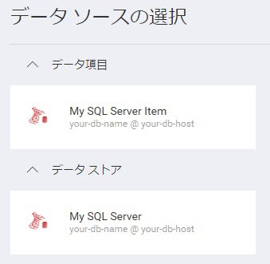
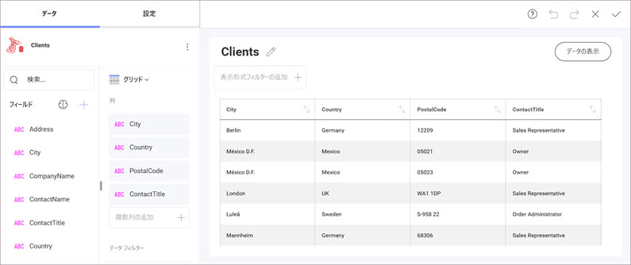

# MS SQL Server データ ソースの追加

**手順 1** - `RevealView.onDataSourcesRequested` イベントのイベント ハンドラーを追加します。

まず、`id` を `revealView` に設定して `<div>` タグを定義します。

```html
<div id="revealView" style="height: 920px; width: 100%;"></div>
```

`revealView` を初期化し、イベント ハンドラーを追加します。

```javascript
var revealView = new $.ig.RevealView("#revealView");
revealView.onDataSourcesRequested = (callback) => {
    //add code here
    callback(new $.ig.RevealDataSources([], [], true));
};
```

**手順 2** - `RevealView.onDataSourcesRequested` イベント ハンドラーで、`RVSqlServerDataSource` オブジェクトの新しいインスタンスを作成します。`Host`、`Database`、`Port`、および `Title` プロパティを、MS SQL Server に対応する値に設定します。`RVSqlServerDataSource` オブジェクトを作成したら、それをデータ ソース コレクションに追加します。

```javascript
revealView.onDataSourcesRequested = (callback) => {
    var sqlDataSource = new $.ig.RVSqlServerDataSource();
    sqlDataSource.host = "your-db-host";
    sqlDataSource.database = "your-db-name";
    sqlDataSource.port = 1234;
    sqlDataSource.title = "My SQL Server";

    callback(new $.ig.RevealDataSources([sqlDataSource], [], true));
};
```

アプリケーションが実行されたら、新しい可視化を作成すると、[データ ソースの選択] ダイアログに新しく作成された  MS SQL Server データ ソースが表示されます。


**手順 3** - `RVSqlServerDataSourceItem` オブジェクトの新しいインスタンスを作成して、新しいデータ ソース項目を追加します。データベース テーブルに対応する `Id`、`Title`、および `Table` プロパティを設定します。`RVSqlServerDataSourceItem` オブジェクトを作成したら、それをデータ ソース項目コレクションに追加します。

```javascript
revealView.onDataSourcesRequested = (callback) => {
    var sqlDataSource = new $.ig.RVSqlServerDataSource();
    sqlDataSource.host = "your-db-host";
    sqlDataSource.database = "your-db-name";
    sqlDataSource.port = 1234;
    sqlDataSource.title = "My SQL Server";

    var sqlServerDsi = new $.ig.RVSqlServerDataSourceItem(sqlDataSource);
    sqlServerDsi.id = "MyCustomId";
    sqlServerDsi.title = "My SQL Server Item";
    sqlServerDsi.table = "TableName";    

    callback(new $.ig.RevealDataSources([sqlDataSource], [sqlServerDsi], true));
};
```

アプリケーションが実行されたら、新しい可否化を作成すると、[データ ソースの選択] ダイアログに新しく作成された MS SQL Server データ ソース項目が表示されます。



> [!IMPORTANT]
> サーバーがクライアント アプリケーションとは異なる URL で実行されている場合は、`$.ig.RevealSdkSettings.setBaseUrl` の呼び出しが必要です。サーバー アプリケーションとクライアント アプリケーションの両方が同じ URL で実行されている場合、このメソッドは必要ありません。このメソッドを呼び出す必要があるのは 1 回だけです。


### カスタム SQL クエリ

[**RVSqlBasedDataSourceItem**](https://help.revealbi.io/api/java/latest/com/infragistics/reveal/sdk/api/model/RVSqlServerDataSourceItem.html) の CustomQuery プロパティを使用すると、サーバーから 「データを取得するときに使用するカスタム SQL クエリ」 を実行できます。


**例: Javascript でカスタム MS SQL Server クエリを定義する**

JavaScript で、`RevealApi.RevealView.onDataSourcesRequested` メソッド内に `RVSqlServerDataSource` および `RVSqlServerDataSourceItem` インスタンスを作成し、`your_DS_Item.customQuery = "SELECT TOP 5 CustomerID,ContactName,ContactTitle,Address,City,Region,PostalCode,Country,Phone,Fax FROM [TABLE]";` の行を追加します。次に、新しく作成した RVSqlServerDataSourceItem を `callback(new RevealApi.RevealDataSources([], [your_DS_Item], true));` コールバックに含めます。

```javascript
            var revealView = new RevealApi.RevealView("#revealView");
            revealView.dashboard = new RevealApi.RVDashboard();

            //...

            revealView.onDataSourcesRequested = function(callback) {

                var sqlDs = new RevealApi.RVSqlServerDataSource();
                sqlDs.title = "Title";
                sqlDs.id = "SqlDataSource1";
                sqlDs.host = "your_host_name";
                sqlDs.port = "sql_port_number";
                sqlDs.database = "your_db_name";

                var sqlDsi = new RevealApi.RVSqlServerDataSourceItem(sqlDs);
                sqlDsi.title = "Clients";
                sqlDsi.id = "SQLDatsaourceItem1";
                sqlDsi.customQuery = "SELECT TOP 5 CustomerID,ContactName,ContactTitle,Address,City,Region,PostalCode,Country,Phone,Fax FROM [TABLE]";

                callback(new RevealApi.RevealDataSources([], [sqlDsi], true));
            };
        }
```


