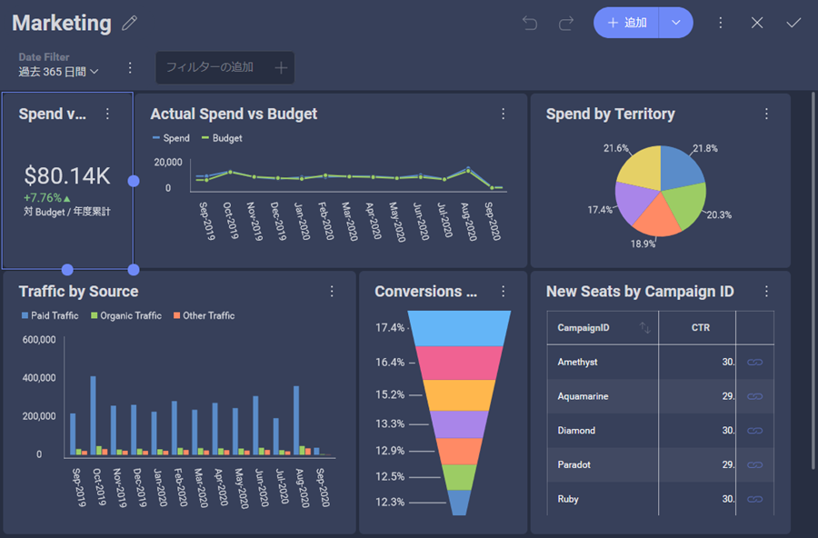
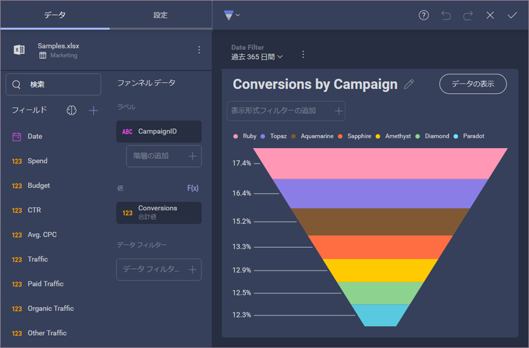

## カスタム テーマの作成

### 概要

分析を既存のアプリケーションに埋め込む場合、それらのダッシュボードがアプリのルック アンド フィールと一致することが重要です。そのため、SDK を通じて Reveal ダッシュボードを完全に制御できます。

カスタム テーマで達成できる主なカスタマイズ:

- **カラー パレット**: 表示形式でシリーズを表示するために使用される色。色の数に制限はありません。すべての色が表示形式で使用されると、Reveal はこれらの色の新しい色合いを自動生成します。これにより、色が重複せず、各値に独自の色が設定されます。
- **アクセント色**: Reveal のデフォルトのアクセント色は、**[+ ダッシュボード]** ボタンやその他のインタラクティブなアクションで見つけることができる青の色合いです。アプリケーションで使用するのと同じアクセント色に一致するように色を変更できます。
- **条件付き書式の色**: 条件付き書式を使用するときに設定できる境界のデフォルトの色を変更します。
- **フォント**: Reveal は、アプリケーションで 3 種類のテキストを使用します: 標準、中、太字。これらの各テキストグループのフォントの使用を指定できます。
- **表示形式とダッシュボードの背景色**: ダッシュボードの背景色と表示形式の背景色を個別に構成できます。

### 一般的なユース ケース: 新しいカスタム テーマ
Reveal で独自のテーマを作成するのは、新しい __$.ig.RevealTheme()__ クラスのインスタンスを作成するのと同じように簡単です。このクラスには、概要にリストされているすべてのカスタマイズ可能な設定が含まれています。

新しい __$.ig.RevealTheme__ インスタンスを作成すると、各設定のデフォルト値が取得され、必要に応じてそれらを変更できます。

次に、テーマ インスタンスを __$.ig.RevealSdkSettings__ のクラスの静的テーマ プロパティに渡します。画面にダッシュボードまたは別の Reveal コンポーネントがすでに表示されている場合は、適用された変更を表示するために、再度描画する (ダッシュボード プロパティを再度設定する) 必要があります。

### 一般的なユース ケース: カスタム テーマの変更

すでに独自のテーマを適用しているが、他に加えた変更を失わずに一部の設定を変更したい場合があります。

この場合、__$.ig.RevealSdkSettings__ からテーマの静的プロパティを取得する必要があります。このメソッドを使用すると、RevealTheme 設定に最後に設定した値を取得できます。RevealTheme の新しいインスタンスを最初から作成する場合とは異なり、変更を適用してテーマを再度更新すると、デフォルト値ではなく、変更していない各設定の最新の値が取得されます。

### コード例

まず、以下は変更する前のサンプル ダッシュボードです。


次のコード スニペットでは、_revealTheme_ クラスの新しいインスタンスを作成し、必要な設定に変更を適用し、Reveal Web でテーマを更新する方法を確認できます。

``` js

var revealTheme = new $.ig.RevealTheme();
revealTheme.chartColors = ["rgb(192, 80, 77)", "rgb(101, 197, 235)", "rgb(232, 77, 137)"];

revealTheme.mediumFont = "Gabriola";
revealTheme.boldFont = "Comic Sans MS";
revealTheme.fontColor = "rgb(31, 59, 84)";
revealTheme.accentColor = "rgb(192, 80, 77)";
revealTheme.dashboardBackgroundColor = "rgb(232, 235, 252)";

$.ig.RevealSdkSettings.theme = revealTheme;

```

> [!NOTE]
> Reveal テーマの boldFont、regularFont、または mediumFont の設定を定義する場合、正確なフォント ファミリ名を渡す必要があります。太さは、名前ではなくフォント自体の定義によって定義されます。@font-face (CSS プロパティ) を使用して、$.ig.RevealTheme フォント設定で指定されたフォント フェイス名が使用可能であることを確認する必要がある場合があります。

さらに、フォントをカスタマイズするには、ページの CSS に次の行を追加する必要があります。

``` CSS

<link href="https://fonts.googleapis.com/css?family=Righteous" rel="stylesheet">
<link href="https://fonts.googleapis.com/css?family=Domine" rel="stylesheet">
<link href="https://fonts.googleapis.com/css?family=Caveat" rel="stylesheet">

```

テーマの変更を実装すると、ダッシュボードと表示形式エディターの両方の結果を確認できます。


### カラー タイプの使用

RGB (red, green, blue) または HEX カラーのいずれかを使用して、カラー設定を指定できます。

``` js

revealTheme.dashboardBackgroundColor = "rgb(232, 235, 252)";
revealTheme.dashboardBackgroundColor = "#E8EBFC";

```

### 定義済みのテーマ 
Reveal SDK には、*Mountain Light*、*Mountain Dark*、*Ocean Light*、*Ocean Dark* の 4 つのビルド済みテーマが付属しています。アプリケーションのデザインに最適なものを設定することも、カスタム テーマのベースとして使用することもできます。   
*UpdateCurrentTheme* メソッドを使用して、選択したビルド済みテーマの設定を適用します。

***Mountain Light テーマ***
``` js
$.ig.RevealSdkSettings.theme = new $.ig.MountainLightTheme();
```

> [!NOTE]
> Mountain Light には、カスタマイズ可能なすべての設定のデフォルト値が含まれています。つまり、Mountain Light と Reveal テーマは基本的に同じように見えます。

***Mountain Dark テーマ***
``` js
$.ig.RevealSdkSettings.theme = new $.ig.MountainDarkTheme();
```

***Ocean Light テーマ***
``` js
$.ig.RevealSdkSettings.theme = new $.ig.OceanLightTheme();
```

***Ocean Dark テーマ***
``` js
$.ig.RevealSdkSettings.theme = new $.ig.OceanDarkTheme();
```

#### 定義済みのテーマはどのように見えますか? 

以下は、各ビルド済みテーマが適用されたときの*表示形式エディター*と*ダッシュボード エディター*の外観を示すテーブルです。

<style type="text/css">
.tg  {border-collapse:collapse;border-spacing:0;}
.tg td{border-color:black;border-style:solid;border-width:1px;font-family:Arial, sans-serif;font-size:14px;
  overflow:hidden;padding:10px 5px;word-break:normal;}
.tg th{border-color:black;border-style:solid;border-width:1px;font-family:Arial, sans-serif;font-size:14px;
  font-weight:normal;overflow:hidden;padding:10px 5px;word-break:normal;}
.tg .tg-fymr{border-color:inherit;font-weight:bold;text-align:left;vertical-align:top}
.tg .tg-0pky{border-color:inherit;text-align:left;vertical-align:top}
</style>
<table class="tg">
<thead>
  <tr>
    <th class="tg-fymr">テーマ</th>
    <th class="tg-0pky"><span style="font-weight:bold">ダッシュボード エディター</span></th>
    <th class="tg-0pky"><span style="font-weight:bold">表示形式エディター</span></th>
  </tr>
</thead>
<tbody>
  <tr>
    <td class="tg-0pky">Mountain Light (デフォルト)</td>
    <td class="tg-0pky"></td>
    <td class="tg-0pky"></td>
  </tr>
  <tr>
    <td class="tg-0pky">Mountain Dark </td>
    <td class="tg-0pky"></td>
    <td class="tg-0pky"></td>
  </tr>
  <tr>
    <td class="tg-0pky">Ocean Light</td>
    <td class="tg-0pky"></td>
    <td class="tg-0pky"></td>
  </tr>
  <tr>
    <td class="tg-0pky">Ocean Dark</td>
    <td class="tg-0pky"></td>
    <td class="tg-0pky"></td>
  </tr>
</tbody>
</table>

