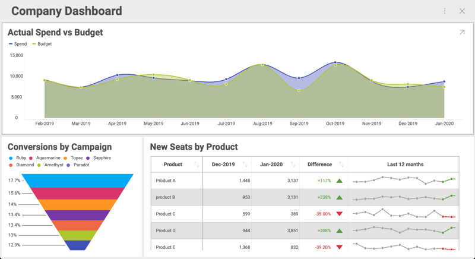

# 表示形式の最大化と単一表示形式モード

## 概要

Web Client SDK は、ダッシュボードをユーザーに表示する際に最大化した表示形式を 1
つだけ表示し、更に最初の表示形式をロックしてユーザーがダッシュボード全体にアクセスできないようにすることができます。


### 例の詳細

表示した 3 つのダッシュボードがあり、それぞれの表示形式に会社の異なる部門のデータが表示されているとします。



この例では、業務アプリケーションでこれらの表示形式を使用します。各部署のホームページに表示される情報の一部として含めます。

## 表示形式の最大化

最大化された表示形式でダッシュボードを開くには、最初に __revealView__ のダッシュボード プロパティを設定する必要があります。次に、最大化する表示形式を __$.ig.RevealView__ インスタンスに渡し、__maximizedVisualization__ プロパティを設定します。
この属性に視覚化を設定しない場合、ダッシュボード全体が表示されます。

**$.ig.RevealView オブジェクトの設定**に示すように、ページに特定のダッシュボードを表示できます。今回は、__maximizedVisualization__ プロパティを設定する必要があります。以下のコードスニペットに示すように、ID が AllDivisions のダッシュボードから表示した Sales が表示されています。

``` html
<script type="text/javascript">
...

var dashboardId = 'AllDivisions';

$.ig.RVDashboard.loadDashboard(dashboardId, function (dashboard) {
    var revealView = new $.ig.RevealView("#revealView");
    revealView.dashboard = dashboard;
    revealView.maximizedVisualization = dashboard.visualizations.getByTitle('Sales');

}, function (error) {
    console.log(error);
});
</script>

<div id="revealView" style="height:500px;" />
```

最初に最大化した表示形式は Sales というタイトルの表示形式になりますが、それでもエンドユーザーはダッシュボードに戻って残りの表示形式を表示できます。

## 単一表示形式モード

また、最初の表示形式をロックして、常に表示形式を 1 つのみ表示するようにすることもできます。これにより、ダッシュボードは単一の視覚化ダッシュボードのように機能します。これが [単一表示形式モード] の概念です。

[単一表示形式モード] をオンにするには、以下のように __singleVisualizationMode__ を true に設定します。

``` js
revealView.singleVisualizationMode = true;
```

この 1 行を追加すると、ダッシュボードは単一の視覚化ダッシュボードとして機能します。各部門のホームページでも同じことができます。dashboard.visualizations.getByTitle() の表示形式のタイトルを正しいものに置き換えてください。

### ロックされた表示形式を動的に変更

ページを再ロードせずに、表示されている単一の表示形式を動的に変更することもできます。ユーザーの観点から見ると、アプリは部門のセレクターと最大化された視覚化を備えた単一ページのアプリケーションになります。ユーザーがリストから 1 つの部門を選択すると、最大化された視覚化が更新されます

以下では、__\$.ig.RevealView__ の __maximizeVisualization__ メソッドを使用します。

``` html
<script type="text/javascript">
    var dashboardId = 'AllDivisions';

    $.ig.RVDashboard.loadDashboard(dashboardId, function (dashboard) {
        var revealView = window.revealView = new $.ig.RevealView("#revealView");
        revealView.singleVisualizationMode = true;
        revealView.dashboard = dashboard;
        revealView.maximizedVisualization = dashboard.visualizations.getByTitle('Sales');

    }, function (error) {
        console.log(error);
    });
    function maximizeVisualization(title) {
        var dashboard = window.revealView.dashboard;
        window.revealView.maximizedVisualization = dashboard.visualizations.getByTitle(title);
    }
</script>

<section style="display:grid;grid-template-rows:30px auto;">
    <section style="display:grid;grid-template-columns:auto auto auto;">
        <button onclick="maximizeVisualization('Sales')">Sales</button>
        <button onclick="maximizeVisualization('HR')">HR</button>
        <button onclick="maximizeVisualization('Marketing')">Marketing</button>
    </section>
    <div id="revealView" style="height:500px;" />
</section>
```

注意事項:

- __\$.ig.RevealView__ オブジェクトは  window.revealView に設定し、後で __maximizeVisualization__ プロパティが設定されたときに使用できます。
- div の前のセクションに追加されたボタンは、例として使用しています。最大化された表示形式を切り替える手段として追加されました。ここでは、アプリケーションで同様のコードを使用する必要があります。
- この例では、サンプル ダッシュボードの表示形式と一致するようにボタンがハードコードされていますが、ダッシュボードの表示形式のリストを繰り返すことでボタンのリストを動的に生成することもできます。詳細については、__\$.ig.RVDashboard.visualizations__ をご覧ください。