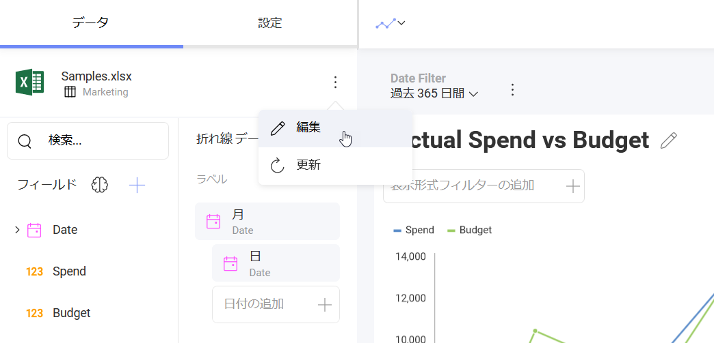
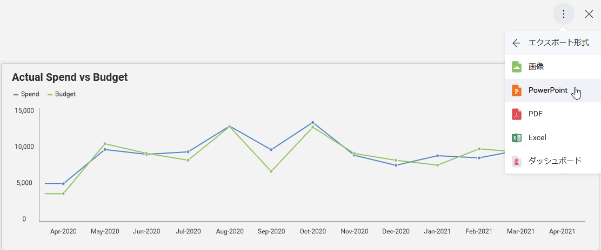
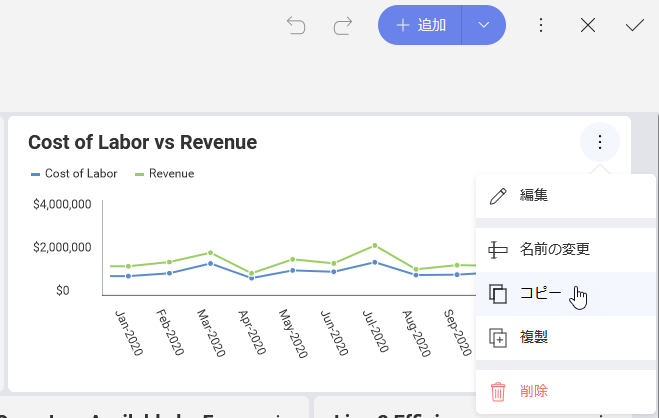
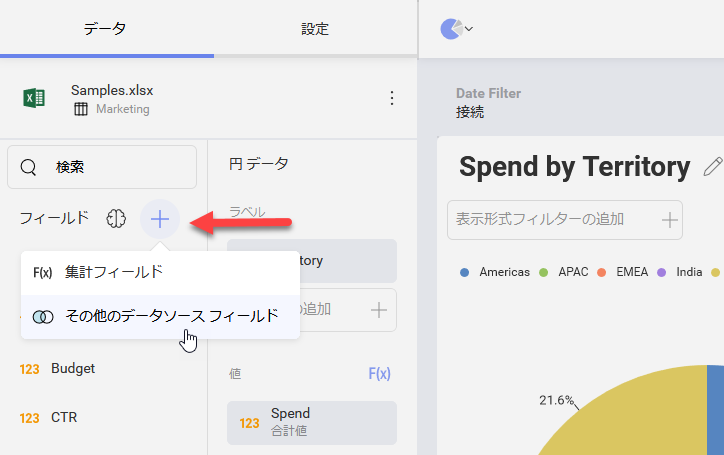
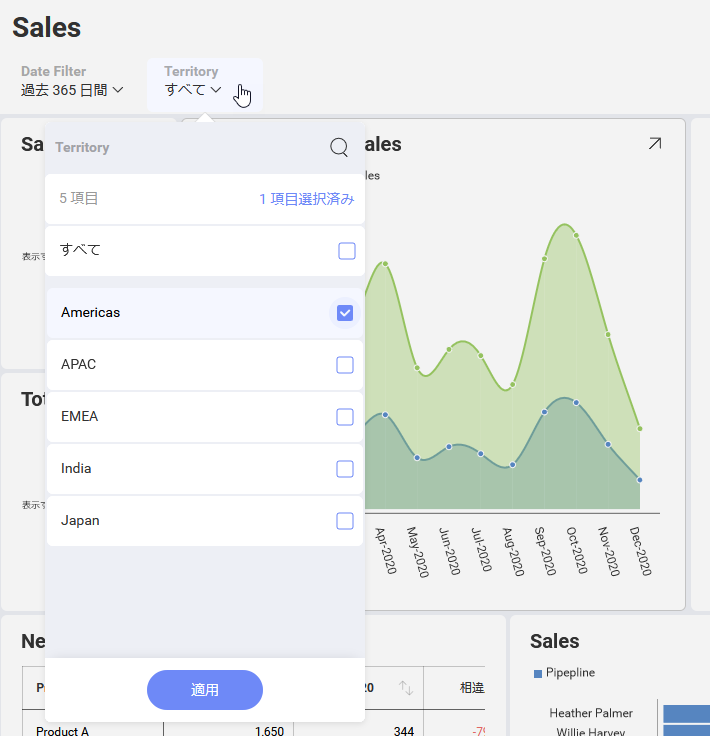

## ユーザー インターフェイス要素の表示/非表示

__$.ig.RevealView__ コンポーネントを使用して、エンド ユーザーに対するさまざまな機能または UI 要素を有効または無効にすることができます。使用可能なプロパティの多くはブール型で簡単に使用できますが、その他のプロパティはそれほど多くありません。

以下に作成する *revealView* インスタンスおよび DOM 要素は、このトピックのすべてのコード スニペットで使用されます。

``` js
var revealView = new $.ig.RevealView("#revealView");
...
<div id="revealView" style="height:500px;" />
```


> [!NOTE]
> CSS レイアウト アプローチによっては、RevealView をホストする要素を静的ではない位置属性 (相対または絶対など) を設定して配置する必要がある場合があります。


### canEdit
このプロパティは、ダッシュボードを編集するユーザー機能を無効にするために使用できます。


``` js
revealView.canEdit = false;
```

### showEditDataSource
このプロパティを使用して、ダッシュボード データ ソースの編集を無効にすることができます。



``` js
revealView.showEditDataSource = false;
```

### showExportImage
このプロパティを使用して、ダッシュボードの画像へのエクスポートを無効にすることができます。


``` js
revealView.showExportImage = false;
```

### showExportToPowerpoint
このプロパティを使用して、ダッシュボードの PowerPoint へのエクスポートを無効にすることができます。



``` js
revealView.showExportToPowerpoint = false;
```

### showExportToPDF
このプロパティを使用して、ダッシュボードの PDF へのエクスポートを無効にすることができます。


``` js
revealView.showExportToPDF = false;
```

### showExportToExcel
このプロパティを使用して、ダッシュボードの Excel へのエクスポートを無効にすることができます。


``` js
revealView.showExportToExcel = false;
```

### canCopyVisualization
このプロパティは、表示形式をコピーし、後で現在のダッシュボードまたは別のダッシュボードに貼り付ける機能を無効にするために使用できます。



``` js
revealView.canCopyVisualization = false;
```

### canDuplicateVisualization
このプロパティは、現在のダッシュボードで表示形式を複製する機能を無効にするために使用できます。


``` js
revealView.canDuplicateVisualization = false;
```

### canAddPostCalculatedFields
このプロパティを使用して、現在のダッシュボードに新しい事後計算フィールドを追加する機能を無効にできます。


事後計算フィールドはデータセットの新しいフィールドで、すでに集計された値に数式を適用して作成されます。
詳細については、[Reveal ヘルプ](https://help.revealbi.io/jp/data-visualizations/fields/calculated-fields/overview.html)をご覧ください。

``` js
revealView.canAddPostCalculatedFields = false;
```

### canAddCalculatedFields
このプロパティを使用して、現在のダッシュボードに新しい事前計算フィールドを追加する機能を無効にできます。



事前計算フィールドはデータセットの新しいフィールドで、データ エディター集計を実行する前に評価されます。
詳細については、[Reveal ヘルプ](https://help.revealbi.io/jp/data-visualizations/fields/calculated-fields/overview.html)をご覧ください。

``` js
revealView.canAddCalculatedFields = true;
```

### showFilters
このプロパティは、ユーザーにダッシュボード フィルター UI を表示または非表示にするために使用できます。


ダッシュボード フィルターを使用すると、ダッシュボードの全ての表示形式のコンテンツを一度にフィルター適用できます。

``` js
revealView.showFilters = true;
```

### canAddDashboardFilter
このプロパティを使用して、[ダッシュボード フィルターの追加] メニュー項目を表示または非表示にすることができます。


``` js
revealView.canAddDashboardFilter = false;
```
### canAddDateFilter
このプロパティを使用して、[日付フィルターの追加] メニュー項目を表示または非表示にすることができます。


``` js
revealView.canAddDateFilter = false;
```

### 選択済みフィルター
ダッシュボードを読み込みする時に既存のダッシュボード フィルターから最初に選択される値を指定できます。



次のコードスニペットは、ダッシュボード 「AppsStats」 を読み込む方法を示しています。「Territory」 ダッシュボード フィルターの選択値を 「Americas」 に設定して、ダッシュボードには 「Americas」 でフィルタリングされたデータが表示されます。

``` js
var dashboardId = "AppsStats";

$.ig.RVDashboard.loadDashboard(dashboardId, function (dashboard) {
    dashboard.filters.getByTitle("Territory").selectedValues = ["Americas"];

    var revealView = new $.ig.RevealView("#revealView");
    revealView.dashboard = dashboard;
}, function (error) {
});
```

### availableChartTypes
このプロパティは、ユーザーが使用できる表示形式タイプをフィルターするために使用できます。


たとえば、以下のように表示形式を追加または削除できます。

``` js
revealView.availableChartTypes.add($.ig.RVChartType.bulletGraph);
revealView.availableChartTypes.remove($.ig.RVChartType.choropleth);
```

さらに、使用可能な表示形式のみを含む新しい配列を使用できます。

``` js
revealView.AvailableChartTypes = [$.ig.RVChartType.bulletGraph, $.ig.RVChartType.choropleth];
```
