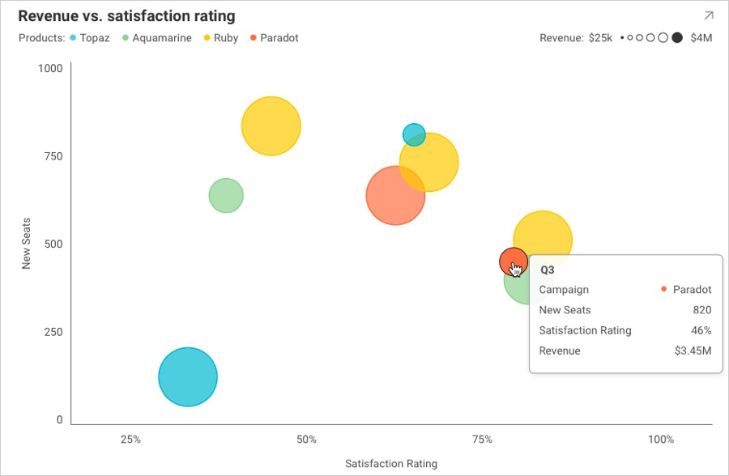

## ツールチップの作業

### 概要

エンドユーザーが表示形式でシリーズの上をホバーするか、シリーズをクリックするたびにトリガーされるイベントがあります (以下の画像を参照)。
このイベントは __.onTooltipShowing__ と呼ばれ、表示形式でツールチップを表示する方法をより柔軟に指定できます。



### 一般的なユースケース
Tooltip イベントをキャンセルするか、もしくはユーザーに表示される項目を変更できます。最も一般的な例:

- ツールチップをすべて無効にするか、特定の表示形式でのみ表示したい場合。
- ビューアーに役立つ RevealView コンポーネント以外のツールチップにデータを表示したい場合。

このイベントは、グリッドやゲージなどのツールチップをサポートしない表示形式ではトリガーされないことに注意してください。


### コード例

以下のコード スニペットでは、表示形式のツールチップを無効にし、エンドユーザーがこの表示形式をホバーまたはクリックするときにイベント引数から追加情報を取得する方法を示します。


``` js

revealView.onTooltipShowing = function (args) {
    if (args.visualization.title == "NoNeedForTooltips") {
             args.Cancel = true;
    }
    console.log("onTooltipShowing: visualization: " + args.visualization.title() + ",cell: " + args.cell.value + ", row:" + args.row.length);
};

```

イベント引数には、ホバーまたはクリックされている表示形式、ホバーまたはクリックされたデータの正確なセル、このセルの行全体 (他の列の情報が必要な場合)、および Cancel ブール値に関する情報が含まれています。
