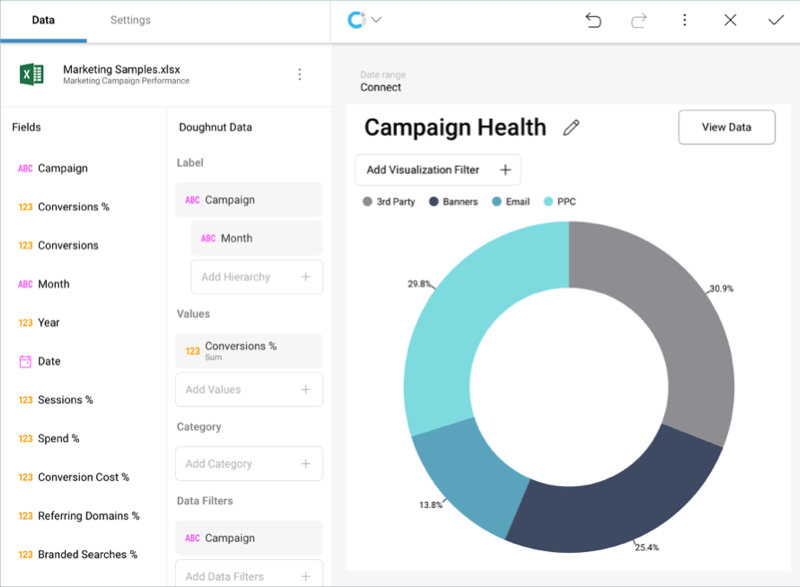

## アドホック階層

Reveal は年月日の日付フィールドの階層を自動的に作成しますが、他のタイプのフィールドでは発生しません。アドホック階層により、ユーザーはチャート、ゲージ、およびグリッドビューでデータを分析でき、データエディターの [行] プレースホルダーにあるフィールドを使用して新しい階層を作成できます。

この機能は、Analysis Services などの多次元データソースではなく、プレーン データソース (SQLテーブル、Excel スプレッドシート、CSVファイルなど) に適用されます。
これらの場合、階層はサーバー側で定義され、Reveal は展開およびドリル操作をサポートします。

>[!NOTE]
>アドホック階層は、テキストとラジアル ゲージ、および Web、テキスト、グリッド ビューを**サポートされません**。

### アドホック階層の有効化

アドホック階層を有効にするには、データ エディターのプレースホルダーの [行の階層セクションを追加] にフィールドをドラッグアンドドロップします。これを設定するとデータ テーブルの構成および動作が変わります。

上記のスクリーンショットのように、単一の列が複数の列を置き換えます。
スクリーンショットに示されている例では、ドリルアップおよびドリルダウンできるだけでなく、[Department] を展開して [Office] を表示することもできます。

>[!NOTE]
>**日付および時刻フィールドを含むアドホック階層**.
>日付、時刻、およびその他のカレンダーデータを使用してアドホック階層を構築することは**できません**。

### サポートされている表示形式

アドホック階層は、以下のものを除くすべての表示形式に追加できます。

  - 円形ゲージ

  - グリッド ビュー

  - テキスト ゲージ

  - テキスト ビュー

  - 画像ビューアー
