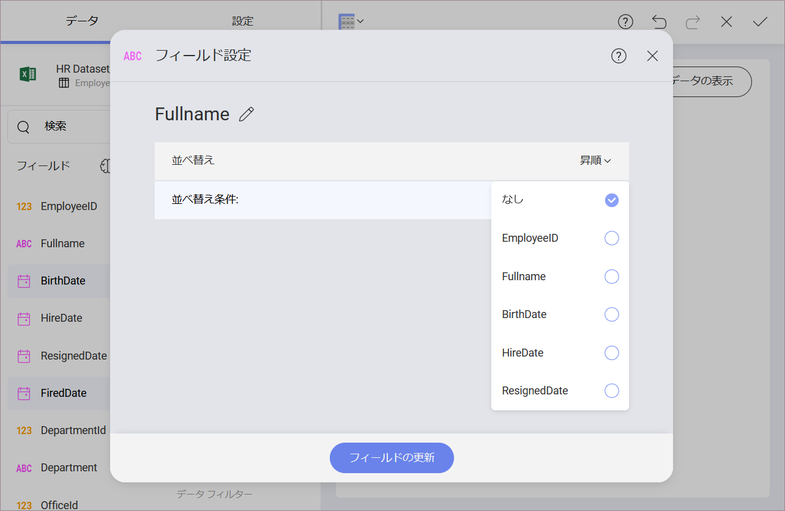
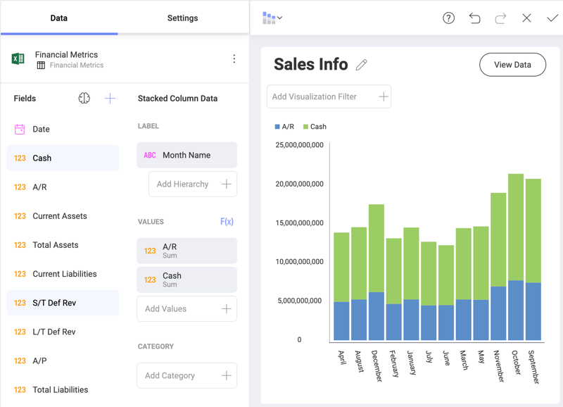
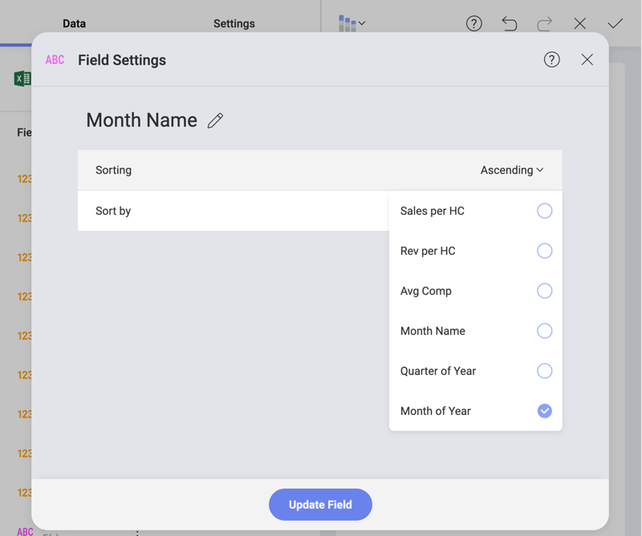
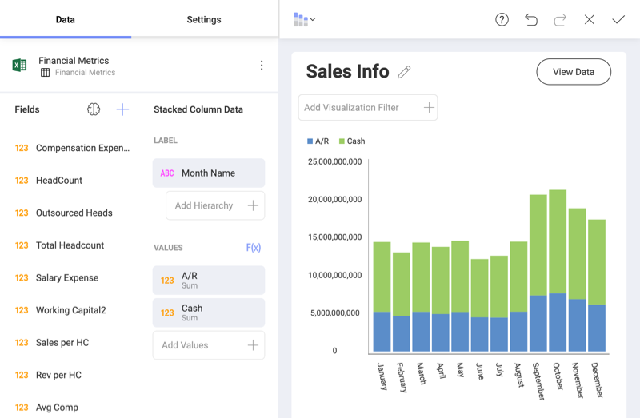
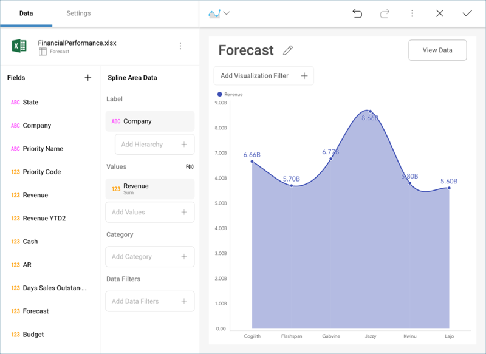
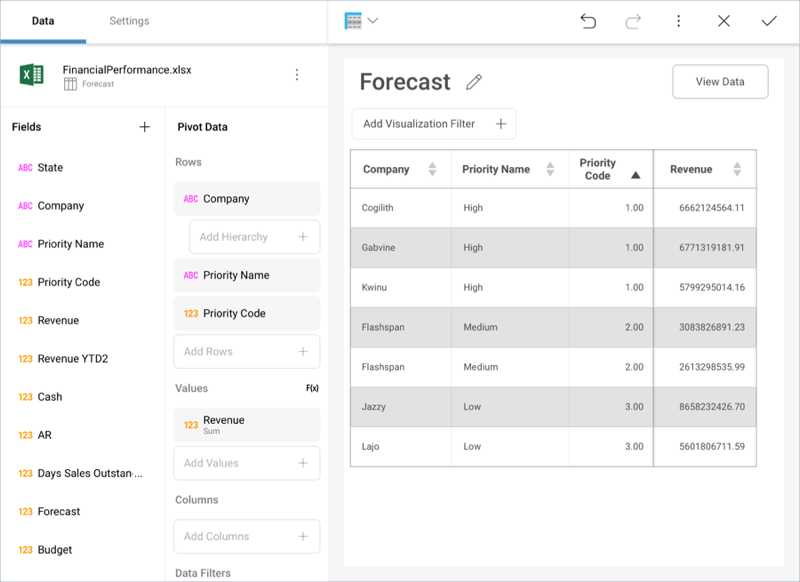
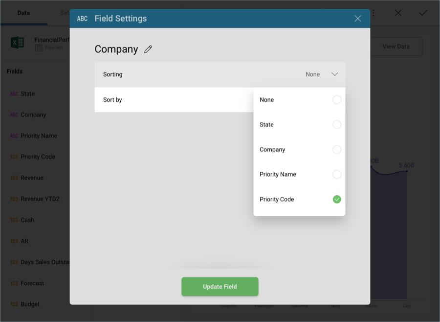
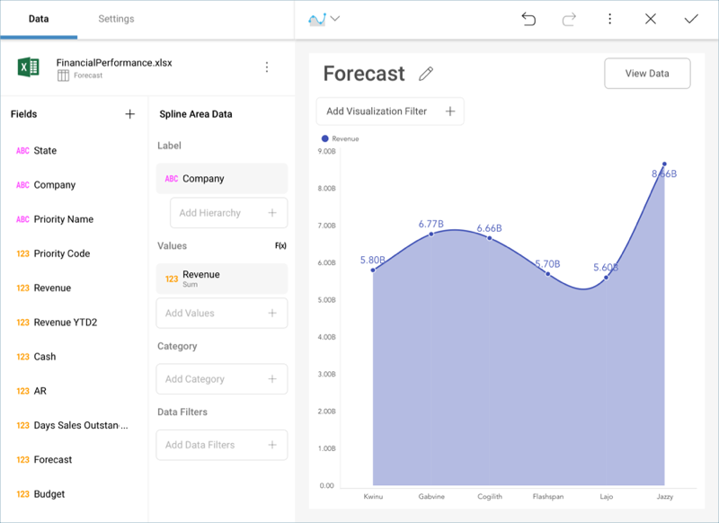

## 並べ替えフィールド

Reveal では、データを昇順または降順に並べ替えることで、 表示形式のデータの表示方法を変更できます。さらに、元のデータ ソースの別のフィールドで文字列フィールドと数値フィールドを並べ替えることもできます。

より実用的な情報については、この機能を示す次の例をご覧ください。

  - [文字列日付を時系列で並べ替え](#string-date-chr-order)

  - [企業を優先順位で順序](#by-priority)

### 文字列日付を時系列で順序

次の表示形式を見てみましょう。ここでは、 [積層型柱状チャート](~/jp/visualization-tutorials/stacked-charts.html#create-stacked-chart)で企業の現金と売掛金の増加をプロットしています。

値は、**月名** (文字列フィールド) で並べ替えされています。ただし、月はデフォルトでアルファベット順に並べ替えされているため、結果の表示形式は分析には適しません。

ただし、書式を変更し、**「年の月」**の順に情報を並べ替えることで、**月の名前**の表示方法を変更できます。Y 軸 (**年の月**) に 1-12 の数値を表示する必要はないかもしれませんが、それでもその順序を優先する必要があります。データ エディターのラベル プレースホルダーで **[月の名前]** フィールドを選択し、目的の並べ替えを選択します。

この後、**フィールドの更新**を選択します。情報は時系列順に並べ替えられます。

### 企業を優先順位で順序

別のシナリオでは、たとえば、スプレッドシートのカスタム ビジネス ロジックに基づいてフィールドを並べ替えます。たとえば、次の表示形式は、6 つの企業の収益予測を[スプライン エリア  チャート](~/jp/visualization-tutorials/simple-charts.html#create-basic-chart).

企業の名前はデフォルトで A-Z の順になっています。ただし、それらに割り当てられた優先度レベルは異なります。

*並べ替え*フィールドを使用して、「優先度コード」 をデータ エディターにドラッグアンドドロップすることなく、優先度別にチャートの情報を整理します。

したがって、結果のウィジェットでは、優先順位が「高」の企業を最初に A-Z の順に配置し、次に「中」の優先企業を配置し、最後に「低」の優先企業を配置します。

