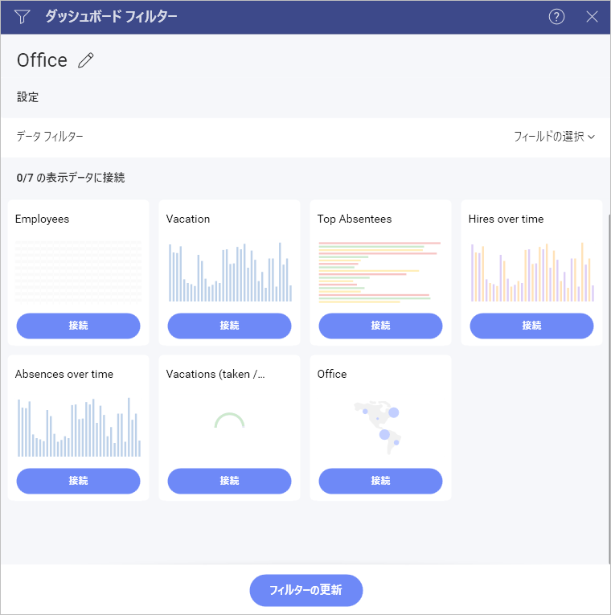

# ダッシュボード フィルターを表示形式に接続

表示したデータをダッシュボード フィルターにバインドする 2 つの方法があります:

  - **ダッシュボード フィルター構成の一部として接続** (上記を参照)
    これにより、ダッシュボード フィルターとダッシュボードのすべての表示形式間のバインド構成が可能です。

  - **表示形式エディター**を使用して、ダッシュボード フィルターが作成された後でも、個々の表示形式をバインドできます。

いずれの場合もダッシュボード フィルター データセットのフィールドへリンクするルールを追加してバインドが定義されます。([フィールドのバインド](#field-binding))
表示形式エディターまたは [ダッシュボード フィルター] メニューで [切断] を選択すると、表示形式のバインドをいつでも削除できます。

## フィールドのバインド

フィールドのバインでは、ダッシュボード フィルターのデータセット スキーマ、および表示形式のスキーマ間の結合関係を構成することができます。使用する [ダッシュボード フィルター] を選択して**接続します**。

上記のダイアログで以下を構成する必要があります。

  - **表示形式**: ダッシュボード フィルターのデータセットと結合するためのキーとして使用される表示形式 データセット内の列を表します。たとえば、Office、EmployeeID、ProductID など。

  - **演算子**: 結合演算子は、以下のいずれかを使用します。

      - **等しい**: フィールド値とダッシュボード フィルター選択の両方が等しい必要があります。

      - **含む**: 文字列フィールドで使用されることを意図し、フィールドの値にダッシュボード フィルター選択が含まれている場合に有効になる一致を返します。
たとえば、表示形式 = `FRANCE` 含む フィルター = `FRA` 。

      - **範囲**: 日付範囲ダッシュボード フィルターでのみ使用します。

  - **フィルター**: 結合されるダッシュボード フィルターの特定のダッシュボード フィルター。

## パラメーター バインド

パラメーター ([REST](~/jp/datasources/supported-data-sources/rest-api.html)、[OData](~/jp/datasources/supported-data-sources/odata-feed.html) および [MS SQL Server](~/jp/datasources/supported-data-sources/microsoft-sql-server.html) ストアド ロシージャ) を使用するデータ ソースの場合、ダッシュボード フィルターをパラメーターに接続する必要があります。そのため、可覚化のフィルター データを変更すると、接続されたパラメーターで選択した値で更新されます。

ダッシュボード フィルターをパラメーターに接続するには、[フィールド バインド](#フィールドのバインド)の手順に従います。データ ソース パラメーターは、[フィルター接続の編集] ダイアログの表示形式ドロップダウン リストの下部にあります。

>[!NOTE]
>日付フィルター: ダッシュボード フィルターのみをパラメーターにバインドできます。パラメーターへの日付フィルターのバインドはサポートされていません。
